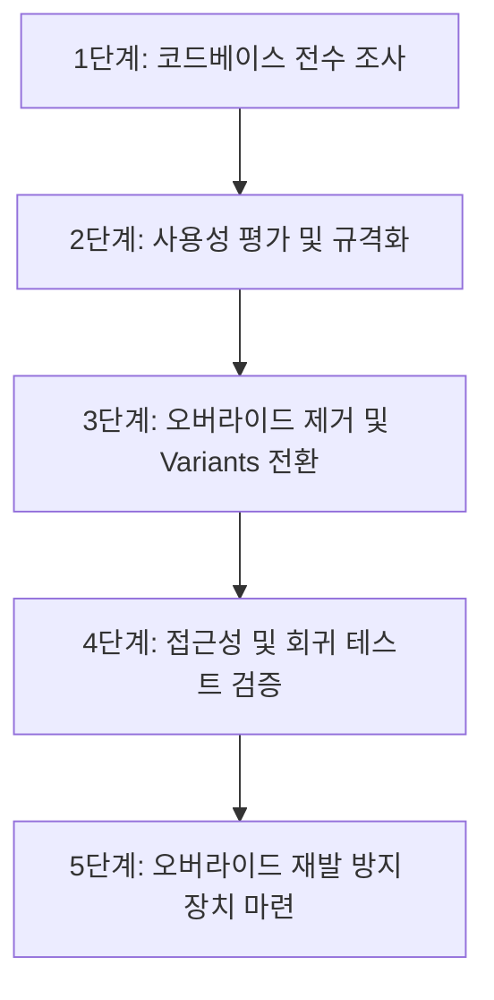

# 디자인 시스템 정렬 및 사용성 향상 계획 (Design System Alignment & Usability Compliance Plan)

본 문서는 `apps/web`을 비롯한 코드베이스 전체에서 공통 UI 패키지(`packages/ui`)의 모든 컴포넌트 사용처를 전수 조사하고, 임의의 스타일 오버라이드를 제거하여 시스템의 시각적 일관성과 사용자 경험(UX) 및 웹 접근성(A11y)을 확보하기 위한 종합 실행 계획입니다.

---

## 1. 문제 정의 및 배경

현재 공통 UI 패키지의 컴포넌트가 각 애플리케이션 화면에 적용되는 과정에서 개별 화면 요구사항에 맞춘 잡다한 인라인 클래스(`className`을 통한 여백, 크기, 색상 등 오버라이드)가 무분별하게 추가되고 있습니다. 이로 인해 디자인적 파편화는 물론, **사용자가 서비스를 이용하는 과정에서 심각한 사용성(Usability) 저하**가 유발되고 있습니다.

---

## 2. 오버라이드로 인한 사용성 및 접근성 부작용

임의의 컴포넌트 스타일 수정은 단순히 '보기 안 좋은 것'을 넘어 사용성을 직접적으로 저해합니다.

### 2.1. 터치 타겟 영역 부족 (Touch Target Size Issue)
- **부작용**: 패딩(`py-`, `px-`)이나 높이(`h-`)를 임의로 오버라이드하여 축소할 경우, 모바일 기기 등 터치 환경에서 사용자가 버튼을 원활히 누르기 힘들어집니다.
- **준수 기준**: WCAG(웹 콘텐츠 접근성 지침) 및 각 플랫폼 가이드라인에 따라 대화형 컴포넌트는 최소 **44 × 44 CSS 픽셀 (또는 48 × 48px)** 이상의 클릭/터치 대상 영역을 확보해야 합니다. 공통 컴포넌트는 이를 보장하도록 최적화되어 있으나, 임의 오버라이드가 이 안전장치를 무력화합니다.

### 2.2. 명도 대비 및 가독성 저하 (Contrast & Legibility)
- **부작용**: 컴포넌트 고유의 텍스트 스케일(`text-`)을 임의로 줄이거나 배경색(`bg-`), 글자색(`text-`)을 오버라이드할 경우, 텍스트와 배경 간 명도 대비가 부족해집니다.
- **준수 기준**: 텍스트와 배경의 명도 대비는 최소 **4.5:1** (큰 텍스트는 3:1) 이상이어야 시각 장애나 저시력자, 야외 환경의 사용자가 텍스트를 읽을 수 있습니다. 무단 오버라이드는 디자인 시스템의 색상 명도 대조 설정을 왜곡합니다.

### 2.3. 키보드 접근성 및 포커스 인디케이터 누락 (Focus & Keyboard Navigation)
- **부작용**: 포커스 링 스타일을 임의로 덮어쓰거나(`outline-none`, `ring-0` 등), 특정 구조적 속성을 훼손하여 키보드로 웹을 탐색하는 시각 장애인 및 파워 유저가 현재 어느 컴포넌트에 포커스가 도달해 있는지 알 수 없게 됩니다.

### 2.4. 반응형 레이아웃 붕괴 및 콘텐츠 잘림 (Responsive Breakage & Overflow)
- **부작용**: 컴포넌트 외곽선이나 내부 구조에 고정 너비(`w-80` 등)나 크기 조절 속성을 오버라이드 주입할 경우, 모바일 뷰포트나 브라우저 줌(Zoom 200%) 환경에서 콘텐츠가 화면 밖으로 넘치거나(Overflow) 글자가 잘려 정보를 정상적으로 인지할 수 없게 됩니다.

### 2.5. 복합 컴포넌트의 오동작 및 흐름 깨짐 (Component UX Breakage)
- **부작용**: `Accordion`, `Dialog`, `DropdownMenu` 등 구조적으로 렌더링 영역이 제어되는 컴포넌트에 무작위 레이아웃 속성을 주입할 경우, 팝업이 화면 중앙을 벗어나거나 화면 외부로 밀려나 닫기 버튼 조작이 불가능해지는 등의 치명적인 사용 차단 현상이 발생합니다.

---

## 3. 대상 컴포넌트 및 정렬 원칙

### 3.1. 조사 대상 컴포넌트
공통 UI 패키지([index.ts](file:///d:/Code/Github/writing-app/writing-app/packages/ui/src/index.ts))에서 내보내는 **모든 대화형/정보 노출형 컴포넌트**가 조사 대상입니다.
- **기본 액션**: `Button`, `Card`, `Badge`
- **폼 입력**: `Input`, `Textarea`, `Select`, `NativeSelect`, `Field`군
- **데이터/피드백**: `Progress`, `EmptyState`, `Alert`, `Callout`, `Spinner`
- **구조/내비게이션**: `Accordion`, `AlertDialog`, `DropdownMenu`, `SegmentedControl`, `ToggleGroup`, `StickyActionBar`

### 3.2. 오버라이드 금지 및 스타일 정렬 원칙
1. **무조건적인 디자인 시스템 스펙 준수**: 컴포넌트 자체의 색상, 폰트 스케일, 내부 여백(패딩), 둥글기(border-radius)는 외부에서 인라인 클래스로 제어하지 않고 컴포넌트 내부 기본값을 신뢰합니다.
2. **Variants 기반의 요구사항 수용**: 디자이너와 협의된 예외 규격(예: 랜딩용 특대형 버튼, 경고 배지 등)은 반드시 공통 UI 컴포넌트의 `variants`로 정식 추가한 뒤 활용합니다.
3. **레이아웃 포지셔닝 속성만 허용**: 인라인 `className` 주입은 마진(`m-`, `mt-` 등), 플렉스/그리드 배치용 정렬 속성(`flex-1`, `shrink-0` 등)과 같이 부모 레이아웃 흐름에 관여하는 설정으로만 엄격히 제한합니다.

---

## 4. 단계별 실행 계획

### 1단계: 코드베이스 전수 조사 (Comprehensive Audit)
- **행동**: `@workspace/ui`에서 가져오는 모든 컴포넌트의 실제 마크업 사용처를 정밀 검색합니다.
- **중점 점검**:
  - 컴포넌트에 주입된 클래스 중 `p-`, `py-`, `px-`, `h-`, `w-`, `text-`, `bg-`, `rounded-`, `border-` 등 디자인 토큰을 강제 우회하는 클래스 목록을 정리합니다.

### 2단계: 사용성 영향도 평가 및 규격화 (Usability Assessment & Standardization)
- **행동**:
  - 식별된 각 오버라이드 사례 중 터치 영역 미달(48px 미만), 대비比 불만족, 텍스트 가독성 저해 요소들을 우선순위(Critical/High)로 구분합니다.
  - 필요한 변형 스타일은 UI 패키지 컴포넌트의 Variant 속성으로 공식 통합합니다.

### 3단계: 오버라이드 제거 및 Variants 전환 (Migration)
- **행동**:
  - 개별 화면단 파일(`landing-sections.tsx`, `auth-page.tsx` 등)의 스타일 오버라이드를 과감히 제거합니다.
  - 신규 등록된 공통 Variant(`size="xl"`, `variant="hero"` 등)로 컴포넌트 속성을 대체 적용합니다.

### 4단계: 접근성 및 회귀 테스트 검증 (Validation)
- **행동**:
  - **Lighthouse / axe-core**: 정렬 및 스타일 개선이 적용된 웹 애플리케이션 주요 화면의 명도 대비와 접근성 감사를 실시하여 사용성 결함이 해결되었는지 계측합니다.
  - **모바일 E2E 테스트**: 모바일 해상도(375px~420px) 환경에서 터치 타겟이 충분한지, 반응형 구조가 정상인지 확인합니다.

### 5단계: 오버라이드 재발 방지 장치 마련 (Prevention)
- **행동**:
  - **PR 린트 단계에서의 제어**: ESLint 혹은 커스텀 정적 분석 플러그인을 사용하여 공통 UI 컴포넌트에 임의의 외형 변경 클래스가 적용되는 것을 방지합니다.
  - **리뷰 프로세스 강화**: 개발 문서(`FRONTEND.md`) 내에 접근성 및 디자인 시스템 준수 원칙 섹션을 추가하고 PR 제출 전 체크리스트에 포함합니다.
