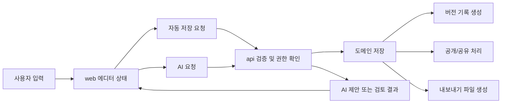

## 흐름 설계 원칙

- 사용자의 생각은 먼저 클라이언트에 나타나고, 그 다음 서버에 안전하게 반영된다.
- 자동 저장은 조용해야 하지만 상태는 명확해야 한다.
- AI는 원문을 덮어쓰지 않고 제안이나 검토 결과만 반환한다.
- 공개와 공유는 글 저장 흐름과 분리한다.

## 1. 앱 진입과 홈 구성

1. 브라우저가 세션 쿠키를 포함해 `web`에 진입한다.
2. `web`은 세션 상태, 이어쓰기 대상, 오늘의 글감 요약을 API에서 가져온다.
3. API는 사용자 상태와 개인화 가능한 최소 데이터만 조합해 반환한다.
4. 홈은 "오늘의 영감", 최근 글, 저장한 글감으로 구성된다.

## 2. 글감 탐색에서 작성 시작까지

1. 사용자가 글감 목록을 조회한다.
2. 필터, 검색어, 북마크 상태가 API에 전달된다.
3. 글감 상세에서 "이 글감으로 바로 쓰기"를 선택하면 새 글 생성 요청이 발생한다.
4. 새 글은 글감 식별자만 참조하고, 글감 원문을 강제로 본문에 주입하지 않는다.

## 3. 글 작성과 자동 저장

1. 사용자가 제목과 본문을 입력하면 편집 상태가 먼저 클라이언트 메모리에 반영된다.
2. 에디터는 일정 조건에 따라 자동 저장 요청을 보낸다.
   - 일정 시간 경과
   - 의미 있는 변경량 발생
   - 포커스 이탈 또는 화면 전환 직전
3. API는 현재 버전과 충돌 여부를 확인한 뒤 글과 새 버전을 저장한다.
4. 성공 시 클라이언트는 마지막 저장 시각과 버전 상태를 갱신한다.
5. 실패 시 클라이언트는 작성 상태를 유지하고 재시도 대기열 또는 경고 상태로 전환한다.

## 4. 버전 기록 조회

1. 사용자가 버전 기록을 열면 API에서 해당 글의 버전 목록을 요청한다.
2. 목록에는 생성 시각, 생성 주체, 저장 유형 같은 메타데이터를 포함한다.
3. 특정 버전 미리보기는 읽기 전용으로 제공한다.
4. 복원은 새 버전을 하나 더 만드는 방식으로 처리한다.

## 5. AI 보조 흐름

### 선택 영역 제안

1. 사용자가 문장 또는 문단을 선택한다.
2. 클라이언트는 선택된 텍스트와 기능 종류를 API에 전달한다.
3. API는 입력 검증 후 AI 제공자에 코칭형 요청을 보낸다.
4. 응답은 제안 목록과 이유 설명으로 반환된다.
5. 사용자가 선택한 제안만 본문에 반영된다.

### 문서 검토

1. 사용자가 맞춤법 또는 흐름 검토를 요청한다.
2. 클라이언트는 문단 단위 텍스트와 위치 정보를 API에 전달한다.
3. API는 검토 결과를 위치 기반 이슈 목록으로 반환한다.
4. 클라이언트는 하이라이트만 표시하고, 실제 반영은 사용자 승인 뒤에 수행한다.

## 6. 공개와 공유

1. 사용자가 공개 범위를 선택한다.
2. API는 글 상태, 권한, 공개 정책을 검증한다.
3. 제한 공유일 경우 별도 공유 링크와 접근 토큰을 생성한다.
4. 전체 공개일 경우 공개용 파생 데이터와 인덱싱 가능한 메타데이터를 생성한다.
5. 공개 후에도 원본 글과 공개본의 관리 상태는 분리한다.

## 7. 내보내기와 파일 생성

1. 사용자가 `txt` 또는 `md` 내보내기를 요청한다.
2. 현재 저장된 버전 또는 명시적으로 선택한 버전을 기준으로 파일을 생성한다.
3. 파일은 짧은 수명의 다운로드 링크 또는 직접 다운로드 응답으로 제공한다.
4. 내보내기 실패는 글 본문 저장 실패와 분리해서 처리한다.

## 흐름 요약

상세 시퀀스는 [[03-architecture/diagrams/writing-runtime-flow]]에서 관리하고, 이 문서의 다이어그램은 전체 흐름 요약만 다룬다.

## 예외 흐름

- 세션 만료: 클라이언트 임시 상태 유지 후 재인증
- 저장 충돌: 최신 버전 비교 후 새 버전으로 재저장
- AI 실패: 에디터 유지, AI 패널만 종료
- 스토리지 실패: 본문 저장은 유지, 파일 작업만 재시도

## 관련 다이어그램

- [[03-architecture/diagrams/writing-runtime-flow]]
- [[03-architecture/diagrams/system-context]]
