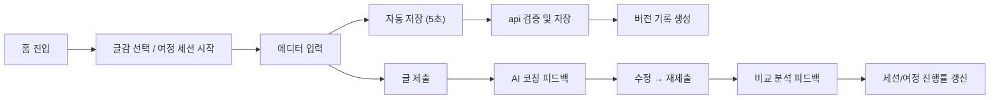

## 흐름 설계 원칙

- 사용자의 생각은 먼저 클라이언트에 나타나고, 그 다음 서버에 안전하게 반영된다.
- 자동 저장은 조용해야 하지만 상태는 명확해야 한다.
- AI는 원문을 덮어쓰지 않고 소크라테스식 코칭 피드백만 반환한다.
- 여정 진행 상태는 서버에서 관리하며, 앱 종료 후 재진입 시 마지막 스텝부터 재개한다.

## 1. 앱 진입과 홈 구성

1. 브라우저가 세션 쿠키를 포함해 `web`에 진입한다.
2. `web`은 세션 상태, 오늘의 추천 글감, 진행 중인 여정 목록을 API에서 가져온다.
3. API는 사용자의 온보딩 데이터(관심사, 수준)를 기반으로 개인화된 최소 데이터를 반환한다.
4. 홈은 시간대별 인사, 오늘의 추천 글감, 진행 중인 여정 카드로 구성된다.

## 2. 글감 탐색에서 자유 글쓰기까지

1. 사용자가 글감 목록을 조회한다. 유형별(감각/회고/의견) 필터를 지원한다.
2. 글감 상세에서 "글쓰기 시작"을 선택하면 새 글 생성 요청이 발생한다.
3. 새 글은 글감 식별자만 참조하고, 글감 원문을 강제로 본문에 주입하지 않는다.
4. 에디터 상단에 글감 정보가 참조용으로 표시된다.

## 3. 여정 탐색에서 세션 진행까지

1. 사용자가 여정 목록을 조회한다. 카테고리별(글쓰기 기술/마음챙김/기술) 필터를 지원한다.
2. 여정 상세에서 세션 리스트와 전체 진행률을 확인한다.
3. "지금 시작하기"를 선택하면 세션 시작 요청이 API에 전달된다.
4. API는 이전 세션 완료 여부를 확인한 뒤 세션을 시작한다.
5. 세션 내 스텝은 순서대로 진행되며, 각 스텝의 유형에 따라 다른 흐름을 탄다.

### 스텝 유형별 데이터 흐름

| 스텝 유형         | 데이터 흐름                                                   |
| ----------------- | ------------------------------------------------------------- |
| 개념 학습 (LEARN) | 서버 → 콘텐츠 렌더링 → "다음" 버튼으로 진행                   |
| 예시 읽기 (READ)  | 서버 → 모범 에세이/분석 포인트 렌더링 → "다음" 버튼으로 진행  |
| 가이드 질문       | 서버 → 질문 표시 → 사용자 답변 입력 → 제출 → 서버 저장        |
| 글쓰기 (WRITE)    | 서버 → 프롬프트 표시 → 에디터 입력 → 자동 저장 → 제출         |
| AI 피드백         | 서버 → AI 분석 트리거 → 피드백(강점/개선점/질문) 렌더링       |
| 수정 (REVISE)     | 서버 → 피드백 참조 + 에디터 → 수정 후 재제출 → 비교 분석 결과 |

## 4. 글 작성과 자동 저장

1. 사용자가 제목과 본문을 입력하면 편집 상태가 먼저 클라이언트 메모리에 반영된다.
2. 에디터는 5초 간격으로 자동 저장 요청을 보낸다.
3. API는 현재 버전과 충돌 여부를 확인한 뒤 글과 새 버전을 저장한다.
4. 성공 시 클라이언트는 마지막 저장 시각과 버전 상태를 갱신한다.
5. 실패 시 클라이언트는 작성 상태를 유지하고 재시도 대기열 또는 경고 상태로 전환한다.

## 5. AI 코칭 피드백 흐름

### 글 제출 후 피드백

1. 사용자가 글쓰기(WRITE) 스텝에서 글을 제출한다.
2. API는 글 내용과 사용자 수준 정보를 AI 제공자(Google Gemini)에 전달한다.
3. AI는 소크라테스식 코칭 원칙에 따라 피드백을 생성한다.
   - 강점 1~2개: 구체적으로 잘된 부분과 이유
   - 개선점 1~2개: 문제 지적 + 방향 힌트 (답을 주지 않음)
   - 사고 촉발 질문 1개: 글의 깊이를 확장하는 메타인지 질문
4. 피드백은 10초 이내에 생성되어 클라이언트에 반환된다.
5. 사용자 수준에 따라 강점:개선점 비율이 조정된다 (입문 2:1, 중급 1:1, 상급 1:2).

### 수정 후 비교 분석

1. 사용자가 피드백을 참고해 글을 수정하고 재제출한다.
2. API는 초안과 수정본을 AI에 함께 전달한다.
3. AI는 초안 대비 개선된 부분을 명시적으로 언급하는 비교 피드백을 생성한다.
4. 개선 부분이 하이라이트되어 사용자에게 성장 피드백을 제공한다.

## 6. 세션 완료와 여정 진행

1. 세션의 마지막 스텝이 완료되면 세션 완료 요청이 API에 전달된다.
2. API는 세션 상태를 COMPLETED로 변경하고, 다음 세션을 LOCKED에서 IN_PROGRESS로 전환한다.
3. 여정 진행률이 업데이트된다.
4. 여정의 마지막 세션이 완료되면 여정 상태가 COMPLETED로 변경되고 축하 화면이 표시된다.

## 7. 데이터 내보내기

1. 사용자가 설정에서 "데이터 내보내기"를 요청한다.
2. 사용자의 모든 글을 마크다운 파일로 패키징하여 다운로드 링크를 제공한다.
3. 내보내기 실패는 글 본문 저장 실패와 분리해서 처리한다.

## 흐름 요약

상세 시퀀스는 [[03-architecture/diagrams/writing-runtime-flow]]에서 관리하고, 이 문서의 다이어그램은 전체 흐름 요약만 다룬다.

## 예외 흐름

- 세션 만료: 클라이언트 임시 상태 유지 후 재인증, 스텝 진행 상태 복원
- 저장 충돌: 최신 버전 비교 후 새 버전으로 재저장
- AI 피드백 실패/타임아웃: "분석에 시간이 조금 더 필요합니다" 메시지 + 재시도 버튼
- 앱 강제 종료: 마지막 완료 스텝까지 서버에 보존, 재진입 시 해당 스텝부터 재개

## 관련 다이어그램

- [[03-architecture/diagrams/writing-runtime-flow]]
- [[03-architecture/diagrams/system-context]]
