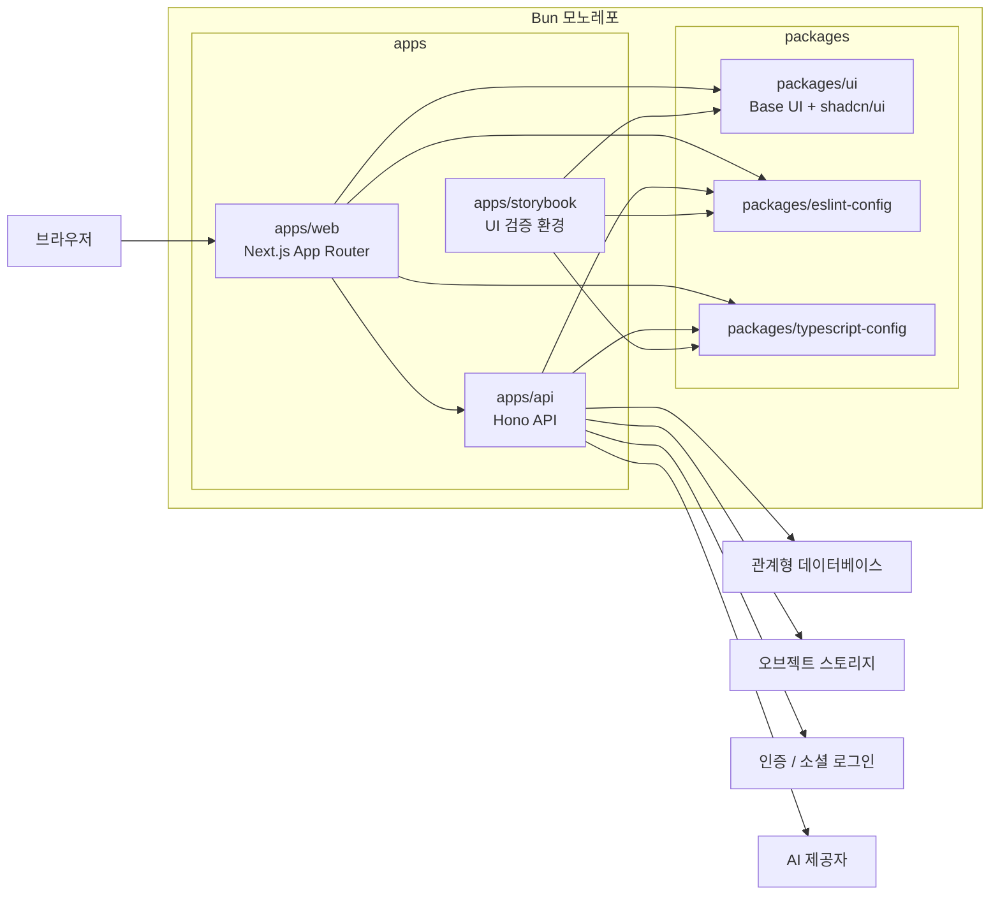

이 다이어그램은 모노레포 안에서 어떤 실행 단위와 공유 패키지가 시스템을 구성하는지 정리한다.

## 다이어그램

## 상태

- 이 다이어그램은 목표 구조를 설명하기 위한 컨테이너 수준 뷰이며, 세부 구현 파일이나 현재 실행 방식 전체를 모두 표현하지는 않는다.

## 관련 문서

- [[03-architecture/diagrams/README]]
- [[03-architecture/README]]
- [[03-architecture/tech-stack]]
- [[03-architecture/api-overview]]
- [[04-engineering/backend-architecture-guide]]
- [[04-engineering/frontend-architecture-guide]]
