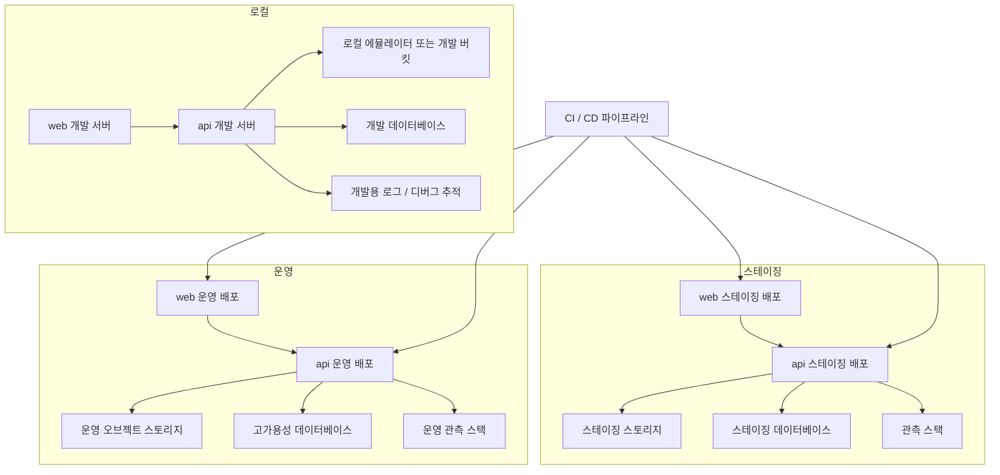

이 다이어그램은 환경별 배치 차이와 배포 경계를 빠르게 비교하기 위한 인프라 관점 뷰다.

## 다이어그램

## 상태

- 로컬은 운영과 같은 인터페이스를 재현하는 개발 환경으로, 스테이징과 운영은 같은 배치 패턴을 공유한다는 가정 위에 그린다.

## 관련 문서

- [[03-architecture/diagrams/README]]
- [[03-architecture/README]]
- [[03-architecture/deployment-strategy]]
- [[03-architecture/file-storage-strategy]]
- [[03-architecture/observability-architecture]]
