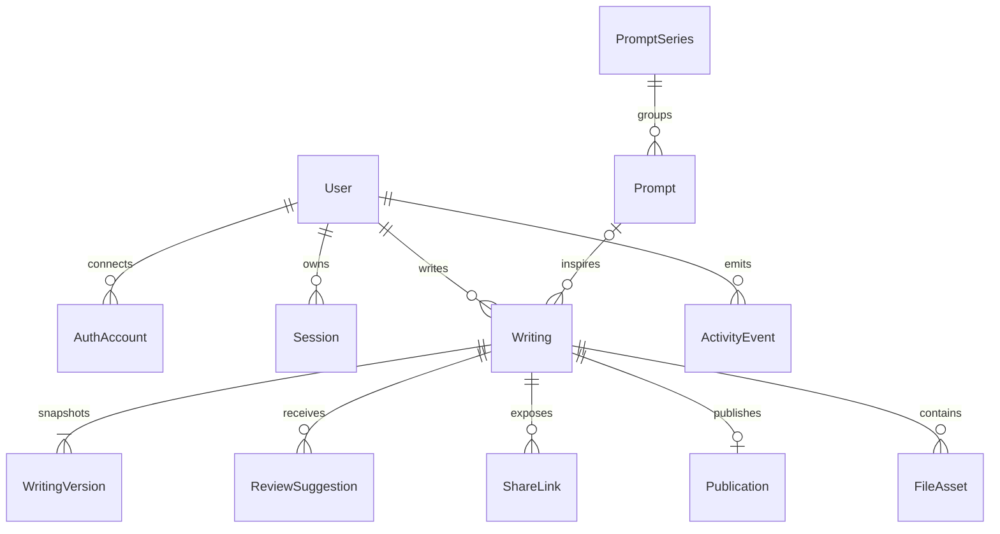

이 다이어그램은 글쓰기 도메인의 핵심 엔티티가 어떤 방향으로 연결되는지 빠르게 파악하기 위한 모델 뷰다.

## 다이어그램

## 상태

- 인증 엔티티는 better-auth의 영속성 모델과 대응되지만, 이 다이어그램은 제품 문서 관점의 도메인 이름으로 표현한다.

## 관련 문서

- [[03-architecture/diagrams/README]]
- [[03-architecture/README]]
- [[03-architecture/domain-model]]
- [[03-architecture/auth-and-session]]
- [[03-architecture/file-storage-strategy]]
