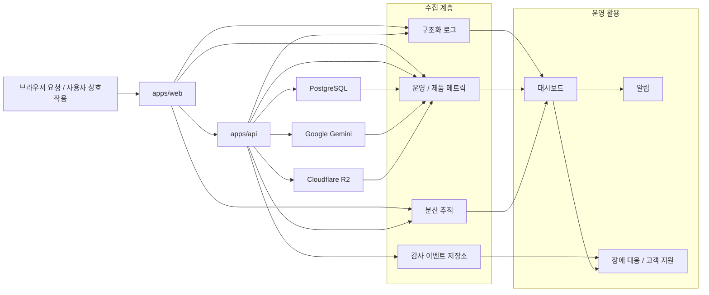

이 다이어그램은 사용자 요청이 운영 신호로 변환되는 경로를 정리해 장애 대응과 품질 추적의 기준점을 제공한다.

## 다이어그램

## 상태

- 관측 데이터는 본문 원문을 복제하지 않고 메타데이터 중심으로 수집한다는 원칙을 전제로 한다.

## 관련 문서

- [[03-architecture/diagrams/README]]
- [[03-architecture/README]]
- [[03-architecture/observability-architecture]]
- [[03-architecture/error-handling]]
- [[03-architecture/auth-and-session]]
