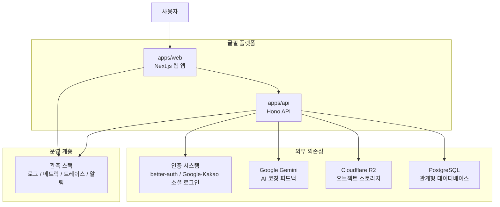

이 다이어그램은 글필 플랫폼을 둘러싼 주체와 시스템 경계를 한 번에 파악하기 위한 상위 수준 뷰다.

## 다이어그램

## 상태

- 이 다이어그램은 현재 코드 구현이 아니라 `03-architecture` 문서에 정의된 목표 아키텍처를 기준으로 한다.

## 관련 문서

- [[03-architecture/diagrams/README]]
- [[03-architecture/README]]
- [[03-architecture/tech-stack]]
- [[03-architecture/api-overview]]
- [[03-architecture/auth-and-session]]
- [[03-architecture/deployment-strategy]]
