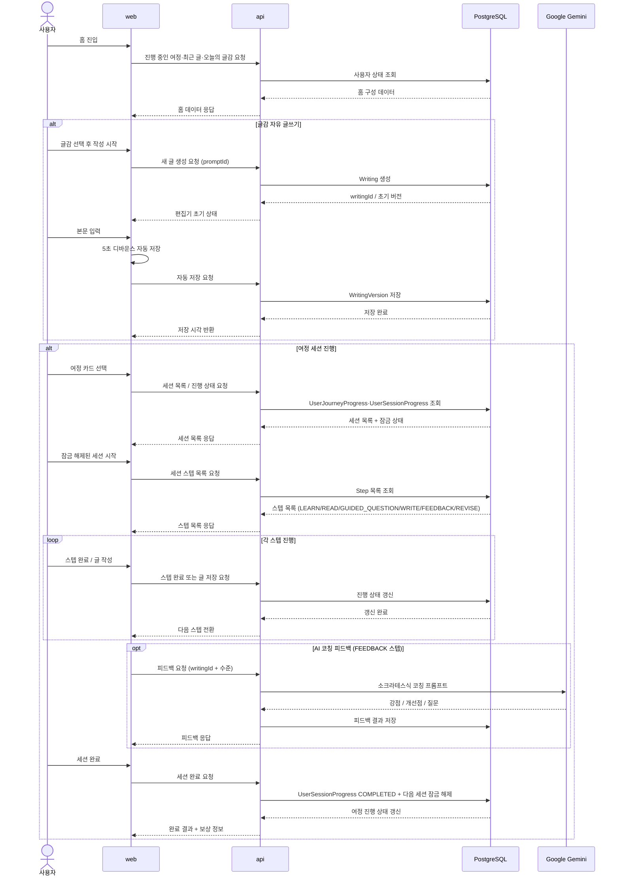

이 다이어그램은 글필의 두 가지 주요 흐름(글감 자유 글쓰기, 여정 세션 진행)에서 어떤 요청과 저장이 어떤 순서로 일어나는지 상세 흐름을 보여준다.

## 다이어그램

## 상태

- 이 다이어그램은 목표 사용자 흐름을 상세하게 보여주며, `data-flow.md`의 요약 다이어그램보다 한 단계 자세한 런타임 뷰다.

## 관련 문서

- [[03-architecture/diagrams/README]]
- [[03-architecture/README]]
- [[03-architecture/data-flow]]
- [[03-architecture/api-overview]]
- [[03-architecture/error-handling]]
