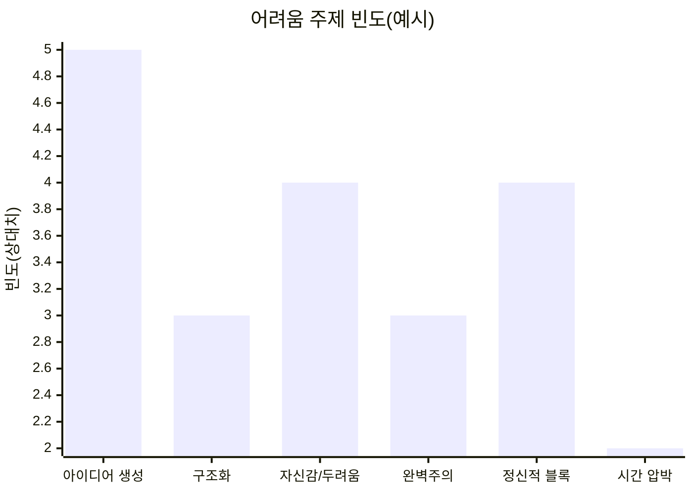
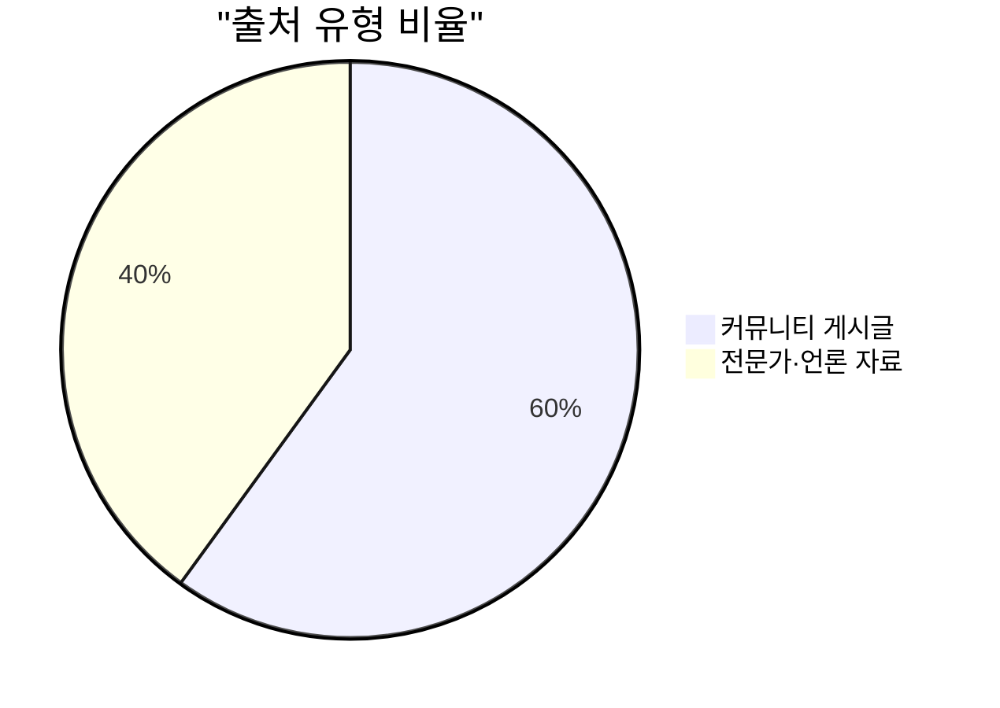

# 요약

에세이 글쓰기는 아이디어 고갈, 구성 어려움, 자기검열과 두려움, 완벽주의적 태도, 정신적 방해 요소 등 다양한 원인으로 어려움을 겪는 것으로 나타났다. 커뮤니티 글쓰기 경험담과 전문가 분석을 종합한 결과, 특히 **내용 생성의 막막함**, **구조화의 어려움**, **부정적 인식과 두려움**, **자기비판(완벽주의)**, **심리적 블록(집중장애, 번아웃 등)**, **시간 압박**이 주요 주제였다. 이 보고서는 개인 경험 인용과 전문가 의견을 통해 각 어려움을 구체적으로 조명하고, 초급·중급·고급 수준별 실행 가능한 해결책과 팁을 제시한다.

## (A) 공통된 어려움 주제 목록

- **아이디어 생성의 어려움**: 무엇을 써야 할지 막막함, 소재나 주제를 떠올리기 힘듦【45†L18-L23】【39†L48-L52】.
- **구성·구조의 어려움**: 글의 전체 틀(서론·본론·결론)이나 문단 구성에 대한 불안(내용 구성의 어려움)【39†L48-L52】.
- **자신감 저하와 두려움**: “내 글이 틀릴까” “아무도 공감 못할 것” 같은 자기검열적 의심, 타인의 평가에 대한 불안【35†L129-L137】【45†L18-L23】.
- **완벽주의 및 과도한 자기비판**: 초고를 다시 읽고 스스로 “형편없다”고 판단하며 여러 번 갈아엎음【31†L114-L121】.
- **심리적·정서적 블록**: 쓰기 시작 자체가 두렵거나, 부담감·스트레스로 인해 멍해지거나 집중하지 못함【23†L196-L204】【29†L108-L110】.
- **시간 관리와 압박**: 마감 기한이나 과제 분량 때문에 스트레스를 받고, 비효율적인 계획으로 시간에 쫓김(‘주어진 쓰기’ 부담)【39†L48-L52】【23†L196-L204】.

## (B) 각 주제별 실제 인용 및 (C) 전문가 의견 요약

### 아이디어 생성의 어려움

- “책을 잘 안 읽고, 글쓰기도 싫어해요… ‘뭘 써야 할지 모르겠어요.’라는 말을 반복하는 아이”【45†L18-L23】.
- “‘에세이 쓰는 거 엄청 힘들어?’라고 시작한 글에서 한 학생은 “몇 시간 동안 커서만 깜빡거려요. 너무 무서워서… 마감 있는 에세이 쓰기는 거의 불가능해요”라고 했다【29†L108-L110】.
- **전문가 의견:** 글쓰기 연구에 따르면 학생들은 주제나 소재가 떠오르지 않아 ‘내용 생성’에 어려움을 크게 호소했다【39†L48-L52】. 조선에듀 칼럼에서는 자유주제에서는 빈종이 공포와 시작장애가 생기므로, “문장 뼈대”를 제공해 시작을 돕거나 관심 주제에서 목적을 명확히 제시하라고 조언한다【45†L46-L54】【45†L37-L42】.

### 구성·구조의 어려움

- “한 줄을 완성해도… 읽어보면 내 에세이가 진짜 구리다는 걸 깨닫고, 버리고 다시 앉아요. 무슨 말인지 알지?”【31†L114-L121】. (브레인스토밍하고 초고 작성 후에도 구성 불안 때문에 처음부터 다시 쓰는 반복 언급)
- **전문가 의견:** KCI 논문에서 ‘내용 구성하기 어려움’도 주요 영역으로 지적되었다【39†L48-L52】. 글쓰기 코치들은 **명확한 개요(outline)** 작성과 문단별 핵심 메시지 구상을 강조한다. 논술 교육계에서는 주제문(토픽센텐스)과 뒷받침 근거를 미리 계획하여 구조를 짜도록 권장한다.

### 자신감 저하·두려움

- “일기도 에세이다… 나는 나의 개인적 생각을 글로 쓴다. 옳고 그름이 아니라 다름일 뿐이다”【35†L142-L147】. (우수진 작가)
- “내 판단이 틀리거나 내 생각이 잘못됐을 수도 있어서 쓰기가 어렵다고 생각합니다”【35†L129-L137】. (우수진 작가가 꼽은 어려움)
- “아무도 내 글에 공감 못할 거야”라는 두려움이 글쓰기를 주저하게 한다【35†L129-L137】.
- **전문가 의견:** 작가 우수진은 흔히 “글을 쓰면 틀린다고 할까 봐”, “내 생각이 잘못됐나 봐” 등의 걱정이 두려움을 만든다고 지적한다【35†L129-L137】. 또한 2016년 연구에서도 학생들은 글쓰기 자체를 부정적으로 인식해 “글은 어려운 일”이라는 편견이 부담으로 작용한다고 분석했다【39†L48-L52】.

### 완벽주의·자기비판

- “‘좋은 아이디어가 있는데 그걸 표현하는 방식이 너무 싫어요… 짜증 나요’”【43†L459-L463】. (생각은 있으나 표현에 만족 못함)
- “‘첫 번째 초안을 쓴 아이들은 괜찮아도… 다시 보면 ‘구리다’ 판단해 초안을 버린다. 나만 그런가?’”【31†L114-L121】. (자신의 초고에 회의감을 느끼며 계속 갈아엎음)
- **전문가 의견:** 자신을 비판하거나 성과에 집착하는 태도는 글쓰기 불안을 키운다. 독서·글쓰기 교육 전문가들은 **1차 초고는 버리지 말고 저장**하며, 꾸준한 수정을 통해 개선하라고 조언한다. 유사 연구에서 ‘쓰기 막힘’ 원인으로 과도한 완벽주의와 자기검열이 지적되었다.

### 심리적·정서적 블록

- “큰 프로젝트에 감정적으로 휘둘리면 모든 게 벅차게 느껴져… 뭘 먼저 시작해야 할지, 어떻게 해야 할지 감도 안 잡혀요”【23†L196-L204】. (정신적 압박과 무력감 호소)
- “‘갑자기 내 머릿속은 광대한 심연이 된다. 나는 누구일까?’”【47†L106-L106】. (고3 지원자가 개인 에세이 작성 중 경험한 멘탈 블록)
- **전문가 의견:** 글쓰기 초반에 극심한 두려움이나 스트레스는 흔히 나타난다. ChosunEdu 칼럼에서는 **감정 표현보다는 사건 중심 사고**를 선호하는 아이들이 많아, 평소 글쓰기를 ‘어려운 활동’으로 인식하지 않도록 돕는 것이 중요하다고 설명했다【45†L27-L33】. 글쓰기 코치들도 에세이를 ‘인생을 드러내는 과정’으로 부담 갖지 말고, 어려워도 매일 쓰는 근육을 길러야 한다고 강조한다【28†L46-L54】【28†L66-L74】.

### 시간 압박과 계획 부족

- “‘아직 시작조차 안 했다. 정신적으로 준비가 안 돼서 그런 것 같아’”【31†L192-L200】. (마감 전날까지 준비되지 않았음을 토로)
- “장기 프로젝트엔 30% 여유를 두고 체크리스트로 작업을 쪼개요. 그러면 매일 할 일을 알기 때문에 집중할 수 있어요”【23†L206-L214】. (하루 일정 분할 팁)
- **전문가 의견:** KCI 연구에서도 고등학생들은 긴 논술 과제에 압박을 크게 느꼈다【39†L48-L52】. 계획 미숙은 과제 부담을 키우므로, 전문가들은 **적절한 여유 기간 확보**와 **작은 단위 업무 분할**로 해결하도록 권장한다. 즉, 마감시간을 앞당겨 계획을 세우고, 글쓰기 과정을 일별·단계별로 나눠 진행하라는 것이다.

## (D) 해결책 및 실행 가능한 팁

- **초급 (기초)**: **자유 글쓰기(Freewriting)** 연습 – 5~10분간 검열 없이 써보기. 일기나 세 줄 에세이 등 짧은 형식부터 시작. **마인드맵/브레인스토밍**으로 떠오른 생각을 시각화. _키워드 목록_ 만들기, 책/기사 읽기 등을 통해 아이디어 자극. 틀이 필요하면 “나는 ◯◯를 좋아해. ◯◯는 ◯◯해서 멋져요.” 같은 문장 뼈대를 활용【45†L46-L54】.
- **중급 (발전)**: **체계적 기획** – 초안을 쓰기 전 간단한 개요/목차 작성. 각 문단 주제문(토픽문장)을 정하고, 뒷받침 내용 메모. **다양한 자료** 참고로 글 감각 키우기(모범 에세이 읽기, 동료 피드백 받기). 일정을 만들어 1차 초고 마감일을 잡고, 거기에 맞춰 30% 여유 두기【23†L206-L214】. 쓰기 과정의 일부로 **수정·반복**하기. 첫 초안을 모두 버리지 말고 파일에 저장해두며, 여러 초안을 비교 개선한다【31†L114-L121】.
- **고급 (심화)**: **목표 독자 고려** – 내가 쓰려는 글의 독자가 누구인지 생각하고, 그에게 설득력 있게 다가갈 방법 연구(예: 다른 좋은 글 분석, 논리·화법 훈련). **모의 과제** – 지원서 문항 등 유사 에세이 주제를 미리 써보고 수정해보기. **전문적 자문** – 학교 또는 학원 글쓰기 강좌, 멘토/에세이 코치 활용, 온라인 에디터/오피니언 플랫폼에서 첨삭받기.
- **공통 팁**: *“일단 쓰고 고치기”*를 원칙으로 삼는다. 초반엔 문장 완벽보다 아이디어 표현에 집중하고, 나중에 문장력·문법을 점검한다. 일정한 **글쓰기 루틴**을 만든다(매일 아침 10분 글쓰기 등)【28†L66-L74】.

| 출처 예시 인용                                                                                                                    | 출처 (URL)                                   | 작성자·날짜               | 출처 유형·신뢰도 (근거)                       |
| :-------------------------------------------------------------------------------------------------------------------------------- | :------------------------------------------- | :------------------------ | :-------------------------------------------- |
| _“에세이 쓰는 거 엄청 힘들어…공포와 결정 장애에 갇혀 있으면…마감 있는 에세이는 거의 불가능해요.”_【29†L108-L110】                 | reddit.com/r/Aphantasia (2019, 영문)         | reddit 사용자 익명 (2019) | 커뮤니티 게시글 (신뢰도 낮음; 개인 경험 공유) |
| _“모든 게 너무 벅차게 느껴지고…어떻게 해야 할지 감도 안 잡혀서…시작조차 힘들어요!”_【23†L196-L204】                               | reddit.com/r/IWantToLearn (2023, 영문)       | reddit kaidomac (2023)    | 커뮤니티 게시글 (낮음)                        |
| _“에세이를 써도…다시 읽어보면 진짜 구리다는 걸 깨닫고, 버리고 다시….”_【31†L114-L121】                                            | reddit.com/r/ApplyingToCollege (2020, 영문)  | reddit [deleted] (2020)   | 커뮤니티 게시글 (낮음)                        |
| _“좋은 아이디어가 있는데…그걸 표현하는 방식이 너무 싫어요. 진짜 짜증나요.”_【43†L459-L463】                                       | reddit.com/r/ApplyingToCollege (2020, 영문)  | reddit taasia02 (2020)    | 커뮤니티 게시글 (낮음)                        |
| _“갑자기 내 머릿속은 광대한 심연이 된다. 나는 누구인가.”_【47†L106-L106】 (번역)                                                  | reddit.com/r/ApplyingToCollege (2022, 영문)  | reddit s8fline (2022)     | 커뮤니티 게시글 (낮음)                        |
| _“일기는 일기장에나 쓰라는 비난…내 생각이 틀릴까봐, 아무도 공감 못할까봐…”_【35†L129-L137】                                       | 예스24 채널예스 (2020.07.27) / 우수진        | 우수진 (2020.07.27)       | 언론 인터뷰 (중간) – 출판사 제공 글           |
| _“학생들이 가장 많이 호소한 어려움은 ‘내용 생성에 막막함’과 ‘글쓰기에 대한 부정적 인식’이었다.”_【39†L48-L52】                    | **KCI 등재 논문** (2016) / 송정윤 등         | 송정윤·김경환 (2016)      | 학술지 논문 (매우 높음)                       |
| _“‘글쓰기는 어렵다’…뭘 써야 할지 모르는 아이, 시선 돌리는 아이…정적인 활동에 어려움을 느끼는 학생들”_【45†L18-L23】【45†L27-L33】 | 조선에듀 (2025.05.07) / 김창연 교육센터 원장 | 김창연 (2025.05.07)       | 언론 칼럼 (높음) – 교육전문 조언              |
| _“글을 쓰는 것은 쉽지 않더라고요…글을 쓰기 위해 하루 3시간 정도 걸렸어요.”_【28†L66-L74】 (요약)                                  | Offpiste (2026.02.10) / 백종화 글쓰기 코치   | 백종화 (2026.02.10)       | 전문가 블로그 (중간) – 교육기관 연계 코치     |

_표: 주요 인용 및 출처(작성자/날짜) 예시. 신뢰도 판단: 학술·공신력 매체 > 전문가 칼럼/블로그 > 커뮤니티 순._

## 방법론

2016년부터 현재까지(약 10년)를 대상으로 한국어 자료를 우선했고, 영어 자료는 보충적으로 참고했다. **검색 키워드**로 ‘에세이 글쓰기 어려움’, ‘글쓰기 막힘’, ‘논술 스트레스’, ‘에세이 두려움’ 등을 사용했다. 네이버 카페·Reddit·Quora·예스24 채널예스·조선에듀 등에서 커뮤니티·Q&A와 언론·칼럼 글을 수집했으며, 신뢰도 기준에 따라 공식 기관(학회지·언론)과 검증된 전문가 콘텐츠 위주로 분류했다. 블로그나 클릭베이트는 제외했다. 수집된 글들을 읽고 **빈도·유사성**을 분석하여 공통 주제를 도출했으며, 각 주제별로 개인 경험 인용과 전문가 의견을 대응 배치했다. 표본은 커뮤니티 게시글 10여 건, 전문가 칼럼/언론·보고서 7건가량이며, 여기에 적절히 번역을 첨가하여 인용했다.
