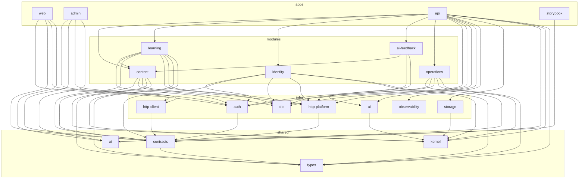
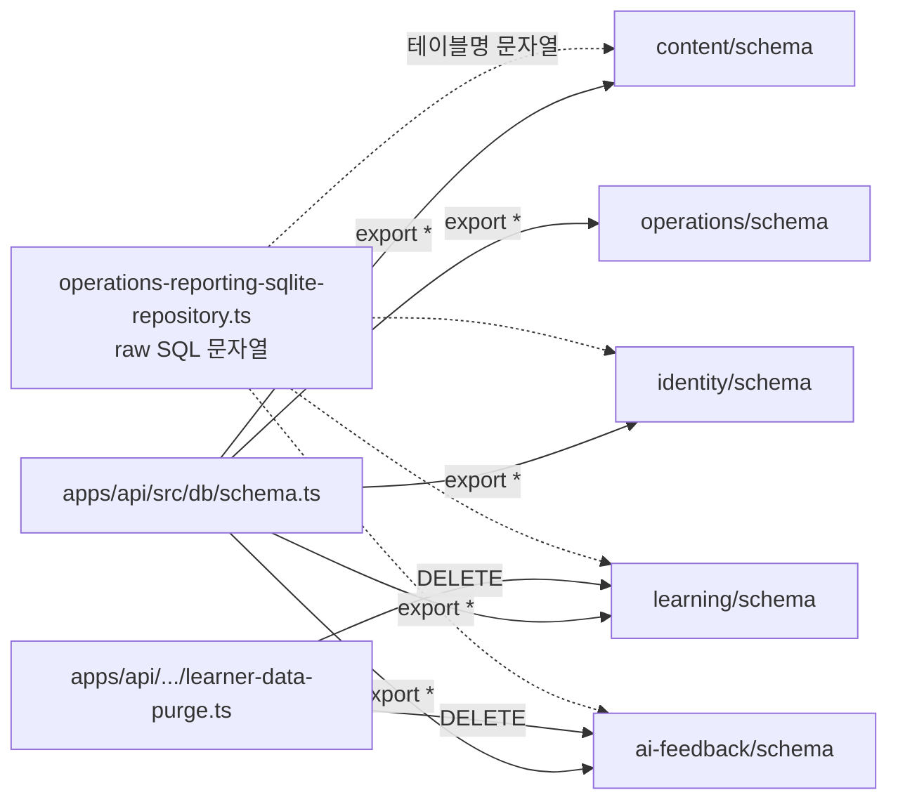

# 01 · 지형도

## 측정 기준

- 기준 commit: `6adc2069bafd3b9c61a5a0589c705fbf85b0e9d6` (main, 2026-07-29), working tree clean
- 총 commit 수: 1,193 (`git rev-list --count HEAD`)
- 측정 환경: Windows / pwsh, Bun 1.3.10, Node v24.15.0, git 2.44.0
- LOC는 `git ls-files` 추적 파일만 대상으로 하며 **비어 있지 않은 줄(SLOC)** 기준이다.
- 제외 대상과 근거
  | 제외 | 근거 |
  | --- | --- |
  | `.turbo/cache` (1,461 파일) | turbo 빌드 캐시 생성물, git 미추적 |
  | `.artifacts/repomix` | repomix 도구 생성물, git 미추적 |
  | `apps/*/.next`, `node_modules`, `bun.lock` | 빌드 산출물·설치 산출물 |
  | `docs/archive` | authority-map이 현재 사실 판정에서 제외하도록 규정 |
  | `.playwright-cli` | 추적되고 있으나 코드가 아님 → 삭제 백로그에서 별도 처리 |

## 파일 분포

`git ls-files` 최상위 그룹별 파일 수

| 그룹              | 파일 수 |
| ----------------- | ------- |
| `apps`            | 454     |
| `packages`        | 426     |
| `docs`            | 419     |
| `.agents`         | 122     |
| `infra`           | 31      |
| `scripts`         | 30      |
| `e2e`             | 12      |
| `.playwright-cli` | 11      |
| `deploy`          | 9       |
| `.github`         | 3       |

## 코드 규모

`apps packages scripts e2e` 의 `.ts/.tsx/.mjs/.cjs`

| 구분               | 파일    | SLOC       |
| ------------------ | ------- | ---------- |
| production         | 559     | 51,659     |
| test·story·fixture | 258     | 34,678     |
| **합계**           | **817** | **86,337** |

테스트 : 프로덕션 SLOC 비 = **0.67 : 1**

## 영역별 프로덕션 SLOC (상위)

| SLOC  | 파일 | 영역                           |
| ----- | ---- | ------------------------------ |
| 6,790 | 82   | `apps/web/src`                 |
| 6,556 | 74   | `apps/api/src`                 |
| 6,473 | 27   | `packages/modules/learning`    |
| 6,412 | 80   | `apps/admin/src`               |
| 4,702 | 49   | `packages/shared/ui`           |
| 4,323 | 29   | `packages/modules/content`     |
| 2,337 | 44   | `packages/shared/contracts`    |
| 2,053 | 18   | `packages/modules/ai-feedback` |
| 1,795 | 19   | `packages/modules/operations`  |
| 1,609 | 21   | `packages/modules/identity`    |
| 1,140 | 18   | `packages/infra/auth`          |
| 771   | 6    | `packages/infra/db`            |
| 737   | 21   | `packages/infra/http-platform` |

## 거대 파일 상위 15 (총 줄 수)

| 줄    | 경로                                                                                                                |
| ----- | ------------------------------------------------------------------------------------------------------------------- |
| 1,384 | `packages/modules/learning/src/infrastructure/persistence/learning-transition-drizzle-repository.ts`                |
| 1,278 | `packages/modules/content/src/infrastructure/persistence/content-drizzle-repository.ts`                             |
| 805   | `packages/modules/learning/src/infrastructure/persistence/learning-drizzle-repository.test.ts`                      |
| 800   | `packages/modules/content/src/infrastructure/persistence/content-drizzle-repository.test.ts`                        |
| 785   | `e2e/admin-content-publishing.spec.ts`                                                                              |
| 766   | `apps/admin/src/features/course-editor/ui/course-editor-shell.tsx`                                                  |
| 745   | `packages/modules/ai-feedback/src/infrastructure/persistence/ai-feedback-drizzle-repository.test.ts`                |
| 697   | `packages/modules/operations/src/infrastructure/persistence/operations-reporting-metrics-sqlite-repository.test.ts` |
| 696   | `packages/modules/operations/src/infrastructure/persistence/operations-reporting-sqlite-repository.ts`              |
| 684   | `packages/infra/auth/src/learner/credentials-flow.integration.test.ts`                                              |
| 637   | `apps/admin/src/features/analytics/ui/admin-analytics-page.tsx`                                                     |
| 622   | `apps/web/src/features/authentication/ui/auth-page.tsx`                                                             |
| 621   | `packages/modules/learning/src/infrastructure/persistence/learner-read-mapping.ts`                                  |
| 615   | `apps/api/src/lifecycle/server-lifecycle.test.ts`                                                                   |
| 581   | `apps/web/src/features/lesson-session/hooks/use-lesson-draft-sync.ts`                                               |

최대 파일 1개는 **42개 최상위 함수**를 담고 있다 (`learning-transition-drizzle-repository.ts`, 함수 선언 위치 `:89`~`:1382`).

## 툴체인

권위 소스: 루트 [`package.json`](../../../package.json)

| 항목                | 값                                                                 |
| ------------------- | ------------------------------------------------------------------ |
| 패키지 매니저       | `bun@1.3.10`                                                       |
| Node engines        | `24.x` (`.nvmrc` = `24`)                                           |
| TypeScript          | `npm:@typescript/typescript6@6.0.2` (`tsc7 --noEmit`)              |
| 빌드 오케스트레이션 | turbo `^2.8.8`                                                     |
| 린터                | oxlint `1.70.0` (+ js plugin `scripts/oxlint/workspace-rules.mjs`) |
| 포매터              | oxfmt `^0.55.0`                                                    |
| 테스트              | vitest `4.1.10`, Playwright `^1.58.2`                              |
| 백엔드              | hono `4.12.25`, `@hono/zod-openapi` `1.4.0`, drizzle-orm `0.45.2`  |
| 프론트              | next `16.2.12`, react `19.2.8`, tailwind `4.3.2`                   |
| 계약 생성           | orval `8.23.0` (OpenAPI → client + MSW)                            |
| 아키텍처 검사       | dependency-cruiser `18.1.0`, knip `6.29.0`, syncpack `15.3.2`      |

## workspace 구성 (24개 turbo task 대상)

```
apps/        web, admin, api, storybook
packages/modules/   content, learning, identity, ai-feedback, operations
packages/infra/     auth, db, http-platform, http-client, ai, observability, storage
packages/shared/    contracts, ui, kernel, types
packages/config/    env, nextjs-config, typescript-config
```

## 패키지 의존성 그래프

각 workspace `package.json` 의 `dependencies` 중 `@workspace/*` 만 추출. 순환 없음 (`depcruise` 결과: 1,435 모듈 / 3,301 의존 / 위반 0).



### 모듈 간 실제 import edge

패키지 선언이 아니라 실제 import 문 기준. 전부 **schema(FK) 층**과 도메인 함수 1건이다.

| from        | to                        | 위치                                                                       |
| ----------- | ------------------------- | -------------------------------------------------------------------------- |
| learning    | content/application       | `learning/src/infrastructure/persistence/published-curriculum-mapper.ts:2` |
| learning    | content/schema            | `learning/src/infrastructure/persistence/schema.ts:7`                      |
| ai-feedback | content/schema            | `ai-feedback/src/infrastructure/persistence/schema.ts:6`                   |
| learning    | auth/schema (`authUsers`) | `learning/src/infrastructure/persistence/schema.ts:2`                      |
| identity    | auth/schema (`authUsers`) | `identity/src/infrastructure/persistence/schema.ts:3`                      |
| ai-feedback | auth/schema (`authUsers`) | `ai-feedback/src/infrastructure/persistence/schema.ts:2`                   |

단일 SQLite 공유 결정(ADR-0021)의 직접 결과다. 모듈 경계는 코드 층에서는 지켜지지만 **데이터 층에서는 FK로 묶여 있다.**

### 경계를 넘는 실제 결합 (dependency-cruiser가 허용하는 경로)



점선은 **타입 시스템이 검증하지 못하는 결합**이다.

## 진입점과 데이터 흐름

| 진입점        | 파일                                                                                         |
| ------------- | -------------------------------------------------------------------------------------------- |
| API 프로세스  | `apps/api/src/main.ts:33` (`parseApiEnv` → `createContainer` → `createApp`)                  |
| 컨테이너 조립 | `apps/api/src/composition/create-container.ts:120` (411 SLOC)                                |
| 통합 HTTP app | `apps/api/src/http/unified-app.ts` (learner + admin)                                         |
| learner 웹    | `apps/web/src/app/**` (Next App Router, `(learner)` / `(lesson)` 그룹)                       |
| admin 웹      | `apps/admin/src/app/(admin)/**`                                                              |
| 계약 생성     | `apps/api/src/scripts/generate-openapi.ts` → orval → `packages/infra/http-client/.generated` |

```
브라우저 → Next(web/admin) → /api/* rewrite 또는 직접 → Hono unified-app
  → module interface/http (register*Routes) → application (use case)
  → domain (정책) / ports → infrastructure/persistence (drizzle) → 단일 SQLite
```

## 변경 빈도 핫스팟

현재 존재하는 파일만 대상 (`git log --name-only`, 전체 이력)

| 변경 횟수 | 파일                                                                                   |
| --------- | -------------------------------------------------------------------------------------- |
| 66        | `apps/web/package.json`                                                                |
| 59        | `apps/api/package.json`                                                                |
| 45        | `apps/api/src/main.ts`                                                                 |
| 43        | `apps/admin/package.json`                                                              |
| 29        | `apps/api/.env.example`                                                                |
| 28        | `apps/web/src/app/layout.tsx`                                                          |
| 26        | `apps/api/tsconfig.json`                                                               |
| 21        | `apps/api/src/env.test.ts`                                                             |
| 20        | `apps/api/src/routes/test-dependencies.ts`                                             |
| 19        | `apps/api/src/config/env.ts` / `apps/web/next.config.ts` / `apps/web/src/app/page.tsx` |
| 18        | `apps/api/src/env.ts` / `apps/admin/next.config.ts`                                    |

읽는 방법: 상위권이 manifest·설정·조립 파일에 몰려 있다. 이 저장소는 **도메인 로직보다 경계·설정을 더 자주 바꿔 왔다.** 대규모 재구조화(`apps/admin-api`, `packages/core`, `apps/web/src/features/lessons` 등 삭제 경로가 이력 상위)를 여러 차례 거친 흔적이다.

`env` 관련 3개 파일(`config/env.ts` 19회, `env.test.ts` 21회, `env.ts` 18회)이 함께 상위권인 것은 F-13(재수출 shim)이 실제 변경 비용을 만들고 있다는 신호다.

## 도메인 용어 대조

| 기획·문서 어휘  | 코드 어휘                                                                 | 불일치                                                                                     |
| --------------- | ------------------------------------------------------------------------- | ------------------------------------------------------------------------------------------ |
| 학습자          | `LearnerId`, `UserId`, `authUsers`, `learnerProfiles`                     | 하나의 개념에 4개 식별자. `authUsers`는 infra/auth, `learnerProfiles`는 identity 모듈 소유 |
| 관리자          | `AdminId`, `adminIdSchema`                                                | 일관                                                                                       |
| 레슨            | `LessonId` / `LearnerLessonDto as Lesson` (11곳)                          | 프론트에 고유 `Lesson` 타입 없이 전송 DTO를 도메인 이름으로 별칭                           |
| 학습 날짜 경계  | `platformLearningTimeZone`, `"Asia/Seoul"`, `seoulOffsetMs`, `'+9 hours'` | 5가지 표현 (F-05)                                                                          |
| — (기획에 없음) | `ConversationId`, `MessageId`                                             | 코드에만 존재하는 사장 개념 (F-17)                                                         |

`docs/glossary.md`는 **13줄**이다. 프로덕션 코드 51,659 SLOC과 `docs/research` 40,807줄에 대비해 유비쿼터스 언어 정의가 가장 얇은 산출물이다.

## 문서 규모

| 줄         | 파일    | 영역               |
| ---------- | ------- | ------------------ |
| 40,807     | 215     | `docs/research`    |
| 11,603     | 71      | `docs/archive`     |
| 3,764      | 54      | `docs/engineering` |
| 2,381      | 44      | `docs/product`     |
| 1,729      | 24      | `docs/design`      |
| 630        | 7       | `docs/work`        |
| 13         | 1       | `docs/glossary.md` |
| **61,086** | **419** | 합계               |

`docs/research`가 전체 문서의 **67%**, 프로덕션 코드 SLOC의 **79%** 다. `docs/authority-map.md`는 이를 "현재 제품 정책의 권위 소스가 아니다"라고 명시한다.

## 정적 검사 실행 결과 (실측)

| 명령                            | 결과                                               | 소요                             |
| ------------------------------- | -------------------------------------------------- | -------------------------------- |
| `bun install --frozen-lockfile` | EXIT 0, 변경 없음                                  | 1.3s                             |
| `bun run typecheck`             | EXIT 0, 24 task (18 cached)                        | 6.2s                             |
| `bun run lint`                  | EXIT 0                                             | 9.0s                             |
| `bun run format:check`          | EXIT 0, 1,358 파일                                 | 5.4s                             |
| `bun run check:architecture`    | EXIT 0, 위반 0 (1,435 모듈 / 3,301 의존)           | —                                |
| `bun run check:dependencies`    | EXIT 0, 이슈 0                                     | —                                |
| `bun run test:oxlint-rules`     | EXIT 0                                             | —                                |
| `bun run check:knip`            | **EXIT 1** — 미사용 export 1건                     | —                                |
| `bun run build`                 | **EXIT 1** — web·admin next.config 로드 실패       | —                                |
| `bun run check:toolchain`       | **EXIT 1** — 스크립트 부재                         | —                                |
| `bun run audit:production`      | EXIT 0, 취약점 0                                   | —                                |
| `bun run test` (전 workspace)   | EXIT 0 — 201 파일 / 742 케이스 / 912 통과 / 2 skip | api 8.5s, web 39.6s, admin 35.7s |

### 패키지별 테스트 실측

| 패키지        | 파일 | 케이스        |
| ------------- | ---- | ------------- |
| api           | 37   | 137 (+1 skip) |
| admin         | 37   | 111           |
| web           | 35   | 126           |
| learning      | 15   | 98            |
| contracts     | 13   | 86            |
| auth          | 11   | 48            |
| content       | 10   | 58            |
| ai-feedback   | 7    | 59            |
| identity      | 6    | 30            |
| operations    | 6    | 23            |
| ui            | 6    | 13            |
| db            | 5    | 25 (+1 skip)  |
| http-platform | 5    | 30            |
| env           | 2    | 29            |
| http-client   | 2    | 17            |
| storage       | 2    | 7             |
| ai            | 1    | 4             |
| observability | 1    | 11            |

케이스당 평균 **46.7 SLOC**.

## 공개 표면 규모

`package.json` `exports` subpath 수 (수동 관리)

| 수      | 패키지                                                                    |
| ------- | ------------------------------------------------------------------------- |
| 49      | `@workspace/ui`                                                           |
| 29      | `@workspace/contracts`                                                    |
| 13      | `@workspace/auth`                                                         |
| 12      | `@workspace/identity`                                                     |
| 9       | `@workspace/operations`                                                   |
| 7       | `@workspace/learning`, `@workspace/ai-feedback`, `@workspace/http-client` |
| 6       | `@workspace/db`                                                           |
| 5       | `@workspace/content`, `@workspace/nextjs-config`                          |
| 4       | `@workspace/http-platform`, `@workspace/observability`                    |
| 3       | `@workspace/env`, `@workspace/typescript-config`                          |
| 2       | `@workspace/kernel`, `@workspace/types`, `@workspace/storage`             |
| 1       | `@workspace/ai`                                                           |
| **170** | 합계                                                                      |
