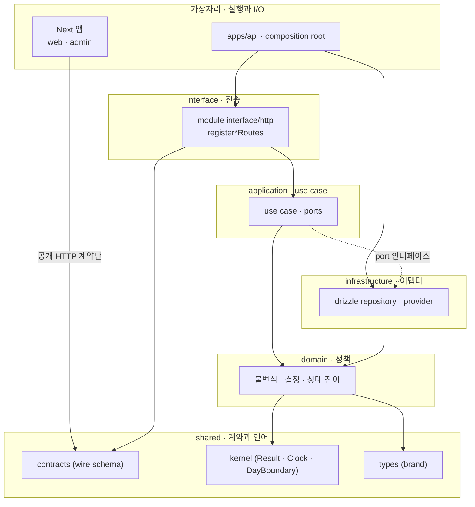

# 03 · 목표 설계 (To-Be)

## 불변 제약

바꾸지 않는다: 모듈러 모놀리스, TypeScript, Next.js 프론트엔드, Hono 백엔드, 제품 기획.
따라서 이 설계는 **구조 교체가 아니라 경계 계약의 정밀화**다. 새 프레임워크·새 런타임·새 저장소를 도입하지 않는다.

## 설계 목표

근본 원인(02 문서 Phase 3)에 1:1로 대응한다.

| 목표                                     | 대응 원인 | 판정 기준                                                                                  |
| ---------------------------------------- | --------- | ------------------------------------------------------------------------------------------ |
| G1. 게이트가 스스로 살아 있음을 증명한다 | R-1       | workflow가 참조하는 모든 script의 존재를 정적 검사가 확인. 로컬과 CI가 동일 입력으로 build |
| G2. 도메인 개념마다 정본이 하나다        | R-2       | 시간대·식별자·레슨 타입의 선언 위치가 각 1곳. 용어집이 그 위치를 가리킨다                  |
| G3. 데이터 경계가 타입으로 검사된다      | R-3       | 모듈 테이블에 대한 외부 쓰기가 컴파일 에러. 크로스-모듈 읽기가 명시적 계약을 통과          |
| G4. 실패 정보가 경계를 통과해도 보존된다 | R-4       | 모든 실패가 `cause`를 운반. 오류 등급(재시도 가능/불가)이 정확                             |
| G5. 삭제가 추가만큼 쉽다                 | R-5       | 기능 1개 제거가 단일 디렉터리 + 포트 구현 제거로 완결                                      |

## 모듈 경계와 의존성 방향

의존성은 항상 바깥→안쪽. 안쪽(domain)은 프레임워크·ORM·HTTP를 모른다. 현행 `module-domain-application-do-not-import-framework-or-db` 규칙이 이미 이를 강제하며 유지한다.



핵심 변경은 세 가지다.

### 변경 1 · 모듈 공개 표면을 4개로 고정

현행 5개 모듈이 5~12개 subpath를 서로 다른 관례로 공개한다(F-08~F-11). 이를 다음으로 정규화한다.

| subpath              | 목적                                     | 허용 소비자                     | 근거                                                  |
| -------------------- | ---------------------------------------- | ------------------------------- | ----------------------------------------------------- |
| `./module`           | 모듈 조립 팩토리 하나                    | `apps/api/src/composition/**`   | 조립 방법은 모듈이 소유한다. app은 검증된 설정만 주입 |
| `./http`             | `register*Routes`                        | `apps/api/src/http/**`          | 엔드포인트 소유자는 모듈                              |
| `./ports`            | 외부가 구현하거나 소비하는 포트 **타입** | 모든 workspace                  | 크로스-모듈 협력의 유일한 어휘                        |
| `./migration-schema` | Drizzle 테이블 정의                      | **`apps/api/src/db/**` 전용\*\* | 단일 migration 계보(ADR-0019)에만 필요                |

사라지는 것: `./schema`(전역 공개), `./mapping`, `./audit-repository`, `./reporting-repository`, `./provider`, `./seed`, `./application`, `./maintenance`, `./register-routes`, `./reporting`, `./queries`, `./sessions`, `./admin-actor`, `./learner-profile`, `./user-status`.

이름을 `./schema` → `./migration-schema`로 바꾸는 이유는 **소비자에게 용도를 강제로 알리기 위해서**다. depcruise 규칙을 하나 추가해 `apps/api/src/db/` 밖에서의 소비를 차단하면, F-06의 `learner-data-purge.ts`가 타 모듈 테이블을 직접 DELETE하는 경로가 컴파일 단계에서 막힌다.

```js
// dependency-cruiser.config.mjs 추가 규칙
{
  name: "migration-schema-is-app-database-only",
  severity: "error",
  from: { pathNot: "^apps/api/src/db/" },
  to: { path: "^packages/modules/[^/]+/src/infrastructure/persistence/schema\\.ts$" },
}
```

### 변경 2 · 크로스-모듈 관심사를 포트 레지스트리로 표현

`apps/api`가 직접 구현하고 있는 두 횡단 관심사를 각 모듈의 책임으로 되돌린다.

**학습자 데이터 삭제 (F-06, 29파일 → 모듈별 1파일 + app 1파일)**

```ts
// packages/shared/kernel/src/learner-data.ts  (새 파일, 계약만)
export type LearnerDataPurgePort = Readonly<{
  moduleName: string
  purge: (
    learnerId: LearnerId
  ) => Promise<Result<PurgedRowCounts, PurgeFailure>>
}>

// 각 모듈: packages/modules/learning/src/infrastructure/persistence/learner-purge.ts
// 자기 테이블만 삭제. 다른 모듈 schema를 import할 수 없다(변경 1의 규칙).

// apps/api/src/privacy/purge-learner.ts
export function createLearnerPurge(ports: readonly LearnerDataPurgePort[]) {
  return async (learnerId: LearnerId) => {
    for (const port of ports) {
      /* 순회 · 실패 격리 · cause 보존 */
    }
  }
}
```

얻는 것: 새 모듈이 학습자 데이터를 저장하면 `LearnerDataPurgePort` 미구현이 **조립 시점 타입 에러**가 된다. 현재는 조용히 누락된다.
잃는 것: 삭제 순서(FK 의존)를 레지스트리 배열 순서로 표현해야 한다. 이는 `create-container`에서 명시적 배열로 두어 가시화한다.

**운영 리포팅 (F-07, raw SQL 380줄)**

두 가지 선택지가 있다. 아래 "대안 비교"에서 다룬다.

### 변경 3 · 오류 모델을 3층으로 축약

현행: domain 실패 → application 오류 → 모듈 HTTP 중간 shape → `AppError` → wire (최대 5단계, 타입 44개, 매퍼 14개).
목표: **domain 실패 → `AppError` → wire (2회 변환)**.

```ts
// packages/shared/kernel/src/failure.ts  (새 파일)
export type Failure<TKind extends string, TDetail = unknown> = Readonly<{
  kind: TKind
  cause?: unknown // 필수 규약: 예외에서 유래한 실패는 반드시 채운다
  detail?: TDetail
  retryable: boolean // 오류 등급을 타입으로 강제 (F-14 재발 방지)
}>
```

규칙 3개를 컨벤션으로 승격한다(06 문서).

1. `catch`에서 만드는 실패는 `cause`를 반드시 담는다.
2. `retryable`은 실패 생성 지점에서 결정한다. 전송 계층이 추측하지 않는다.
3. 계층 간 변환은 **정보를 추가할 때만** 허용한다. 이름만 바꾸는 변환은 만들지 않는다.

```ts
// AS-IS (F-22) — 원인 소실, 감사 실패 무흔적
} catch { return err({ kind: "audit-event-persistence-failed" }) }

// TO-BE
} catch (cause) {
  logger.error({ cause, event: logEventNames.auditPersistenceFailed }, "audit.persist_failed")
  return err({ kind: "audit-event-persistence-failed", cause, retryable: true })
}
```

`assertExhaustiveHttpResult`와 `http-result-exhaustiveness.typecheck.ts`는 그대로 유지한다. variant 누락을 컴파일 시 잡는 현행 장치가 이 축약의 안전망이다.

## 공개 계약

### 도메인 언어 정본

| 개념                 | 정본 위치                                                                     | 금지                                                         |
| -------------------- | ----------------------------------------------------------------------------- | ------------------------------------------------------------ |
| 학습 날짜 경계       | `packages/shared/kernel/src/day-boundary.ts` (`timeZone` + `sqliteOffset`)    | 리터럴 `"Asia/Seoul"`, `9*60*60*1000`, SQL `'+9 hours'`      |
| 식별자 브랜드        | `packages/shared/types/src/ids.ts`                                            | 모듈 내 재선언                                               |
| 식별자 스키마 팩토리 | `packages/shared/contracts/src/identifier.ts` (단일 `createIdentifierSchema`) | `createIdSchema` 중복 정의                                   |
| 실패 표현            | `packages/shared/kernel/src/failure.ts`                                       | 계층별 재선언                                                |
| Result               | `packages/shared/kernel/src/result.ts` (현행 유지)                            | —                                                            |
| 학습자 화면 모델     | `apps/web/src/features/*/model/*`                                             | `Awaited<ReturnType<typeof fetcher>>`를 도메인 이름으로 별칭 |
| wire 스키마          | `packages/shared/contracts/**`                                                | 앱에서 재선언                                                |

`docs/glossary.md`는 이 표를 사람의 어휘로 서술하고 각 행의 정본 위치를 링크한다(F-33).

### 오류 모델 (wire)

현행 `packages/shared/contracts/src/api-error.ts`를 유지한다. `code`가 `^[A-Z][A-Z0-9_]*$`이고 `requestId`가 필수인 현재 계약은 충분하다. 변경은 서버 내부 변환 횟수뿐이며 **wire 계약은 바꾸지 않는다** — 프론트엔드 재작업이 발생하지 않는다.

### 포트 인터페이스 규약

- 포트는 `application/ports/`에 **타입만** 둔다. 구현체는 절대 두지 않는다(현행 유지).
- 포트 메서드는 `Promise<Result<TValue, Failure<...>>>` 또는 순수 조회면 `Promise<TValue | null>`.
- 모듈이 다른 모듈을 필요로 하면 **자기 어휘로 포트를 선언**하고 app이 어댑터를 제공한다(현행 `LearningContentQueryPort` 패턴 — 좋은 선례이므로 표준으로 승격).

## 폴더 구조

바뀌는 부분만 표기한다. 표시 없는 경로는 현행 유지.

```
packages/
  shared/
    kernel/src/
      result.ts                 (현행)
      clock.ts                  (현행)
      day-boundary.ts           신규 · G2 · 시간대 정본
      failure.ts                신규 · G4 · 실패 표현 정본
      learner-data.ts           신규 · G3 · LearnerDataPurgePort
    contracts/src/
      identifier.ts             신규 · F-24 통합 (기존 3중 팩토리 대체)
    types/src/
      ids.ts                    ConversationId · MessageId 제거 (F-17)

  modules/<module>/
    package.json                exports 4개로 축약 (module · http · ports · migration-schema)
    src/
      domain/                   (현행)
      application/
        ports/                  (현행)
      infrastructure/
        persistence/
          schema.ts             → ./migration-schema 로만 공개
          learner-purge.ts      신규 · 자기 테이블만 삭제
          reporting-view.ts     신규 · operations에 공개할 읽기 계약 (대안 1 채택 시)
      interface/http/           (현행)
      module.ts                 유일한 조립 진입점 (content는 신규)
    test/
      fixtures/                 신규 · F-29 셋업 공유

apps/api/src/
  env.ts                        config/env.ts 를 여기로 통합, shim 제거 (F-13)
  composition/                  (현행) · learning 우선 조립으로 이중 조립 제거 (F-12)
  db/
    schema.ts                   ./migration-schema 만 소비 (유일 허용 지점)
  privacy/
    purge-learner.ts            포트 레지스트리 순회 (adapters/identity/learner-data-purge.ts 대체)
  http/
    openapi.ts                  openapi/ 와 admin/admin-openapi.ts 를 여기로 통합 (F-2 인지 부하)
  test-support/
    learner-app-fixture.ts      routes/test-dependencies.ts 이동 + 실 조립 재사용 (F-15)
  ⊘ routes/                     디렉터리 제거
  ⊘ admin/                      http/ 로 흡수
  ⊘ openapi/                    http/ 로 흡수
  ⊘ context/                    middleware/ 로 흡수

apps/web/src/features/lesson-session/
  model/lesson-view-model.ts    신규 · DTO 별칭 11곳 대체 (F-27)
  api/draft-transport.ts        신규 · keepalive/sendBeacon flush + AbortController (F-25, F-26)
```

각 경계가 존재하는 이유를 한 줄로 답할 수 있어야 한다.

| 경계                       | 존재 이유                                                                                        |
| -------------------------- | ------------------------------------------------------------------------------------------------ |
| `shared/kernel`            | 모든 계층이 공유하지만 도메인에 속하지 않는 어휘(결과·시간·실패). 여기에 제품 규칙을 두지 않는다 |
| `shared/contracts`         | 프론트와 백엔드가 **동시에** 의존하는 유일한 지점. wire 호환성의 소유자                          |
| `shared/types`             | 브랜드 식별자. 런타임 코드 0                                                                     |
| `modules/*/domain`         | 프레임워크 없이 테스트 가능한 제품 규칙                                                          |
| `modules/*/application`    | use case 흐름과 포트 선언                                                                        |
| `modules/*/infrastructure` | 교체 가능한 어댑터. 모듈 밖에서 보이지 않아야 한다                                               |
| `modules/*/interface/http` | 전송 관심사(검증·세션·응답 변환)                                                                 |
| `infra/*`                  | 벤더·런타임 격리. 제품 어휘를 담지 않는다                                                        |
| `apps/api`                 | 유일한 조립 지점. 설정을 읽는 유일한 곳                                                          |
| `apps/web`, `apps/admin`   | 공개 HTTP 계약만 소비                                                                            |

## 대안 비교 · 운영 리포팅의 크로스-모듈 읽기 (F-07)

이것이 이 설계에서 유일하게 되돌리기 어려운 결정이다.

### 대안 1 · 모듈 공개 읽기 뷰 (Read-view contract)

각 모듈이 `infrastructure/persistence/reporting-view.ts`에서 리포팅용 Drizzle view 또는 타입 있는 쿼리 함수를 공개하고, operations가 그것만 조합한다.

```ts
// packages/modules/learning/src/infrastructure/persistence/reporting-view.ts
export const learnerActivityReportingView = sqliteView("learning_activity_reporting").as(...)
// operations는 @workspace/learning/ports 를 통해 타입만 알고, view 이름은 계약으로 고정
```

| 항목                 | 평가                                                          |
| -------------------- | ------------------------------------------------------------- |
| 복잡도 비용          | 낮음. 기존 SQL을 view로 옮기고 이름만 계약화                  |
| 스키마 드리프트 검출 | 컴파일 시 부분 검출 + migration 시 view 생성 실패로 즉시 검출 |
| 성능                 | 동일 (SQLite view는 인라인 확장)                              |
| 가역성               | 높음. view를 걷어내면 현행으로 복귀                           |
| 남는 위험            | operations가 view 컬럼 의미를 오해할 여지는 남는다            |
| 예상 공수            | 2 MD                                                          |

### 대안 2 · 이벤트 기반 읽기 모델 (CQRS 방향)

각 모듈이 도메인 이벤트를 발행하고, operations가 자기 소유 읽기 모델 테이블을 갱신한다. 크로스-모듈 join이 사라진다.

| 항목                 | 평가                                                                                                          |
| -------------------- | ------------------------------------------------------------------------------------------------------------- |
| 복잡도 비용          | **높음**. 이벤트 계약, 발행 트랜잭션 경계, 순서 보장, 읽기 모델 재구축 절차, 지연 일관성이 제품 요구에 미포함 |
| 스키마 드리프트 검출 | 완전 차단(operations가 타 모듈 테이블을 아예 모름)                                                            |
| 성능                 | 조회는 개선, 쓰기 경로에 부하 추가                                                                            |
| 가역성               | **낮음**. 읽기 모델 데이터가 생기면 되돌리기 어렵다                                                           |
| 남는 위험            | 대시보드 수치가 지연 일관성을 갖게 되어 `docs/product/metrics.md` 정의 재확인 필요                            |
| 예상 공수            | 12 MD 이상                                                                                                    |

### 권고 · 대안 1

이유 세 가지.

1. **문제 규모에 비례한다.** F-07의 실제 위험은 "타 모듈 컬럼 변경이 런타임까지 발견되지 않음"이다. view 계약으로 migration 시점까지 앞당기면 위험의 대부분이 사라진다. 이벤트 도입은 이 위험을 위해 지불하기에는 과하다.
2. **가역적이다.** view는 언제든 인라인 SQL로 되돌릴 수 있다. 읽기 모델 테이블은 데이터가 축적되면 되돌릴 수 없다.
3. **제품이 요구하지 않는다.** `docs/product/admin-operations.md`와 `metrics.md`는 실시간 정합성을 전제한다. 지연 일관성은 지금 필요하지 않은 성질이고, 필요해지기 전에 도입하면 YAGNI 위반이다.

대안 2는 다음 조건이 관측되면 재검토한다: 대시보드 질의가 사용자 요청 경로의 p95를 악화시킬 때, 또는 모듈 하나를 별도 프로세스로 분리해야 할 때.

## 대안 비교 · 모듈 공개 표면 (F-08~F-11)

### 대안 A · exports 4개 고정 + depcruise 규칙 추가 (권고)

| 얻는 것                                                    | 잃는 것                                                                                                               |
| ---------------------------------------------------------- | --------------------------------------------------------------------------------------------------------------------- |
| 모듈 내부 교체가 공개 계약 변경이 아니게 된다              | `create-container.ts`가 concrete adapter를 못 고른다 → 테스트에서 fake 주입 방식을 `module.ts` 파라미터로 옮겨야 한다 |
| `migration-schema` 소비자 제한으로 F-06 경로가 컴파일 차단 | 조립 파라미터가 모듈별로 늘어난다                                                                                     |
| 170개 subpath → 약 40개                                    | —                                                                                                                     |
| depcruise `modulePublicTargetPattern`이 자동으로 좁아진다  | —                                                                                                                     |

공수 4 MD. 가역성 높음(exports는 되돌릴 수 있다).

### 대안 B · 현행 유지 + 문서화

| 얻는 것          | 잃는 것                                            |
| ---------------- | -------------------------------------------------- |
| 공수 0.5 MD      | F-06·F-08·F-09가 남는다. 규칙이 아니라 규율에 의존 |
| 조립 유연성 유지 | 신규 모듈마다 관례 판단 비용                       |

권고는 **대안 A**다. 근거: F-06(개인정보 미삭제 위험)이 규율만으로 막히지 않는다는 것이 이미 증명됐다 — `learner-data-purge.ts`가 depcruise 위반 0인 상태로 타 모듈 테이블을 삭제하고 있다. 문서는 이 경로를 금지하지 못했다.

## 도입하지 않을 것

패턴을 위한 패턴을 배제한다는 원칙에 따라 다음은 검토 후 제외한다.

| 후보                                      | 제외 이유                                                                                                     |
| ----------------------------------------- | ------------------------------------------------------------------------------------------------------------- |
| 이벤트 버스 / 도메인 이벤트               | 위 대안 2. 현재 문제 규모에 비해 복잡도·비가역성 과다                                                         |
| 리포지토리 위 별도 Unit of Work           | Drizzle 트랜잭션이 이미 그 역할. 추가 층은 얕은 모듈이 된다                                                   |
| 상태 관리 라이브러리(zustand 등)          | `lesson-session-machine.ts`가 이미 존재. 새 라이브러리가 아니라 F-25·F-26의 전송 primitive 교체가 문제        |
| 데이터 페칭 라이브러리(TanStack Query 등) | F-26의 취소는 `AbortController` 배선으로 해결된다. 라이브러리 도입은 초안 동기화 프로토콜을 재작성하게 만든다 |
| 모노레포 도구 교체                        | turbo 캐시가 typecheck 6.2초를 만들고 있다. 문제는 도구가 아니라 게이트 실행(F-01)                            |
| 코드 생성 확대                            | 이미 OpenAPI→orval 체인이 있고 F-27은 그 출력을 UI가 직접 소비하는 것이 문제. 생성을 늘리면 악화된다          |
