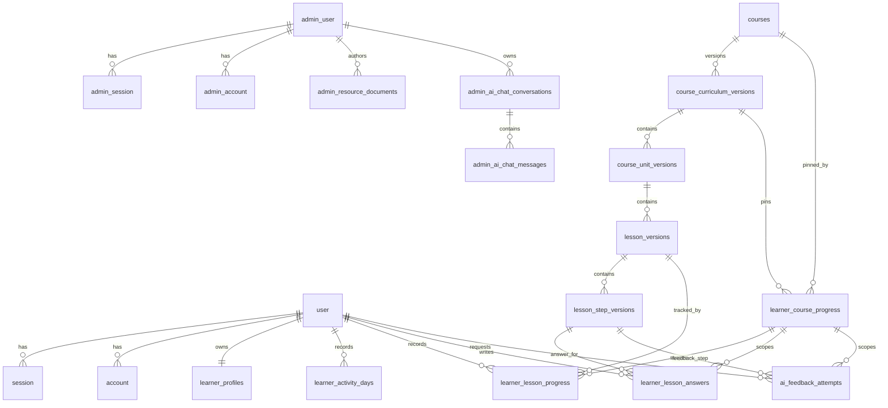
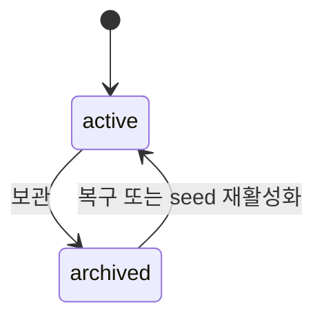
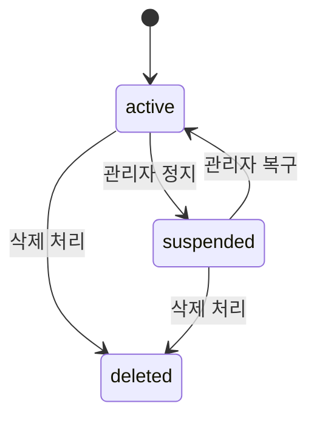
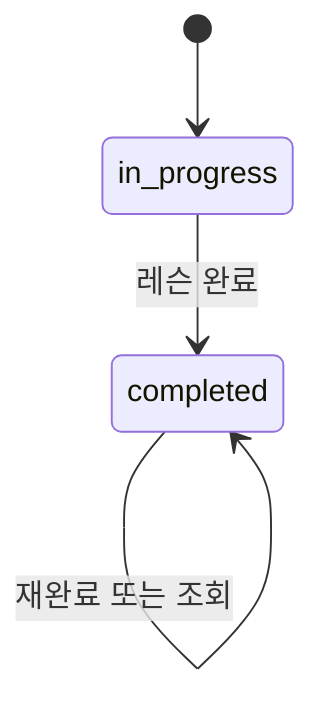

# 데이터 모델

이 문서는 writing-app의 엔티티, DB 관계와 상태 값을 설명한다. 제품 불변식은 `docs/product/content-model.md`, 실제 DB schema와 migration은 `packages/db`가 권위 소스이며 `docs/authority-map.md`가 소유 관계를 안내한다.

## 기준

- 기준 파일:
  - `packages/db/src/schema/*.schema.ts`
  - `packages/db/src/persisted-values.ts`
  - `packages/db/src/migrations/0000-writing-app-baseline.sql`
  - `packages/db/src/seeds/*`

## 모델 원칙

- 콘텐츠는 `Course -> Unit -> Lesson -> Step` 계층이다.
- 커리큘럼은 `docs/product/content-model.md`와 현재 `packages/db` schema가 정의한 관계형 `draft | published` 버전 모델을 사용한다. ADR-0011은 이 모델을 채택한 배경 결정이며 현재 값의 권위 소스가 아니다.
- 코스 보관은 코스 identity만 `archived`로 바꾸며 published 버전과 학습자 고정은 삭제하지 않는다.
- 학습 진행, 답변과 AI 시도는 학습자에게 고정된 커리큘럼 버전 범위의 레슨·스텝을 참조한다.
- 학습자 인증 테이블과 관리자 인증 테이블은 분리한다.
- DB row 이름은 API DTO로 그대로 노출하지 않는다.

## ERD

## 인증 테이블

Better Auth adapter 계약을 따른다.

| 테이블               | 소유               | 설명                   |
| -------------------- | ------------------ | ---------------------- |
| `user`               | 학습자 Better Auth | 학습자 사용자          |
| `session`            | 학습자 Better Auth | 학습자 세션            |
| `account`            | 학습자 Better Auth | OAuth 계정 연결        |
| `verification`       | 학습자 Better Auth | 인증 검증 값           |
| `admin_user`         | 관리자 Better Auth | 관리자 사용자와 role   |
| `admin_session`      | 관리자 Better Auth | 관리자 세션            |
| `admin_account`      | 관리자 Better Auth | 관리자 credential 계정 |
| `admin_verification` | 관리자 Better Auth | 관리자 인증 검증 값    |

관리자 role은 `admin_user.role`에 저장하며 값은 `owner | operator`다.

## 콘텐츠 테이블

| 테이블                       | 주요 컬럼                                                                                   | 설명                                    |
| ---------------------------- | ------------------------------------------------------------------------------------------- | --------------------------------------- |
| `courses`                    | `id`, `status`, `sort_order`, `published_curriculum_version_id`, `created_at`               | 코스 identity, 보관 상태, 발행 포인터   |
| `course_curriculum_versions` | `id`, `course_id`, `revision`, `edit_version`, `status`, 코스 표시 metadata, `published_at` | 변경 가능한 단일 draft와 불변 published |
| `course_unit_versions`       | `curriculum_version_id`, `id`, `title`, `sort_order`, `status`                              | 버전 범위 유닛                          |
| `lesson_versions`            | `curriculum_version_id`, `id`, `unit_id`, 제목·설명·요약·시간·순서·상태                     | 버전 범위 레슨                          |
| `lesson_step_versions`       | `curriculum_version_id`, `id`, `lesson_id`, `type`, `sort_order`, `content_json`, `status`  | 버전 범위 스텝                          |

하위 콘텐츠의 영속 identity는 `(curriculum_version_id, 논리 ID)` 복합 키다. 코스당 `draft`는 partial unique index로 하나만 허용하며 baseline trigger가 published 버전과 하위 콘텐츠의 수정·삭제를 거절한다. `revision`은 발행 순서이고 `edit_version`은 draft 저장의 `If-Match` 검증자다.

현재 content status 값은 코드 기준 `active | archived`다. 과거 문서의 `deprecated`는 현재 persisted 값에 없다.

표준 step type은 다음 10개다.

- `READING`
- `COMPARE`
- `MULTIPLE_CHOICE`
- `FILL_BLANK`
- `SELECT`
- `ORDER`
- `WRITE`
- `AI_FEEDBACK`
- `MATCH`
- `CATEGORIZE`

## 학습 테이블

| 테이블                    | 주요 컬럼                                                                                                      | 설명                            |
| ------------------------- | -------------------------------------------------------------------------------------------------------------- | ------------------------------- |
| `learner_profiles`        | `user_id`, `status`, `display_name`, `deleted_at`                                                              | 앱 소유 학습자 프로필           |
| `learner_activity_days`   | `user_id`, `activity_date`, `first_activity_at`, `last_activity_at`, `completed_lessons`, `saved_answers`      | Asia/Seoul 기준 학습 활동 날짜  |
| `learner_course_progress` | `user_id`, `course_id`, `curriculum_version_id`, `status`, 활동·시작·완료 시각                                 | 코스별 immutable 버전 고정      |
| `learner_lesson_progress` | `user_id`, `course_id`, `curriculum_version_id`, `lesson_id`, `current_step_id`, `status`, 시작·완료·수정 시각 | 버전 범위 레슨 진행             |
| `learner_lesson_answers`  | `user_id`, `course_id`, `curriculum_version_id`, `lesson_id`, `step_id`, `answer_json`, 답변·수정 시각         | 버전 범위 스텝 답변             |
| `ai_feedback_attempts`    | `id`, `user_id`, `course_id`, `curriculum_version_id`, `lesson_id`, `step_id`, 시도·상태·결과·시각             | 버전 범위 AI 피드백 예약과 결과 |

학습자 상태 값은 `active | suspended | deleted`다.

레슨 진행 상태 값은 `in_progress | completed`다.

`current_step_id`가 영속 기준이다. 현재 전환 API가 사용하는 `currentStepIndex`는 고정된 버전의 스텝 `sort_order`로 변환하거나 조회 시 파생하며 DB에는 저장하지 않는다. 완료 상태는 `in_progress`로 후퇴하지 않는다.

학습자 read model은 시작 전 코스에는 현재 published version을, 시작한 코스에는 `learner_course_progress.curriculum_version_id`를 사용한다. `/progress` keyset은 `last_activity_at DESC, course_id ASC` 순서이며 cursor에는 마지막 두 값을 넣는다. 코스 목록은 선택한 정렬값 뒤에 항상 `course_id ASC`를 tie-breaker로 사용해 같은 key의 페이지 경계에서도 중복이나 누락을 만들지 않는다.

AI 피드백 attempt 상태 값은 `pending | succeeded | failed | expired`다. `pending`과 `succeeded`만 완료 한도 slot을 점유하고, 같은 학습자·레슨·스텝에는 `pending` row를 하나만 허용한다. 같은 범위의 `idempotency_key`는 유일하며 `succeeded` 재요청은 저장된 결과를 재사용한다. provider 실패는 즉시 `failed`, TTL을 넘긴 미완료 예약은 다음 예약 transaction에서 `expired`로 전이해 slot을 반환한다.

## 운영 설정 테이블

| 테이블           | 주요 컬럼                    | 설명                                        |
| ---------------- | ---------------------------- | ------------------------------------------- |
| `admin_settings` | `key`, `value`, `updated_at` | 공지, 법적 문서, 운영 설정 key-value 저장소 |

## 관리자 자료실과 AI 채팅 테이블

관리자 전용 운영 도구는 다음 테이블을 사용한다.

| 테이블                        | 주요 컬럼                                                                                             | 설명                                    |
| ----------------------------- | ----------------------------------------------------------------------------------------------------- | --------------------------------------- |
| `admin_resource_nodes`        | `id`, `kind`, `parent_id`, `name`, `normalized_name`, `status`, `trash_root_id`, 생성·수정 메타데이터 | 최대 3단계 이름순 트리와 재귀 휴지통    |
| `admin_resource_documents`    | `node_id`, `content_markdown`, `version`                                                              | 최신 GFM Markdown 원본과 충돌 감지 버전 |
| `admin_resource_assets`       | `id`, `document_id`, `r2_object_key`, `content_type`, `byte_size`, `created_at`                       | 문서 종속 R2 이미지 메타데이터          |
| `admin_resource_search`       | `node_id`, `name`, `body_text`                                                                        | 활성 문서 제목·본문 FTS5 색인           |
| `admin_ai_chat_conversations` | `id`, `title`, `admin_id`, timestamp                                                                  | 관리자별 AI 채팅 대화                   |
| `admin_ai_chat_messages`      | `id`, `conversation_id`, `role`, `content`, `created_at`                                              | AI 채팅 사용자/어시스턴트 메시지        |

관리자 AI 채팅 목록은 관리자별 최대 50개 대화, 상세는 최대 100개 메시지를 page query에 따라 시간순으로 반환한다. `admin_ai_chat_conversations(admin_id, updated_at)`와 `admin_ai_chat_messages(conversation_id, created_at)` 복합 index가 이 조회를 지원한다.

자료 트리의 `active | trashed` 상태와 `trash_root_id`는 함께 바뀐다. 폴더 휴지통 이동·복원·영구 삭제는 연결된 최대 3단계 하위 트리에 같은 SQLite transaction으로 적용한다. `content_markdown`은 본문의 유일한 원본이고 `version`은 사용자용 이력이 아닌 조건부 저장 검증자다. 제목, Markdown, 검색 색인, 수정 메타데이터와 버전 증가는 한 transaction에서 확정한다. collaboration snapshot, update log, transaction receipt, 전역 tree revision과 자료실 전용 audit event는 저장하지 않는다.

`admin_resource_assets`는 문서에서만 사용하는 R2 객체를 추적한다. JPEG·PNG·WebP와 5MB 상한을 API와 저장 경계에서 검증한다. R2와 SQLite는 같은 transaction을 공유하지 않으므로 객체 정리 실패는 구조화 로그로 관측하며, 이미지 라이브러리나 문서 간 재사용 계약은 만들지 않는다.

## 상태 머신

### 콘텐츠 상태

### 학습자 상태

### 레슨 진행 상태

## Seed 정책

- 기본 seed는 코스마다 revision `1` published와 revision `2` draft를 만들며 각 버전에 기준 콘텐츠 5개 코스, 15개 유닛, 44개 레슨, 136개 스텝을 저장한다.
- `packages/db/src/seeds/content-seed-data.json`가 콘텐츠 seed 원천이다.
- `db:seed`는 baseline migration을 적용한 뒤 기존 published 버전과 학습자 고정을 보존하고 mutable draft만 stable ID 기준으로 교체한다.
- seed에서 사라진 코스 identity만 `archived`로 전환하며 과거 버전은 보존한다.
- 기본 학습자 `user-1`과 `learner_profiles` row를 보장한다.

## 스키마 명명 규칙

- Better Auth가 소유한 테이블과 필드는 provider convention을 따른다.
- 프로젝트가 직접 소유한 테이블과 SQL 컬럼은 snake_case를 사용한다.
- Drizzle TypeScript 속성은 camelCase를 사용할 수 있다.
- 상세 규칙은 `docs/engineering/schema-conventions.md`를 따른다.
