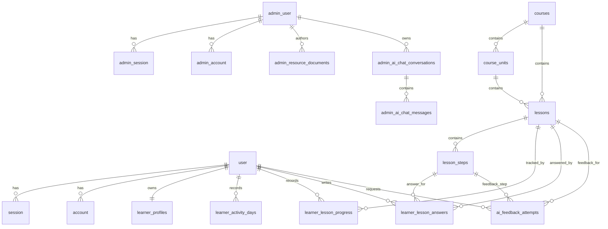
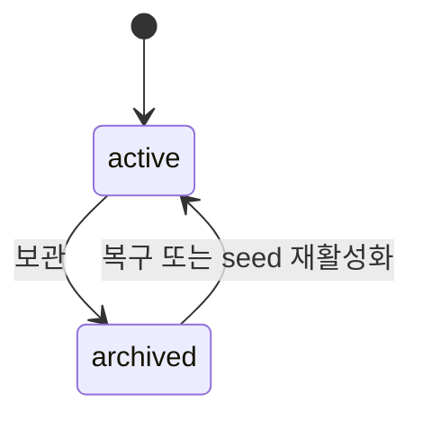
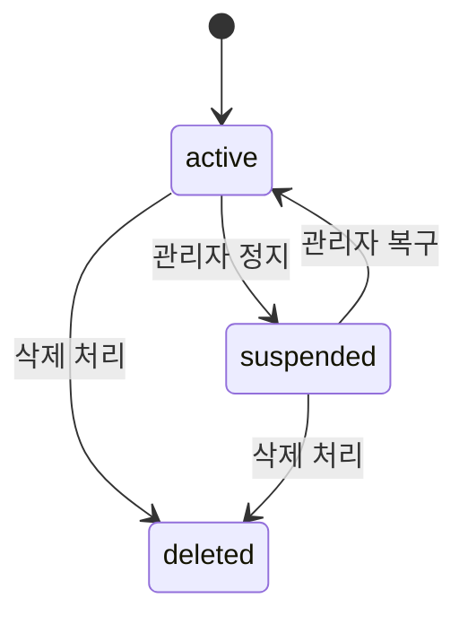
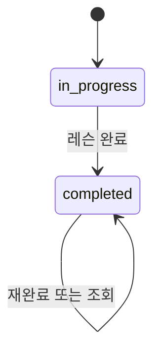

# 데이터 모델

이 문서는 writing-app의 엔티티, DB 스키마, 관계, 상태 값을 설명하는 단일 진실 원천이다.

## 기준

- 기준일: 2026-06-25
- 기준 파일:
  - `packages/db/src/schema/*.schema.ts`
  - `packages/db/src/persisted-values.ts`
  - `packages/db/src/migrations/0000-writing-app-baseline.sql`
  - `packages/db/src/seeds/*`

## 모델 원칙

- 콘텐츠는 `Course -> Unit -> Lesson -> Step` 계층이다.
- 현재는 커리큘럼 버전 모델을 운영하지 않는다.
- 콘텐츠 row는 기본적으로 삭제하지 않고 `archived` 상태로 숨긴다.
- 학습 진행과 답변은 사용자와 레슨/스텝 ID에 직접 연결한다.
- 학습자 인증 테이블과 관리자 인증 테이블은 분리한다.
- DB row 이름은 API DTO로 그대로 노출하지 않는다.

## ERD

## 인증 테이블

Better Auth adapter 계약을 따른다.

| 테이블               | 소유               | 설명                   |
| -------------------- | ------------------ | ---------------------- |
| `user`               | 학습자 Better Auth | 학습자 사용자          |
| `session`            | 학습자 Better Auth | 학습자 세션            |
| `account`            | 학습자 Better Auth | OAuth 계정 연결        |
| `verification`       | 학습자 Better Auth | 인증 검증 값           |
| `admin_user`         | 관리자 Better Auth | 관리자 사용자와 role   |
| `admin_session`      | 관리자 Better Auth | 관리자 세션            |
| `admin_account`      | 관리자 Better Auth | 관리자 credential 계정 |
| `admin_verification` | 관리자 Better Auth | 관리자 인증 검증 값    |

관리자 role은 `admin_user.role`에 저장하며 값은 `owner | operator`다.

## 콘텐츠 테이블

| 테이블         | 주요 컬럼                                                                                                                     | 설명           |
| -------------- | ----------------------------------------------------------------------------------------------------------------------------- | -------------- |
| `courses`      | `id`, `title`, `description`, `category`, `visual_key`, `status`, `sort_order`, `curriculum_revision`                         | 코스           |
| `course_units` | `id`, `course_id`, `title`, `sort_order`, `status`                                                                            | 코스 하위 유닛 |
| `lessons`      | `id`, `course_id`, `unit_id`, `title`, `category`, `description`, `estimated_minutes`, `summary_json`, `sort_order`, `status` | 레슨           |
| `lesson_steps` | `id`, `lesson_id`, `type`, `sort_order`, `content_json`, `status`                                                             | 레슨 스텝      |

현재 content status 값은 코드 기준 `active | archived`다. 과거 문서의 `deprecated`는 현재 persisted 값에 없다.

표준 step type은 다음 10개다.

- `READING`
- `COMPARE`
- `MULTIPLE_CHOICE`
- `FILL_BLANK`
- `SELECT`
- `ORDER`
- `WRITE`
- `AI_FEEDBACK`
- `MATCH`
- `CATEGORIZE`

## 학습 테이블

| 테이블                    | 주요 컬럼                                                                                                 | 설명                           |
| ------------------------- | --------------------------------------------------------------------------------------------------------- | ------------------------------ |
| `learner_profiles`        | `user_id`, `status`, `display_name`, `deleted_at`                                                         | 앱 소유 학습자 프로필          |
| `learner_activity_days`   | `user_id`, `activity_date`, `first_activity_at`, `last_activity_at`, `completed_lessons`, `saved_answers` | Asia/Seoul 기준 학습 활동 날짜 |
| `learner_lesson_progress` | `user_id`, `lesson_id`, `current_step_index`, `status`, `started_at`, `completed_at`, `updated_at`        | 레슨 진행                      |
| `learner_lesson_answers`  | `user_id`, `lesson_id`, `step_id`, `answer_json`, `answered_at`, `updated_at`                             | 스텝 답변                      |
| `ai_feedback_attempts`    | `user_id`, `lesson_id`, `step_id`, `attempt_number`, `answer_text`, `result_json`, `created_at`           | AI 피드백 시도                 |

학습자 상태 값은 `active | suspended | deleted`다.

레슨 진행 상태 값은 `in_progress | completed`다.

## 운영 설정 테이블

| 테이블           | 주요 컬럼                    | 설명                                        |
| ---------------- | ---------------------------- | ------------------------------------------- |
| `admin_settings` | `key`, `value`, `updated_at` | 공지, 법적 문서, 운영 설정 key-value 저장소 |

## 관리자 자료실과 AI 채팅 테이블

관리자 전용 운영 도구는 다음 테이블을 사용한다.

| 테이블                                      | 주요 컬럼                                                                                                    | 설명                                     |
| ------------------------------------------- | ------------------------------------------------------------------------------------------------------------ | ---------------------------------------- |
| `admin_resource_nodes`                      | `id`, `kind`, `parent_id`, `name`, `normalized_name`, `sort_order`, `status`, `trash_root_id`                | 무제한 폴더·문서 트리와 휴지통 원래 위치 |
| `admin_resource_documents`                  | `node_id`, `content_markdown`, `content_revision`                                                            | 문서별 GFM Markdown 도메인 원본          |
| `admin_resource_collaboration`              | `document_id`, `yjs_state`, `state_version`, `projected_at`                                                  | 재연결 가능한 Yjs 동기화 상태            |
| `admin_resource_collaboration_updates`      | `document_id`, `state_version`, `content_revision`, `transaction_id`, `actor_id`, `yjs_update`, `created_at` | HTTP 증분 동기화용 최근 Yjs update log   |
| `admin_resource_collaboration_transactions` | `document_id`, `transaction_id`, `state_version`, `content_revision`, `actor_id`, `created_at`               | 7일 보존 transaction 멱등 승인 기록      |
| `admin_resource_audit_events`               | `id`, `node_id`, `event_type`, `actor_id`, `payload_json`, `created_at`                                      | 자료 구조 변경 감사 이벤트               |
| `admin_resource_tree_state`                 | `singleton_id`, `revision`, `updated_at`                                                                     | 구조 명령 직렬화용 전역 revision         |
| `admin_resource_search`                     | `node_id`, `kind`, `name`, `body_text`                                                                       | 활성 자료 제목·본문 FTS5 색인            |
| `admin_ai_chat_conversations`               | `id`, `title`, `admin_id`, timestamp                                                                         | 관리자별 AI 채팅 대화                    |
| `admin_ai_chat_messages`                    | `id`, `conversation_id`, `role`, `content`, `created_at`                                                     | AI 채팅 사용자/어시스턴트 메시지         |

관리자 AI 채팅 목록은 관리자별 최대 50개 대화, 상세는 최대 100개 메시지를 page query에 따라 시간순으로 반환한다. `admin_ai_chat_conversations(admin_id, updated_at)`와 `admin_ai_chat_messages(conversation_id, created_at)` 복합 index가 이 조회를 지원한다.

자료 트리의 `active | archived` 상태와 `trash_root_id`는 함께 바뀐다. 폴더 휴지통 이동·복원은 연결된 전체 하위 트리에 같은 transaction으로 적용한다. `content_markdown`은 본문의 유일한 도메인 원본이며 `yjs_state`와 update log는 동시 편집 병합과 재접속을 위한 동기화 메타데이터다. update log는 문서별 200건·2MiB까지만 보존한다. transaction 승인 receipt는 7일 동안 멱등 재시도를 보장하고 새 commit 안에서 보존 기간이 지난 행만 정리하며, 보존 구간 10,000개 상한을 넘는 새 transaction은 거부한다. `yjs_state`는 계약·repository·SQLite에서 동일하게 3,000,000byte 이하를 강제한다.

## 상태 머신

### 콘텐츠 상태

### 학습자 상태

### 레슨 진행 상태

## Seed 정책

- 기본 seed는 기준 콘텐츠 5개 코스, 15개 유닛, 44개 레슨, 136개 스텝을 생성한다.
- `packages/db/src/seeds/content-seed-data.json`가 콘텐츠 seed 원천이다.
- `db:seed`는 baseline migration을 적용한 뒤 stable ID 기준으로 upsert한다.
- seed에서 사라진 콘텐츠 row는 삭제하지 않고 `archived`로 전환한다.
- 기본 학습자 `user-1`과 `learner_profiles` row를 보장한다.

## 스키마 명명 규칙

- Better Auth가 소유한 테이블과 필드는 provider convention을 따른다.
- 프로젝트가 직접 소유한 테이블과 SQL 컬럼은 snake_case를 사용한다.
- Drizzle TypeScript 속성은 camelCase를 사용할 수 있다.
- 상세 규칙은 `docs/engineering/schema-conventions.md`를 따른다.
