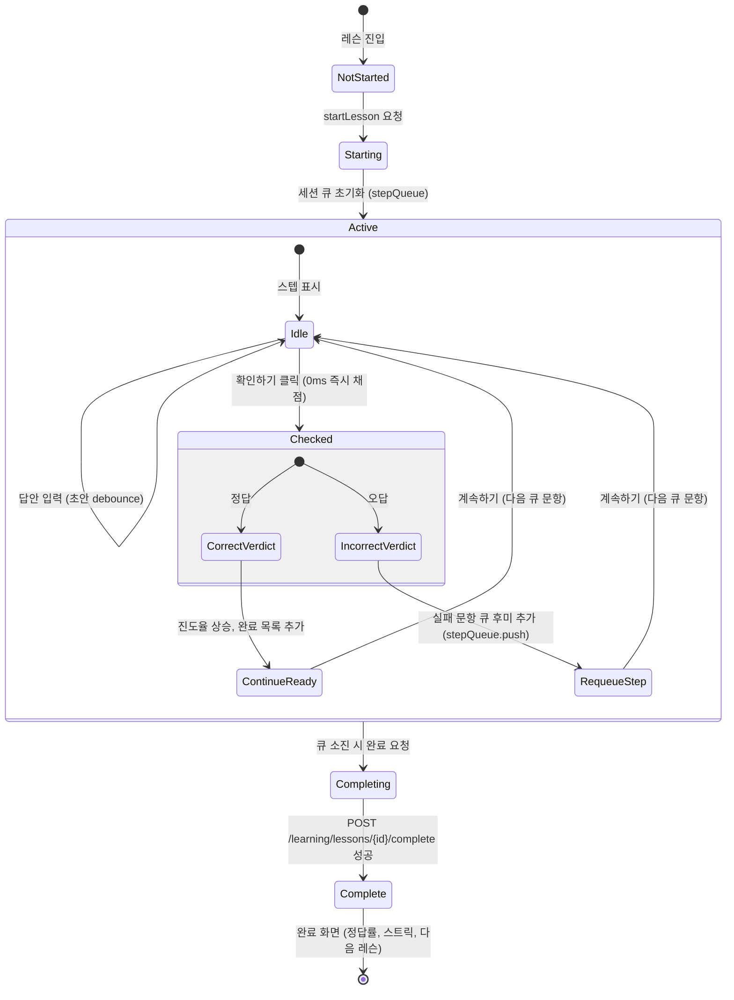
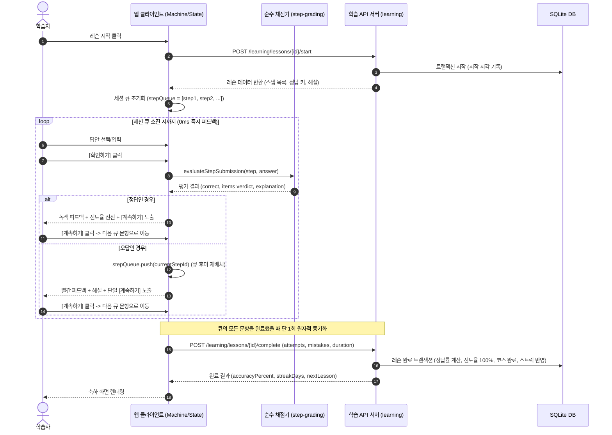

# 레슨 런타임과 스텝 편집 계약

## 작업 상태

- 2026-07-17: 매칭 choice·결정적 순서·selection/payload 정책과 interaction state를 `apps/web`으로 옮기고 UI를 controlled presentation으로 축소했다.
- 2026-07-17: 일반 `completeStep`을 순수 채점·전이 effect plan과 결정된 순서로 적용하는 SQLite transaction interpreter로 분리했다.
- 2026-07-17: `startLesson`을 최소 readonly snapshot의 순수 의사결정과 idempotent effect를 적용하는 SQLite transaction shell로 분리했다.
- 2026-07-17: 레슨 초안 저장 정책을 `apps/web`으로 이동하고 server/client 첫 render 뒤 mount 시점에 복원하도록 전환했다.
- 2026-07-17: 학습자 레슨을 서버 권위 상태 전이 계약으로 전환하고 공유 lesson runtime과 별도 어드민 QA 제품 화면을 제거했다.
- 2026-07-24: 서버 단계 초안, 낙관적 version 저장, 레슨 조회·시작 복구와 제출 transaction의 초안 정리를 learning 경계에 추가했다.
- 2026-07-24: 8개 활동의 완료 방식·draft·서버 평가 정책과 stable item ID를 canonical 계약으로 묶고, 서버·클라이언트 학습 상태 책임을 확정했다.
- 2026-07-24: 웹 초안을 서버 autosave·복구·충돌 조정으로 전환하고 브라우저 저장소와 로그아웃 정리 경로를 제거했다.
- 2026-07-24: learning application을 조회·시작·초안 저장·단계 제출 transaction use case로 압축하고 전달 전용 service·query wrapper를 제거했다.
- 2026-09-01: 스텝별 동기 서버 채점 방식을 클라이언트 주도 0ms 즉시 채점과 동적 재시도 큐, 단일 원자적 레슨 완료 동기화(`completeLesson`) 모델로 전면 전환했다.

## 경계

- `@workspace/contracts/content/steps`는 9개 상호작용 활동 DTO와 각 타입의 완료 방식·draft 가능 여부·평가 정책을 소유한다. admin form registry와 learner renderer registry는 이 같은 타입 집합을 빠짐없이 소비한다.
- `@workspace/contracts/learning/learner-content`와 `@workspace/contracts/learning/learner-transition`은 공개 레슨, 정답 키와 해설을 포함한 스텝 투영, 타입별 draft answer, stable item ID 제출, 평가 결과 및 레슨 완료 전이 계약을 소유한다.
- `@workspace/contracts/learning/step-grading`은 9개 상호작용 스텝의 정답 여부와 항목별 verdict를 0ms 순수 함수로 판정하는 `evaluateStepSubmission`을 소유한다.
- `@workspace/learning`은 레슨 전체 완료, 정답률 및 소요시간 계산, 진도율 산정, 잠금 해제, 코스 완료 및 학습 활동 기록을 소유한다.
- application 공개 경계는 `readLearnerHome`, `readCourseCatalog`, `readCourseDetail`, `readLesson`, `startLesson`, `saveStepDraft`, `completeLesson`을 중심으로 구성한다. HTTP route는 application을 직접 호출한다.
- 레슨 완료 정책(`planCompleteLesson`)은 lesson scope, 잠금, 기존 진행, 제출된 완료 스텝 목록과 시도/오답 횟수 snapshot을 받아 정답률 산정, 레슨 완료, 코스 완료, 학습 활동 일자 기록 effect를 계획한다. Drizzle repository는 한 transaction에서 load → decide → apply를 수행한다.
- 학습자 레슨 조회는 `presentLearnerStep`이 정답 키와 해설을 포함하여 클라이언트에 투영하며, 선택지·낱말·타일 등은 HMAC 결정적 순열로 배열한다.

## 세션 라이프사이클과 동적 재시도 큐

### 세션 상태 전이 흐름

### 상호작용 및 통신 시퀀스

## 학습자 동작

- 레슨 시작은 `startLesson`, 세션 완료는 `completeLesson` 단일 원자적 호출로 수행한다.
- 모든 스텝 채점은 서버 왕복 없이 클라이언트 순수 함수(`evaluateStepSubmission`)를 통해 0ms 즉시 이루어진다.
- 오답 발생 시 즉시 빨간 피드백과 해설을 제공하며, 액션 버튼은 판단 부담이 없는 단일 **[계속하기]** 버튼만 노출된다.
- 틀린 문항은 세션 큐 맨 뒤에 자동으로 재배치되어 세션 후반부에 다시 출제된다.
- 큐에 남은 모든 문항을 해결했을 때 1회의 `completeLesson` 요청으로 학습 소요 시간, 총 시도 횟수, 오답 횟수를 서버에 원자적으로 커밋한다.
- 서버는 제출된 기록을 바탕으로 세션 정답률을 계산하고 코스 진행도 및 연속 학습일(스트릭)을 갱신한다.

## 검증

- 9개 상호작용 스텝의 정답/오답/오류 판정 및 해설 생성은 contracts 단위 테스트(`step-grading.test.ts`)로 검증한다.
- 동적 재시도 큐 및 세션 머신 상태 전이는 web 단위 테스트(`lesson-session-machine.test.ts`)로 검증한다.
- 레슨 완료 플래너 및 정답률 산정, 코스 완료 연계는 learning module 단위 테스트(`complete-lesson-effect-plan.test.ts`)로 검증한다.
- 전체 정적 분석(`ci:static`), 유닛/통합 테스트(`ci:tests`), 프로덕션 빌드(`build`)를 통해 무결성을 보장한다.
