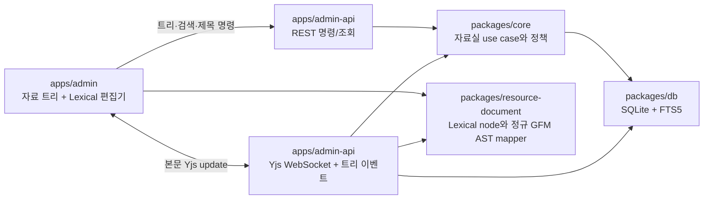

# 자료실 공동 편집 구현 계획

## 문서 상태

- 계획 확정
- 작성일: 2026-07-10
- 관련 제품 기준: `REQ-ADM-7`
- 관련 화면: `SCR-110`
- 관련 결정: `ADR-0004`

## 목표

현재 Tiptap JSON 기반 목록·폼 자료실을 제거하고, 폴더 트리와 Markdown 원본, Lexical GFM 편집기, 자체 호스팅 Yjs 공동 편집을 하나의 전환 작업으로 완성한다. 구현은 내부 단계로 나누지만 구버전과의 이중 쓰기나 하위 호환 계층 없이 한 번에 교체한다.

## 공식 참고 기준

- [Lexical Website Notion 예제](https://github.com/facebook/lexical/tree/main/examples/website-notion): rich text, 블록 핸들, 실험적 draggable block plugin, typeahead 기반 슬래시 메뉴의 상호작용을 참고한다.
- [Lexical React plugin 문서](https://lexical.dev/docs/react/plugins): rich text, list, checklist, table, Markdown shortcut, collaboration plugin의 등록 조건을 따른다.
- [Lexical 공동 편집 문서](https://lexical.dev/docs/collaboration/react): `@lexical/yjs`, `yjs`, `y-websocket` 기반 연결과 `editorState: null` 초기화 규칙을 따른다.
- [reui Tree 문서](https://reui.io/docs/components/base/tree): `@headless-tree/core`, `@headless-tree/react` 기반 Tree, TreeItem, TreeItemLabel 구조를 사용한다.

## 현재 상태와 제거 대상

- `admin_resource_documents.content_json`은 제한된 Tiptap 문단 JSON을 저장한다.
- `apps/admin`은 목록, 생성 form, 상세 `Textarea`를 한 파일에서 렌더링한다.
- `apps/admin-api`와 `packages/core`는 문서 단위 CRUD, 작성자 전용 보관·삭제를 제공한다.
- 검색은 제목과 160자 발췌문의 `LIKE` 비교다.
- 폴더, 복원, WebSocket, 공동 편집 상태, 감사 이벤트가 없다.

전환 시 기존 자료 row, Tiptap contract, 변환 helper, 목록 pagination/status filter, 작성자 전용 보관, 영구 삭제 endpoint를 제거한다.

## 목표 구조



### 책임 경계

- `packages/ui`는 reui에서 가져온 범용 Tree 프리미티브만 소유한다.
- `apps/admin/src/features/resources`는 트리 데이터 조립, 자료실 UX, Lexical React plugin, 라우팅을 소유한다.
- `packages/resource-document`는 브라우저와 headless 서버가 공유하는 Lexical node 등록과 GFM AST mapper, Markdown 검증·직렬화를 소유한다. React 화면, API 호출, 폴더 정책은 포함하지 않는다.
- `packages/contracts`는 REST request/response와 WebSocket 사용자 정의 event schema를 소유한다. Yjs binary protocol 자체를 다시 정의하지 않는다.
- `packages/core`는 이름, 이동, 순환 방지, 정렬, 재귀 휴지통, 복원, 감사 이벤트 정책을 소유한다.
- `apps/admin-api`는 인증, REST mapping, WebSocket upgrade, room 수명주기와 broadcast를 소유한다.
- `packages/db`는 schema, migration, FTS5와 SQLite primitive를 소유한다.

## 데이터 모델 계획

| 테이블                         | 핵심 필드                                                                                                                     | 책임                           |
| ------------------------------ | ----------------------------------------------------------------------------------------------------------------------------- | ------------------------------ |
| `admin_resource_nodes`         | `id`, `kind`, `parent_id`, `name`, `normalized_name`, `sort_order`, `status`, `trash_root_id`, 생성자·마지막 수정자·timestamp | 폴더와 문서의 공통 트리·상태   |
| `admin_resource_documents`     | `node_id`, `content_markdown`, `content_revision`                                                                             | 문서 전용 Markdown 원본        |
| `admin_resource_collaboration` | `document_id`, `yjs_state`, `state_version`, `projected_at`                                                                   | 복구 가능한 CRDT 동기화 상태   |
| `admin_resource_audit_events`  | `id`, `node_id`, `event_type`, `actor_id`, `payload_json`, `created_at`                                                       | 구조 변경 감사 기록            |
| `admin_resource_search`        | `node_id`, `kind`, `name`, `body_text`                                                                                        | FTS5 이름·본문 검색 색인       |
| `admin_resource_tree_state`    | 단일 `revision`, `updated_at`                                                                                                 | 트리 event gap 감지용 revision |

### 무결성 규칙

- `kind`는 `folder | document`, `status`는 `active | archived`의 명시적 enum contract로 제한한다.
- 문서 node만 `admin_resource_documents` row를 가져야 한다.
- 활성 형제 이름 고유성은 루트용 partial unique index와 `parent_id IS NOT NULL`용 partial unique index로 나눠 보장한다.
- 정렬은 부모별 정수 `sort_order`와 ID tie-breaker로 결정한다. 이동 트랜잭션이 영향받는 형제 범위를 다시 번호 매긴다.
- 애플리케이션은 recursive CTE로 조상·하위 트리를 조회하고 순환 이동을 거부한다.
- 휴지통 이동은 전체 하위 트리에 `status=archived`, `trash_root_id=<직접 이동한 root>`를 기록한다.
- 복원은 `trash_root_id`가 같은 전체 트리를 활성화하고, 최상위 이름 충돌만 접미사로 해소한다.
- FTS5는 Markdown 문법을 제거한 일반 텍스트를 색인하고 node 상태는 일반 table join으로 필터링한다.

### 마이그레이션

1. 명시적 DB migration에서 기존 `admin_resource_documents`의 `content_json` 컬럼을 감지한다.
2. 하나의 SQLite 트랜잭션에서 기존 자료 table을 삭제하고 새 table·index·FTS5 table을 만든다.
3. 기존 화면이 남아 있는 내부 구현 단계에서는 fresh database에 baseline과 자료실 migration을 순서대로 적용한다. 7단계 일괄 전환에서 legacy 코드 삭제와 함께 baseline 자체를 같은 최종 schema로 합친다.
4. migration은 재실행해도 새 자료를 다시 삭제하지 않도록 schema 판별을 먼저 수행한다.
5. 서버 시작은 migration을 실행하지 않는다. 배포 전 기존 SQLite 파일을 백업하고 명시 명령으로 실행한다.

## API와 실시간 계약 계획

### REST

| 메서드  | 경로                                       | 용도                                 |
| ------- | ------------------------------------------ | ------------------------------------ |
| `GET`   | `/resources/tree`                          | 루트 또는 펼친 폴더의 자식 지연 조회 |
| `POST`  | `/resources/folders`                       | 폴더 생성                            |
| `POST`  | `/resources/documents`                     | 빈 문서 즉시 생성                    |
| `POST`  | `/resources/documents/import`              | 단일 Markdown 문서 원자적 가져오기   |
| `GET`   | `/resources/documents/{documentId}`        | 문서 Markdown과 메타데이터 조회      |
| `GET`   | `/resources/documents/{documentId}/export` | 최신 room flush 뒤 Markdown 다운로드 |
| `PATCH` | `/resources/nodes/{nodeId}/name`           | 직렬화된 이름 변경                   |
| `PATCH` | `/resources/nodes/{nodeId}/move`           | 부모 변경과 형제 정렬                |
| `POST`  | `/resources/nodes/{nodeId}/trash`          | 전체 하위 트리 휴지통 이동           |
| `POST`  | `/resources/nodes/{nodeId}/restore`        | 전체 하위 트리 복원                  |
| `GET`   | `/resources/search`                        | 활성 또는 휴지통 FTS 검색            |

- 이름·이동 명령은 최신 tree revision을 받고 성공 시 새 revision과 영향받은 부모 ID를 반환한다.
- 휴지통 이동 응답은 하위 폴더·문서 수와 종료한 active room 수를 반환한다.
- REST contract는 `packages/contracts/src/admin/admin-resources.ts`를 트리·문서·검색·명령 schema 파일로 분리해 과대 파일을 피한다.
- 영구 삭제 endpoint와 기존 `PUT /resources/{id}` 전체 저장 endpoint는 제거한다.

### WebSocket

- `/resources/collaboration/{documentId}`는 y-websocket 호환 Yjs binary protocol을 제공한다.
- `/resources/events`는 tree revision, 영향받은 부모, trash/restore, 제목 확정 이벤트만 제공한다.
- upgrade 시 기존 Better Auth `admin_session_token` cookie, 허용 origin, 활성 문서, room 인원 20명 상한을 검증한다. token을 WebSocket URL query나 첫 message에 복제하지 않는다.
- room load 순서는 Yjs snapshot, 없으면 Markdown bootstrap이다.
- 본문 update는 접속자에게 즉시 전달하고 약 1초 debounce 뒤 Yjs snapshot, Markdown projection, `content_revision`, 마지막 수정자, FTS를 transaction으로 갱신한다.
- projection 실패 시 기존 Markdown과 FTS를 유지하고 room을 오류 상태로 전환한다.
- tree event revision gap을 감지한 클라이언트는 영향받은 부모 또는 루트를 다시 조회한다.
- 휴지통 이동은 room 입력을 잠그고 flush한 뒤 DB 상태를 바꾸고 모든 접속자에게 읽기 전환 event를 보낸 후 연결을 닫는다.
- 프로세스 종료 hook은 열린 room을 flush하고 WebSocket 수락을 중단한 뒤 DB를 닫는다.

## 프런트엔드 계획

### 파일 경계

```text
apps/admin/src/features/resources/
  resource-workspace.tsx
  resource-workspace-state.ts
  tree/
    resource-tree.tsx
    resource-tree-actions.tsx
    resource-tree-dnd.ts
  editor/
    resource-editor.tsx
    resource-editor-theme.ts
    resource-editor-nodes.ts
    plugins/
      block-actions-plugin.tsx
      floating-format-plugin.tsx
      markdown-shortcut-plugin.tsx
      slash-command-plugin.tsx
      sync-status-plugin.tsx
  collaboration/
    resource-collaboration-provider.ts
    resource-sync-state.ts
  search/
    resource-search.tsx
  trash/
    resource-trash.tsx
  markdown/
    resource-markdown-import.ts
    resource-markdown-export.ts
```

- 현재 `admin-resources-page.tsx`의 목록·생성·상세 책임을 위 경계로 분해한 뒤 legacy helper와 test를 삭제한다.
- `app/(admin)/resources/layout.tsx`가 persistent 자료실 shell을 렌더링한다.
- `resources/page.tsx`, `resources/[id]/page.tsx`, `resources/trash/page.tsx`는 선택 상태와 초기 서버 조회만 담당한다.
- 제목 입력은 optimistic text를 표시하되 서버 확정 전 sync 상태를 유지하고 실패하면 마지막 확정값으로 복구한다.

### Lexical 구성

- 공식 Notion 예제의 상호작용과 구성 방식을 참고하되 예제의 현재 버전을 그대로 추종하지 않는다. 자료 문서 위험 게이트에서 검증한 모든 Lexical 패키지를 `0.46.0` exact version으로 함께 고정하고, 이후 버전을 올릴 때는 모든 Lexical 패키지와 round-trip fixture를 한 번에 갱신한다.
- 공식 extension이 있는 rich text, history, list, table, horizontal rule은 extension API를 우선하고, 공동 편집과 사용자 정의 slash·block·toolbar·sync 기능만 plugin adapter로 둔다.
- rich text, heading, quote, list, checklist, code, link, table, horizontal rule, image node만 등록한다.
- 정규 GFM AST 변환 경계를 import, paste, 저장 projection에 공통 사용하고 Lexical transformer는 shortcut에만 사용한다.
- 원시 HTML transformer와 GFM 밖의 node는 등록하지 않는다.
- 이미지 node는 HTTPS URL과 필수 alt만 가지며 `referrerPolicy="no-referrer"`로 렌더링한다.
- 링크는 HTTPS, `mailto:`, 앱 내부 상대 경로만 허용하고 외부 링크에는 `noopener noreferrer`를 적용한다.
- slash command는 기본 텍스트, 제목 1~3, 글머리·번호·할 일 목록, 인용, 코드, 구분선, 표, 이미지 URL을 제공한다.
- 블록 drag plugin은 공식 실험 API를 직접 퍼뜨리지 않고 `block-actions-plugin.tsx` adapter 안에 격리한다.
- 공식 plugin이 키보드 블록 이동을 제공하지 않으면 같은 adapter가 명시적 위·아래 이동 명령을 제공한다.
- collaborative mode에서는 일반 HistoryPlugin 대신 Yjs origin별 undo manager를 사용한다.
- 공동 커서 DOM과 접속자 UI는 렌더링하지 않는다.

### Tree 구성

- reui Tree source를 `packages/ui/src/components/ui/tree.tsx`에 프로젝트 토큰과 접근성 규칙에 맞춰 둔다.
- `@headless-tree/core`, `@headless-tree/react`는 `packages/ui`의 직접 의존성으로 선언한다.
- data loader는 루트와 expanded folder의 자식만 요청한다.
- expanded folder ID는 관리자 ID를 포함한 localStorage key로 저장한다.
- drag/drop은 폴더 내부, 형제 앞·뒤를 구분하고 서버 응답 전 optimistic 위치를 표시한다.
- 서버 거부 또는 event gap은 영향받은 부모를 재조회해 rollback한다.
- 모든 drag 행동은 항목 메뉴의 이동 dialog에서도 수행할 수 있다.

## 구현 순서

### 0. 위험 검증과 계약 fixture

상태: 완료

- 같은 exact Lexical version으로 최소 editor를 구성한다.
- 합의한 모든 GFM block의 Markdown → Lexical → Markdown 왕복 fixture를 먼저 만든다.
- 특히 표, 할 일 목록, fenced code language, 이미지 alt/URL, 중첩 목록을 검증한다.
- 두 Lexical client와 자체 Bun WebSocket endpoint가 y-websocket protocol로 수렴하는 spike를 만든다.
- server-side Yjs snapshot → headless Lexical → Markdown projection을 검증한다.
- 실험적 draggable block plugin이 React 19와 Next.js client boundary에서 동작하는지 확인한다.
- spike 코드는 production 경계로 이동하거나 삭제하고 별도 실험 디렉터리에 남기지 않는다.

검증 결과:

- `packages/resource-document`에 exact Lexical `0.46.0` node와 정규 GFM MDAST import/export, Markdown 검증, Yjs headless 투영 공개 경계를 추가했다.
- 문단, H1~H3, 인라인 서식과 링크, 글머리·번호·할 일·중첩 목록, 인용, 언어가 있는 fenced code, 구분선, 정렬 표, HTTPS 이미지와 대체 텍스트의 의미 왕복과 반복 정규화 안정성을 계약 테스트로 고정했다.
- reference 링크·이미지, 중복 definition의 GFM first-wins 의미, autolink, 괄호 URL, escaped alt, 표의 optional outer pipe·inline-code pipe·escaped pipe·빈 셀·누락 셀·초과 셀을 실제 GFM AST에서 검증한다. 코드와 escape literal은 URL 검증 대상에서 제외한다.
- 지원하지 않는 H4~H6, title, inline 이미지, 혼합 task 목록, 복수 block 인용, loose list, code meta와 성립하지 않는 표 delimiter는 조용히 손실하지 않고 구체적인 `invalid` issue로 거부한다. 원시 HTML은 실행하거나 HTML로 렌더링하지 않고, 블록은 `html` fenced code, 문장 내부는 inline code인 리터럴 코드로 정규화해 여러 줄 원문도 보존한다.
- 저장 projection 전에 지원 node 계층과 Text·Element·Link·Heading·ListItem·Table의 Markdown에 투영되지 않는 속성을 검사한다. 손실 가능한 상태는 조용히 버리지 않고 구체적인 `invalid` issue로 차단하며, projection 결과의 URL 안전성도 다시 검증한다.
- 저장 projection은 직렬화한 Markdown을 새 headless Lexical editor에 다시 입력한 결과와 원래 `EditorState`가 같은지 비교한다. 인접 서식과 delimiter 문자를 포함한 의미 왕복이 다르면 `markdown-round-trip-mismatch`로 거부하고 손실 가능한 Markdown을 저장하지 않는다.
- persisted NodeState는 자료 표 열 정렬 상태만 허용하고 다른 key와 Lexical slot은 저장 전에 거부한다. 표 정렬 상태도 허용 값만 파싱하며 잘못된 값을 기본값으로 대체하지 않는다.
- Yjs snapshot을 새 headless Lexical binding에 적용해 같은 Markdown으로 투영하고, 손상 snapshot을 포함한 모든 투영 종료 경로에서 binding과 문서를 `try/finally`로 정리한다.
- 브라우저 공동 편집은 네트워크 Y.Doc, 검증용 headless Y.Doc, 화면 editor용 Y.Doc을 분리한다. 원격 update는 headless Lexical 구조 검증을 통과한 상태만 화면 Y.Doc으로 미러링하며, 실패와 회복 상태를 호출자에게 명시적으로 알린다. 객체형·빈 이미지 속성, 비 HTTPS URL, 임의 node type·tag·NodeState는 화면 reconcile 전에 격리한다.
- 사용자 정의 이미지 node는 화면 경계에서도 URL과 대체 텍스트를 다시 검사하고, 유효하지 않은 값은 `` 생성과 `src` 반영 전에 동기적으로 거부한다.
- `apps/admin-api`의 Bun adapter는 공식 `y-protocols`·`lib0` 공개 API를 사용한다. 실제 Bun endpoint와 `WebsocketProvider` 두 개, 각 Y.Doc에 연결한 Lexical binding의 동시 편집이 같은 Markdown으로 수렴함을 검증했다.
- socket `send`의 exception과 반환값 `0`을 해당 연결로 격리한다. initial sync, sync reply, awareness broadcast 실패가 건강한 연결이나 발신자를 닫지 않는 failure-injection 계약을 고정했다.
- `apps/admin/src/features/resources/editor/resource-draggable-block-plugin.tsx`가 공식 website-notion 예제와 같은 `DraggableBlockPlugin_EXPERIMENTAL`을 Next client component 안에 격리한다. React 19 실제 렌더와 두 블록 drag reorder 테스트, admin typecheck와 production build를 통과했다.

### 1. DB와 domain 전환

상태: 완료

- legacy 자료 table을 교체하는 idempotent migration을 추가한다.
- unified node, document, collaboration, audit, tree state, FTS schema를 추가한다.
- branded resource node/document/folder ID와 discriminated union contract를 만든다.
- 이름 정규화, unique suffix, cycle 검증, 정렬 재번호, 휴지통 이동·복원 정책을 순수 함수와 repository integration test로 고정한다.

검증 결과:

- 기존 `content_json` schema를 판별해 자료를 폐기하고 unified node, Markdown document, Yjs collaboration, audit, tree revision, FTS5 schema를 한 SQLite 트랜잭션에서 생성하는 명시적 migration을 추가했다. 최종 schema 재실행은 새 자료를 보존하고 알 수 없는 변형 schema는 삭제하지 않고 거부한다.
- kind, status, 활성 형제 이름, 폴더 부모, 문서 본문 소유, 이름·본문 길이, 휴지통 상태, revision, 감사 event·JSON을 DB 제약과 trigger로 검증한다. 활성 자료의 이름과 Markdown 일반 텍스트 검색을 위한 FTS5 table을 생성한다.
- folder, document, audit event ID를 brand type으로 분리하고 폴더·문서 node를 discriminated union으로 정의했다. NFC·공백·대소문자 이름 정규화, grapheme을 자르지 않는 숫자 접미사, 수동 충돌 거부, 순환 검증, 연속 정렬, 연결된 하위 트리 휴지통·복원을 순수 정책으로 고정했다.
- 트리 repository는 `BEGIN IMMEDIATE` transaction과 expected revision으로 구조 명령을 직렬화한다. 생성, 이름 변경, 부모 이동, 같은 부모 재정렬, 재귀 휴지통 이동·복원, 감사 event가 원자적으로 반영되고 감사 저장 실패 시 node와 revision도 함께 롤백된다.
- 1,100단계 폴더 fixture에서 애플리케이션 깊이 제한 없이 recursive CTE 휴지통 이동·복원을 통과했다. 도메인·repository·migration 계약과 core·DB package 전체 test, lint, typecheck를 통과했다.

### 2. REST tree와 자료 명령

상태: 완료

- core port/use case/repository를 tree, document, search 책임으로 나눈다.
- 폴더·문서 생성, 지연 조회, 이름 변경, 이동, 휴지통 이동·복원, 검색, import/export endpoint를 구현한다.
- 모든 관리자에게 변경 권한을 허용하고 구조 이벤트를 audit table에 남긴다.
- OpenAPI와 admin HTTP adapter를 새 contract로 갱신한다.

검증 결과:

- 트리, Markdown 문서, 검색 REST contract를 책임별 파일로 분리하고 문서 말단 node, active·trash 범위, expected revision, 경로·행위자 metadata를 Zod schema로 고정했다.
- tree, document, search port와 use case, Drizzle repository를 분리했다. 생성·이름 변경·이동·재정렬·재귀 휴지통 이동·복원·단일 Markdown 가져오기는 `BEGIN IMMEDIATE` transaction과 revision 검증을 거치며 모든 구조 변경과 가져오기가 감사 event를 남긴다.
- 첫 번째 H1 제목 추출과 본문 제거, 파일명 제목, GFM 검증, 일반 텍스트 FTS 색인, 활성·휴지통 검색, `# 제목`을 결합한 Markdown 내보내기를 구현했다. 유효하지 않은 Markdown은 node나 revision을 변경하기 전에 거부한다.
- 지연 트리와 모든 자료 명령을 관리자 세션 REST route로 공개하고 validation, not found, 이름·위치·순환·revision 충돌을 400·404·409 오류로 구분했다. 일반 `operator`를 포함한 모든 관리자가 명령을 실행할 수 있으며 새 route가 OpenAPI에 포함된다.
- admin HTTP adapter는 새 JSON contract와 `text/markdown` 내보내기 contract를 검증하고 revision·이름·이동 충돌을 UI가 구분할 수 있는 오류로 보존한다. route와 adapter 계약, 문장부호·폴더·활성·휴지통 FTS, 원자적 가져오기와 경로 metadata를 통합 테스트로 고정했다.

### 3. 자료실 shell과 Tree

상태: 완료

- reui Tree primitive를 `packages/ui`에 추가한다.
- persistent layout, desktop resize/collapse, mobile drawer를 구현한다.
- lazy load, expanded state, drag/drop, menu move, context actions, breadcrumb, 검색과 휴지통을 연결한다.
- 이 단계에서는 문서 본문을 읽기 전용 Markdown으로 연결해 tree/API 흐름을 먼저 안정화한다.

검증 결과:

- reui 공식 구조를 따르는 generic `Tree`, `TreeItem`, `TreeItemLabel`, `TreeDragLine` primitive를 `packages/ui`에 추가하고 Headless Tree의 keyboard selection, async data loader, drag/drop 기능과 연결했다. tree·treeitem·expanded·selected 접근성 계약을 UI package test로 고정했다.
- 자료실 nested layout이 관리자 세션과 활성 최상위 트리를 병렬 prefetch하고, client 작업 공간은 viewport 판별 뒤 desktop resize·collapse 또는 mobile left drawer 중 하나만 렌더링한다. 최초 서버 tree 결과는 정확히 한 번만 소비하며 active·trash 전환 뒤에는 현재 API 상태를 다시 읽는다.
- expanded folder ID를 version·관리자 ID·active/trash 범위가 포함된 localStorage key로 관리하고 storage event도 같은 외부 store 경계에서 동기화한다. 루트와 실제 expanded folder만 지연 조회하며 중복 요청은 item별 promise cache로 합친다.
- 폴더·문서 생성, 이름 변경, 낙관적 drag/drop, 검색 기반 목적지와 형제 위치를 선택하는 menu move, 재귀 휴지통 이동·복원을 expected revision 흐름으로 연결했다. stale revision은 화면에 올라온 부모를 재조회하고, 서버 거부는 이동 전 자식 순서로 복구한다.
- 휴지통에서는 삭제 subtree의 최상위 항목에만 복원 메뉴를 제공하고 하위 항목 단독 복원은 노출하지 않는다. 폴더 휴지통 이동·복원 뒤 하위 문서까지 함께 전환되고, 선택 문서가 subtree에 포함되면 빈 선택 화면으로 이동하는 동작을 실제 브라우저에서 확인했다.
- 검색 결과의 조상 경로를 펼쳐 문서로 이동하고, 읽기 화면은 full breadcrumb와 긴 경로의 가운데 popover 축약, 생성자·수정자·상대·정확 시각 metadata, active·archived 상태를 제공한다. GFM Markdown renderer는 raw HTML을 실행하지 않고 HTTPS URL 이미지만 렌더링한다.
- 구 Tiptap 목록·폼 UI와 helper·test를 새 route 전환과 함께 삭제해 죽은 frontend 코드를 남기지 않았다. legacy API·repository·schema의 최종 삭제는 7단계 일괄 전환에 남긴다.
- 실제 로컬 관리자 로그인과 데스크톱·모바일 브라우저에서 생성, 중첩, 이름 변경, 읽기 화면 갱신, 재귀 휴지통 이동, archived 하위 문서 열기, subtree 복원, drawer 자동 닫힘을 확인했다. 이 과정에서 발견한 누락 migration을 막기 위해 `dev:admin:setup`이 baseline seed 직후 자료실 migration을 적용하도록 고정했다.
- admin 전체 test, UI primitive test, admin·UI lint/typecheck, root lint와 admin production build를 통과했다.

### 4. Lexical GFM 편집기

상태: 완료

- `packages/resource-document`의 node와 transformer를 확정한다.
- WYSIWYG editor, slash command, Markdown shortcut, block handle, 플로팅 toolbar를 구현한다.
- 단일 Markdown import/export, URL image, raw HTML 비활성화를 연결한다.
- 아직 collaboration 없이 한 client에서 Markdown projection과 화면 상태를 검증한다.

완료 근거:

- 문서 저장 계약에 `contentRevision` 낙관적 잠금을 적용하고, GFM 정규화·일반 텍스트 FTS·수정자 metadata를 하나의 SQLite transaction으로 갱신한다. stale revision은 별도 API 오류로 보존해 다음 단계의 공동 편집 경계와 구분했다.
- Lexical `0.46.0` exact 패키지로 분할 화면 없는 WYSIWYG 편집기, Markdown 단축키, 키보드 슬래시 메뉴, 블록 이동 핸들, 플로팅 인라인 서식·링크 도구를 구현했다. 저장 버튼 없는 동기화 상태는 아이콘 애니메이션과 한국어 텍스트로 항상 표시한다.
- 슬래시 명령은 일반 문단에서만 열리고 본문, H1~H3, 글머리·번호·할 일 목록, 인용, 코드, 구분선, 표, HTTPS 이미지 URL을 제공한다. 다이얼로그형 이미지·표 명령은 슬래시 문단을 대상 블록으로 직접 교체해 Markdown에 표현할 수 없는 빈 문단을 남기지 않는다.
- Lexical DOM reconciler가 첫 하위 텍스트에서 계산하는 Element 포맷 캐시는 파생 값과 일치할 때만 허용하고, 임의로 주입된 layout·포맷 속성은 계속 거부한다. 여러 블록에 적용한 인라인 서식도 GFM 저장과 재접속 왕복을 보장한다.
- 단일 `.md` 가져오기와 내보내기를 트리 작업 공간에 연결했다. raw HTML은 실행하지 않고 코드 리터럴로 렌더링하며, 외부 이미지는 HTTPS와 필수 대체 텍스트만 허용하고 `no-referrer`로 렌더링한다. 관리자 CSP도 자료실의 임의 HTTPS 이미지 정책과 일치시켰다.
- 관련 contract·core·API·React·Markdown 테스트와 타입 검사를 통과했다. `ENABLE_TEST_AUTH=true` 실제 브라우저에서 제목 단축키, 슬래시 H2, 다중 블록 굵게 저장·재접속, 단일 가져오기·내보내기, raw HTML 비실행, HTTP 이미지 거부, HTTPS 이미지 저장·`no-referrer`, 2×2 GFM 표 저장을 확인했다.

### 5. 자체 호스팅 공동 편집

상태: 완료

- admin-api WebSocket upgrade와 인증·origin 검증을 추가한다.
- Yjs room registry, SQLite snapshot load/flush, Markdown projection, FTS 갱신을 구현한다.
- admin client provider, sync 상태 UI, 재연결 병합, local undo를 연결한다.
- 제목과 트리 event channel을 연결하고 revision gap refetch를 구현한다.
- 휴지통 이동 중 active room flush·읽기 전환·disconnect를 구현한다.

완료 근거:

- 관리자 session cookie와 정확한 Origin을 검증하는 Bun WebSocket upgrade를 공동 편집과 receive-only 자료 event channel에 각각 추가했다. URL query token은 허용하지 않으며 비활성 문서, 잘못된 method·upgrade·origin, 인증 실패를 연결 전에 거부한다.
- 자체 호스팅 Yjs room registry는 문서당 연결 20개 상한, 1초 debounce와 직렬 flush, 마지막 연결 종료·명시 내보내기·서버 종료 시 flush를 제공한다. snapshot, state version, GFM Markdown projection, 일반 텍스트 FTS, 수정자 metadata를 하나의 `BEGIN IMMEDIATE` transaction으로 저장하고 projection·DB 실패는 해당 room만 오류 상태로 격리한다.
- 브라우저는 `WebsocketProvider`와 cursor를 렌더링하지 않는 Lexical collaboration provider를 사용한다. 원격 update를 별도 headless 문서에서 검증한 뒤 화면에 반영하며, 재연결 병합, 현재 client 변경만 추적하는 Yjs undo, 폐기·서버 오류의 읽기 전용 전환, 연결·동기화·저장·재연결·오류 상태의 상시 표시를 구현했다. 기존 REST 자동 저장 plugin과 `HistoryPlugin`은 제거했다.
- 구조 변경과 문서 제목 확정을 별도 WebSocket event로 발행한다. client는 다음 revision만 부분 재조회하고 gap에서는 보이는 트리 전체를 다시 읽으며 stale event는 무시한다. 원격 휴지통 이동은 선택 문서를 빈 화면으로 이동시킨다.
- 휴지통 이동은 하위 활성 문서 room을 잠그고 모두 flush한 뒤 DB 구조 변경, event 발행, socket 종료 순서로 실행한다. 확인창은 하위 문서의 실제 WebSocket 연결 수를 조회해 활성 편집자 수를 아이콘과 텍스트로 항상 표시하며, 조회 실패 시 삭제를 허용하지 않는다. 내보내기도 열린 room을 먼저 flush해 최신 Markdown을 반환한다.
- 공식 `WebsocketProvider` client와 Lexical binding 통합 테스트로 동시 입력 수렴, snapshot bootstrap, debounce·빈 room·종료 flush, room별 실패 격리, 20개 연결 상한과 잠금을 검증했다. 계약·core·API·React 관련 테스트와 타입 검사를 통과했다.
- `ENABLE_TEST_AUTH=true` 로컬 환경의 두 독립 브라우저에서 교차 입력, 다른 client 변경을 보존하는 local undo, 한 client offline 중 양쪽 입력의 재연결 병합, API 서버 재시작 뒤 snapshot 복구, 제목 event 전파, 휴지통 이동 시 양쪽 화면 전환을 확인했다. 같은 문서를 연 두 브라우저에 대해 휴지통 확인창이 `현재 공동 편집 중인 관리자 2명`을 표시하는 것도 확인했다.
- root typecheck·lint·format 검사와 admin·admin-api production build를 통과했다. root build는 두 application build가 성공한 뒤 이 작업과 무관한 Storybook의 기존 `@tailwindcss/typography` 의존성 누락에서 중단되는 상태를 확인했다.

### 6. 오류·접근성·성능 강화

상태: 대기

- 10,000개 node fixture로 lazy tree와 FTS 검색을 측정한다.
- 문서당 20개 WebSocket client 부하와 재연결 폭주를 검증한다.
- projection 실패, DB busy, WebSocket 인증 만료, event gap을 계측하고 복구 동작을 검증한다.
- reduced motion, 키보드 tree/slash/toolbar, 모바일 drawer, focus 복구를 점검한다.
- 모든 대화상자와 sync 상태 메시지를 한국어 접근성 이름으로 검증한다.

### 7. 한 번에 전환

상태: 대기

- 남은 legacy Tiptap contract, API, repository code와 test를 삭제한다.
- DB 백업 후 명시 migration을 실행한다.
- `ENABLE_TEST_AUTH=true`로 두 브라우저 context E2E를 통과시킨다.
- build, lint, typecheck, package test, API contract drift, 문서 drift를 실행한다.
- 제품·디자인·엔지니어링 기준 문서를 현재 구현 상태로 전환하고 계획 표기를 제거한다.

## 테스트 계획

### 단위와 계약

- 정규 GFM AST mapper round-trip golden fixture.
- HTML·위험 프로토콜 거부와 HTTPS 이미지 허용.
- 이름 정규화·충돌·빈 이름 복구·자동 접미사.
- 경로 breadcrumb 축약과 전체 경로 복원.
- WebSocket 사용자 정의 event Zod schema.

### SQLite 통합

- 무제한 깊이 recursive CTE와 cycle 거부.
- 부모 간 이동, 같은 부모 재정렬, 동시 명령 직렬화.
- 전체 subtree 휴지통 이동·복원과 trash root 조회.
- restore 이름 충돌과 원래 순서 복구.
- Markdown, Yjs snapshot, content revision, FTS의 원자적 projection.
- migration 재실행 시 새 자료 보존.

### WebSocket 통합

- 두 client의 교차 입력 수렴.
- 같은 위치 동시 입력과 중첩 block 변경 수렴.
- 일시 연결 끊김 뒤 병합.
- 서버 재시작 뒤 snapshot 복구.
- 현재 사용자 변경만 undo.
- 21번째 client 연결 거부.
- 휴지통 이동 전 flush와 모든 client 읽기 전환.
- 인증 없음, 만료 session, 허용하지 않는 origin 거부.

### 화면과 E2E

- lazy tree의 키보드 탐색과 drag/menu 이동 동등성.
- 데스크톱 panel 조절·접기와 모바일 drawer.
- 슬래시 command 전체 목록과 Markdown shortcut.
- 플로팅 toolbar와 링크/image validation.
- sync 아이콘 애니메이션, reduced motion, 오류 재시도와 Markdown 복사.
- 검색 결과 breadcrumb 이동과 축약 popover.
- 항상 표시되는 휴지통 이동 확인 dialog와 active editor count.
- 휴지통 읽기 전용, 전체 복원, 단일 import/export.

## 관측성과 운영

- room open/close 수, 현재 room client 수, 거부된 21번째 연결 수를 기록한다.
- Yjs update byte 수, projection latency·실패, snapshot 크기, flush 이유를 구조화해 기록한다.
- tree command latency·충돌·cycle 거부·event gap refetch를 기록한다.
- SQLite busy/lock과 FTS update 실패를 기존 요청 로그와 연결한다.
- 문서 본문, Yjs binary, session token은 로그에 기록하지 않는다.
- 운영 종료는 새 WebSocket 수락 중단 → room flush → DB close 순서를 지킨다.

## 주요 위험과 완화

| 위험                               | 완화                                                                   |
| ---------------------------------- | ---------------------------------------------------------------------- |
| 실험적 draggable block plugin 변경 | exact version 고정, adapter 격리, E2E golden interaction               |
| GFM 표·이미지의 왕복 손실          | phase 0 정규 GFM AST mapper fixture 통과 전 UI 공개 금지               |
| Yjs 상태와 Markdown 불일치         | state version, 단일 projection transaction, 실패 시 기존 Markdown 보존 |
| SQLite write contention            | room별 debounce, 짧은 transaction, WAL·busy timeout 계측               |
| 단일 서버 장애                     | snapshot 주기 저장, 종료 flush, 재시작 복구 test                       |
| 무제한 중첩 cycle                  | 서버 recursive ancestor 검증과 DB transaction                          |
| tree event 유실                    | 단조 revision과 gap refetch                                            |
| 외부 이미지 추적                   | HTTPS만 허용, no-referrer, 서버 proxy 미사용                           |

## 완료 조건

- `REQ-ADM-7`의 확인 방법을 모두 자동 또는 명시적 수동 시나리오로 검증했다.
- 구 Tiptap JSON, 작성자 전용 보관, 영구 삭제 경로가 남아 있지 않다.
- 문서 Markdown과 Yjs snapshot이 서버 재시작·재연결 뒤 같은 내용을 복구한다.
- 10,000개 node와 문서당 20명 목표 검증 결과가 기록돼 있다.
- 로컬 브라우저와 E2E는 Google OAuth가 아닌 `ENABLE_TEST_AUTH=true`를 사용한다.
- `bun lefthook run pre-commit`, 관련 package test, build, typecheck가 통과한다.
- 구현 완료 시 `admin-operations.md`, `ia-spec.md`, `system-overview.md`, `api-contract.md`, `data-model.md`, `auth-permissions.md`, `security.md`, `testing.md`, `observability.md`, `migration.md`, `rollback.md`, `tech-stack.md`, `runtime-configuration.md`, `ARCHITECTURE.md`, `BACKEND.md`, `FRONTEND.md`를 실제 상태로 갱신한다.
