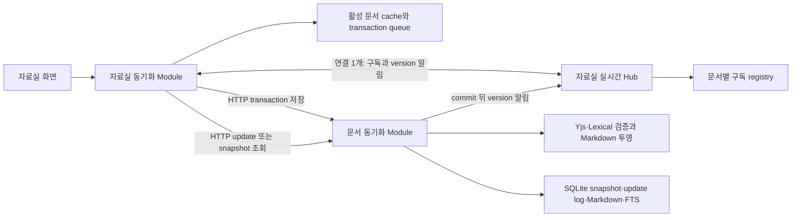
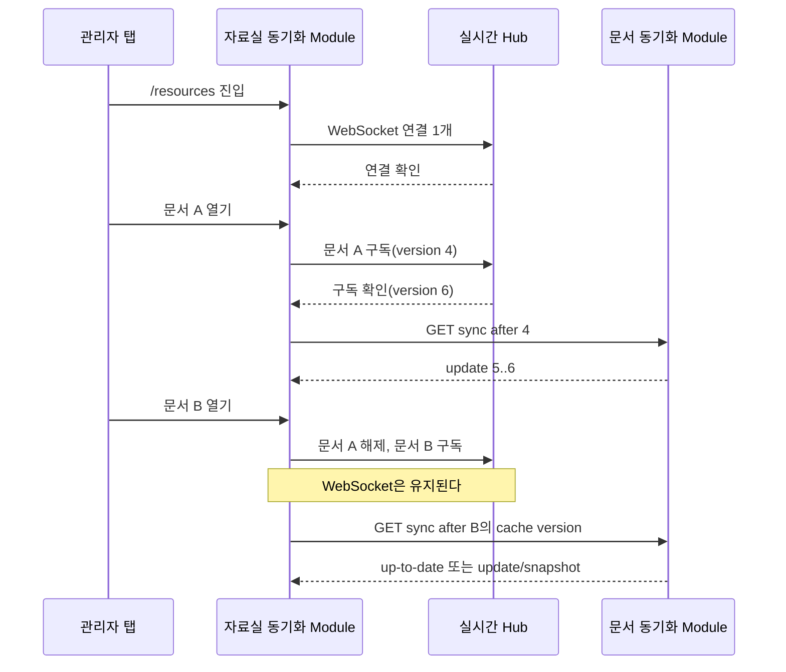

# 자료실 지속 연결·HTTP 동기화 설계

## 문서 상태

- 상태: 부분 구현 (4단계 클라이언트 Adapter 전환 진행 중)
- 기준일: 2026-07-11
- 관련 요구사항: `REQ-ADM-7 자료실 공동 편집`
- 관련 화면: `SCR-110 관리자 자료실`
- 현재 결정: `ADR-0004 자료실 Markdown 원본과 공동 편집 경계`

이 문서는 자료실의 문서별 Yjs WebSocket 연결을 작업 공간 단위의 지속 연결과 HTTP transaction 동기화로 재구성하는 목표 설계를 정의한다. 1단계인 상태와 화면 분리는 완료했으며, 지속 연결과 HTTP transaction을 채택할 때 `ADR-0004`의 문서별 WebSocket room 결정은 새 ADR에서 명시적으로 대체한다.

## 구현 현황

- 2026-07-11: 작업 공간 연결 상태를 `preparing`, `online`, `reconnecting`, `unavailable`로 분리하고 문서 동기화 상태가 자료 트리의 구조 변경 가능 여부에 전파되던 Context를 제거했다.
- 작업 공간 실시간 사건 연결이 유지되는 동안 문서 공동 편집의 `connecting`, `syncing`, `reconnecting` 상태는 자료 트리를 잠그거나 트리 내부에 경고를 삽입하지 않는다.
- 작업 공간 실시간 사건 연결이 끊기면 구조 명령은 즉시 잠그되, 750ms 안에 복구되면 전역 경고를 표시하지 않는다.
- 문서 제목 아래 동기화 상태 영역은 최소 높이와 데스크톱 고정 폭을 사용해 상태 문구 전환에 따른 배치 이동을 줄였다.
- 2026-07-11: 2단계 지속 연결 구독을 완료했다. `/resources/events`는 문서 구독·해제·heartbeat를 받고 구독 확인, 본문 version 증가와 문서 무효화 사건을 해당 문서 구독자에게만 보낸다.
- 작업 공간 shell이 실시간 연결을 소유하므로 자료 트리 접기·펼치기와 active/trash 전환에서 실제 WebSocket을 다시 만들지 않는다. 문서 route 변경은 기존 연결에서 구독만 바꾸고 재연결 뒤 마지막 활성 문서를 다시 구독한다.
- Hub는 연결당 활성 문서를 하나만 보관하고 빠른 구독 전환을 연결별로 직렬화한다. heartbeat가 45초 동안 확인되지 않거나 socket이 닫히면 구독을 정리한다.
- 활성 편집자 수는 문서 구독 registry의 관리자 ID 집합으로 계산한다. 기존 Yjs room flush가 commit되면 해당 구독자에게 새 version을 알리고 휴지통 이동은 문서 무효화 사건을 먼저 보낸다.
- 본문 클라이언트 Adapter와 휴지통·내보내기 공통 operation queue는 아직 전환하지 않았다. 본문 update는 계속 기존 문서별 WebSocket을 사용한다.
- 2026-07-11: 3단계 서버 구현을 완료했다. HTTP transaction은 Yjs 검증, Markdown·FTS 투영, snapshot·update log·멱등 receipt와 version 증가를 한 SQLite transaction으로 확정한다. sync 조회는 연속된 최근 update가 없거나 1MiB를 넘으면 최신 snapshot으로 복구한다.
- update log는 승인 시점에 문서별 200건·2MiB 한도를 즉시 강제하고, 별도 receipt는 정리 뒤에도 같은 transaction ID의 최초 승인 결과를 보존한다. 클라이언트 본문 transport는 4단계까지 기존 문서별 WebSocket을 유지한다.
- 2026-07-11: 4단계 클라이언트 Adapter 전환을 시작했다. 먼저 관리자 HTTP API Adapter와 문서별 cache·transaction queue를 분리해 검증한 뒤 편집기 binding을 한 번에 전환한다.
- 관리자 HTTP API Adapter는 Yjs binary와 Base64 wire 형식의 변환을 담당한다. 문서별 transaction queue는 500ms 유휴 구간의 update를 합치고 연속 입력은 1초 안에 확정하며, 실패한 요청은 같은 transaction ID와 payload로 재시도한다.
- 활성 문서 조회는 Markdown bootstrap 시점의 `stateVersion`을 함께 반환한다. collaboration snapshot이 없는 기존 문서는 0으로 명시해 첫 pull 기준을 추측하지 않게 한다.

## 결정 요약

- 관리자 탭은 `/resources` 작업 공간에 머무는 동안 실시간 연결을 하나만 유지한다.
- 문서를 이동할 때 연결을 다시 만들지 않고 기존 연결에서 문서 구독만 바꾼다.
- 실시간 연결은 자료 트리 사건, 제목 확정, 문서 version 변경 알림과 활성 편집 구독만 전달한다.
- 문서 본문의 로컬 Yjs update는 짧게 합쳐 HTTP transaction으로 저장한다.
- 다른 관리자의 본문 변경 알림을 받으면 HTTP로 누락 update 또는 최신 snapshot을 가져온다.
- Yjs는 동시 편집과 일시적 오프라인 병합을 위해 유지한다.
- `content_markdown`은 계속 유일한 도메인 원본이며 Yjs snapshot과 update log는 동기화 메타데이터다.
- 연결 준비 상태와 실제 장애 상태를 분리한다. 정상적인 문서 구독 전환은 자료 트리를 잠그거나 경고 영역을 삽입하지 않는다.
- 브라우저를 닫은 뒤에도 편집을 복구하는 완전한 오프라인 지원은 이번 범위에 포함하지 않는다.

## 배경

### 현재 구조

현재 자료실은 두 종류의 WebSocket을 사용한다.

- `/resources/events`: 자료 트리와 제목 사건을 모든 관리자에게 전달하는 작업 공간 단위 연결
- `/resources/collaboration/{documentId}`: 현재 문서의 Yjs update를 전달하는 문서별 연결

문서를 선택할 때마다 편집기 Module이 새 `WebsocketProvider`와 Y.Doc을 만들고, 이전 문서 편집기가 해제되면 provider와 문서별 연결을 폐기한다. 연결 수명은 라우트의 문서 편집기 수명과 결합되어 있다.

이 구조는 Yjs의 표준 `y-websocket` Adapter를 빠르게 적용하기에는 단순하지만 다음 마찰을 만든다.

- 문서를 이동할 때마다 WebSocket handshake와 초기 Yjs sync가 반복된다.
- 정상적인 `연결 중` 상태가 자료 구조 변경 불가 상태로 전파된다.
- 자료 트리에 조건부 경고가 삽입되면서 목록이 아래로 밀렸다가 복구된다.
- 제목 아래 상태 문구와 아이콘이 문서 전환마다 연속해서 바뀐다.
- 작업 공간 사건 연결과 문서 공동 편집 연결이 별도로 재연결·인증·관측된다.
- 연결 수명, 문서 수명, 저장 수명이 한 Module에 모이지 않아 테스트가 여러 seam으로 분산된다.
- 활성 문서 route가 최대 200,000자의 Markdown을 조회하지만 production 편집기는 이 값을 사용하지 않고, WebSocket upgrade가 같은 문서를 다시 읽어 snapshot과 Markdown을 전체 검증한다.
- 같은 서버 room이 이미 열려 있어도 새 client의 upgrade 준비 과정이 먼저 DB 조회와 전체 projection을 수행한다.
- 현재 화면의 `동기화됨`은 provider가 원격 Yjs 상태를 받은 시점이며, 1초 debounce 뒤 SQLite flush가 끝난 시점이 아니다.

### Notion에서 참고할 점

Notion은 2021년 공개 글에서 다음 하이브리드 구조를 설명했다.

1. 클라이언트가 block 변경 operation을 즉시 로컬 상태에 적용한다.
2. operation을 transaction으로 묶어 로컬 `TransactionQueue`에 보관한다.
3. transaction을 HTTP `/saveTransactions`로 저장한다.
4. 클라이언트마다 `MessageStore`와 장기 WebSocket 연결 하나를 유지한다.
5. 현재 렌더링한 record를 그 연결에서 구독한다.
6. WebSocket으로 새 record version 알림을 받으면 HTTP `syncRecordValues`로 실제 데이터를 가져온다.

2025년 오프라인 설계 글에서는 페이지별 polling을 폐기하고, 페이지 channel의 push 알림을 받은 뒤 최신 변경을 fetch하는 구조와 재접속 시 변경된 페이지만 비교하는 방식을 설명했다.

이 설계는 Notion의 비공개 구현을 복제하지 않는다. 다음 원칙만 채택한다.

- 변경 저장과 변경 알림의 전송 책임을 분리한다.
- 연결은 작업 공간 수명에 맞추고 문서 선택은 구독 수명으로 표현한다.
- 로컬 반영을 네트워크 승인보다 먼저 수행한다.
- version 알림을 합쳐 필요한 변경만 가져온다.
- 재접속 시 전체 상태보다 현재 version과 누락 변경을 먼저 비교한다.

참고 자료:

- [Notion의 block 데이터 모델과 실시간 갱신](https://www.notion.com/blog/data-model-behind-notion)
- [Notion의 오프라인 동기화 설계](https://www.notion.com/blog/how-we-made-notion-available-offline)

## 목표

- `/resources` 진입 후 관리자 탭당 실시간 연결을 하나만 유지한다.
- 문서를 100번 이동해도 실시간 연결 생성 횟수가 증가하지 않게 한다.
- 문서 전환 중 자료 트리 위치와 높이가 바뀌지 않게 한다.
- 다른 관리자의 본문 변경을 현재 제품과 같은 실시간 체감으로 반영한다.
- 일시적인 연결 끊김 동안 현재 탭의 편집을 허용하고 재접속 후 Yjs로 병합한다.
- HTTP 재시도에서 같은 transaction이 중복 저장되지 않게 한다.
- WebSocket 알림 유실이나 재접속 뒤에도 HTTP version 비교로 수렴하게 한다.
- 기존 Markdown 투영, 검색 색인, 내보내기와 휴지통 원자성 계약을 보존한다.
- 동기화 transport의 변경을 편집기와 자료 트리 호출자에게 숨기는 깊은 Module을 만든다.
- 활성 문서 조회에서 편집기가 사용하지 않는 Markdown 중복 전송과 중복 snapshot 검증을 제거한다.

## 비목표

- Notion의 전체 block 데이터 모델을 도입하지 않는다.
- 제목과 자료 트리를 CRDT로 전환하지 않는다.
- 브라우저 종료 후 로컬 변경을 복구하는 완전한 오프라인 편집을 제공하지 않는다.
- 여러 서버 인스턴스 사이의 pub/sub와 문서 실행 소유권을 이번 단계에서 해결하지 않는다.
- 공동 커서, 선택 영역과 관리자 이름을 화면에 표시하지 않는다.
- `content_markdown`을 Yjs 상태로 대체하지 않는다.
- 공개 Notion Interface나 비공개 endpoint를 모방하지 않는다.

## 설계 원칙과 불변식

### 연결과 구독

- 관리자 탭 하나는 자료실 작업 공간 연결을 최대 하나만 가진다.
- 연결은 `ResourceWorkspace` 수명에 속하고 문서 편집기 수명에 속하지 않는다.
- 연결 소유자는 `ResourceTree`가 아니며, 자료 트리 접기·펼치기와 active/trash 범위 전환으로 연결을 해제하지 않는다.
- 활성 문서 구독은 한 탭에서 최대 하나다.
- 문서 전환은 `이전 문서 구독 해제 → 다음 문서 구독`으로 표현한다.
- 같은 관리자가 여러 탭에서 같은 문서를 열어도 활성 편집자 수는 관리자 ID 기준으로 한 명으로 센다.
- 연결이 재설정되면 현재 활성 문서와 마지막 확인 version을 다시 구독한다.
- server heartbeat가 45초 동안 확인되지 않거나 socket이 닫히면 해당 연결의 모든 구독을 제거한다.

### 본문과 version

- 문서마다 `stateVersion`은 서버가 승인한 본문 transaction 순서를 나타내는 단조 증가 정수다.
- transaction 하나는 불변 `transactionId`, 문서 ID, 관리자 ID, Yjs update와 클라이언트가 마지막으로 확인한 version을 가진다.
- 같은 문서와 `transactionId`의 재시도는 같은 승인 결과를 반환한다.
- Yjs update는 교환 법칙에 따라 뒤처진 `stateVersion`에서도 수락할 수 있다. 제목과 트리 명령의 엄격한 expected revision과 혼합하지 않는다.
- 서버는 update를 격리된 Y.Doc에 먼저 적용하고 지원 node, 계층, 속성과 NodeState를 검증한다.
- 검증 또는 Markdown 의미 왕복에 실패한 update는 update log와 원본 Markdown 어디에도 기록하지 않는다.
- 승인된 update, 최신 Yjs snapshot, Markdown, 검색 색인, 수정자 메타데이터와 version 증가는 하나의 SQLite transaction으로 확정한다.
- 서버 commit 뒤에만 version 변경 알림을 발행한다.

### 클라이언트 수렴

- 로컬 입력은 화면 Y.Doc에 즉시 반영하고 전송 대기열에 넣는다.
- 연속 로컬 update는 짧은 debounce 동안 `Y.mergeUpdates`로 합친다.
- 탭은 문서별로 승인받은 마지막 `stateVersion`과 서버가 알린 목표 version을 구분한다.
- 여러 version 알림이 연달아 오면 가장 큰 목표 version 하나로 합친다.
- 누락 update를 순서대로 적용한 뒤에만 확인 version을 올린다.
- update가 정리되어 더 이상 증분 조회할 수 없으면 서버가 최신 snapshot을 반환한다.
- Yjs update 재적용은 멱등이라는 성질을 이용하되 HTTP transaction 자체도 `transactionId`로 멱등성을 보장한다.
- 문서를 이동해도 승인되지 않은 transaction과 해당 Y.Doc은 작업 공간 cache에 남긴다.
- 승인 대기 transaction이 있는 문서는 cache 크기 제한으로 제거하지 않는다.

## 목표 구조



### 클라이언트 자료실 동기화 Module

자료실 화면은 연결과 transaction 순서를 직접 조립하지 않는다. `ResourceWorkspaceSync` Module 하나가 다음 구현을 감춘다.

- 작업 공간 실시간 연결 생성, 재연결과 종료
- 현재 문서 구독 전환
- 문서별 Y.Doc cache
- 로컬 update 병합과 transaction 대기열
- HTTP 저장 재시도와 멱등 키 유지
- 원격 목표 version 병합과 증분 pull
- snapshot fallback
- 화면에 제공할 작업 공간 상태와 문서 상태 계산
- 승인 대기 문서를 제거하지 않는 bounded LRU cache

호출자가 알아야 할 Interface는 다음 수준으로 제한한다.

```ts
type ResourceWorkspaceSync = {
  readonly attachDocument: (input: {
    readonly documentId: ResourceDocumentId
    readonly editor: LexicalEditor
  }) => ResourceDocumentSyncLease
  readonly subscribeWorkspace: (
    listener: ResourceWorkspaceSyncListener
  ) => () => void
  readonly dispose: () => void
}

type ResourceDocumentSyncLease = {
  readonly release: () => void
  readonly retry: () => void
  readonly subscribe: (listener: ResourceDocumentSyncListener) => () => void
}
```

Lexical과 Yjs 연결, transaction batching, HTTP Adapter와 WebSocket Adapter는 Module 내부 seam이다. 화면 테스트와 실제 화면은 같은 외부 Interface를 사용한다.

`ResourceDocumentSyncLease.release()`는 화면 binding과 활성 구독을 해제하지만 승인 대기 transaction이 있는 Y.Doc을 파괴하지 않는다. 승인 대기열이 비고 문서가 LRU 한도를 벗어났을 때만 cache에서 제거한다. 초기 한도는 깨끗한 문서 3개로 두고 실제 메모리 계측으로 조정한다.

### 서버 자료실 실시간 Hub

기존 수신 전용 `/resources/events` 연결을 구독 가능한 자료실 실시간 Hub로 확장한다.

- 관리자 세션과 정확한 Origin을 upgrade 전에 검증한다.
- 연결마다 관리자 ID와 활성 문서 구독을 보관한다.
- 자료 트리와 제목 사건은 현재처럼 모든 자료실 연결에 전달한다.
- 본문 version 사건은 해당 문서를 구독한 연결에만 전달한다.
- client 메시지는 구독, 구독 해제와 heartbeat만 허용한다.
- 본문 Yjs update를 WebSocket으로 받지 않는다.
- 전송 실패한 socket은 다른 연결과 분리해 닫는다.
- 문서별 활성 관리자 수를 관리자 ID의 집합으로 계산한다.
- socket close와 heartbeat 만료에서 구독 registry를 결정적으로 정리한다.

### 서버 문서 동기화 Module

`ResourceDocumentSync` Module은 다음을 하나의 깊은 Interface 뒤에 둔다.

- transaction 멱등성 확인
- 최신 snapshot과 update tail 복구
- Yjs update 적용과 구조 검증
- Markdown 의미 왕복 검증
- SQLite 직렬화와 version 할당
- snapshot과 update log 정리
- 증분 update 또는 snapshot 응답 선택
- commit 뒤 실시간 Hub 발행
- 같은 문서의 본문 저장, 휴지통 이동과 내보내기를 한 순서로 처리하는 문서별 operation queue

기존 `packages/resource-document`의 정규 GFM mapper와 원격 Yjs 검증 구현을 재사용한다. transport 변경 때문에 동일한 검증 utility를 복제하지 않는다.

문서별 operation queue는 Module 내부 seam이다. 본문 transaction, 휴지통 이동과 내보내기는 같은 문서 ID에서 한 번에 하나만 실행된다. SQLite `BEGIN IMMEDIATE`는 최종 저장 직렬화를 보장하고, operation queue는 비싼 Yjs 복구·검증·projection이 같은 문서에서 중복 실행되지 않게 한다.

활성 문서 route는 제목, 경로, 작성자, 수정자, 시각과 현재 `stateVersion`만 편집 화면에 제공한다. 활성 본문은 문서 동기화 Module의 sync Interface에서만 읽는다. 휴지통 읽기 전용 화면과 Markdown 내보내기는 계속 서버의 durable Markdown을 사용한다.

## 전송 Interface

### 실시간 연결

목표 경로는 `/resources/events`를 유지한다. 메시지는 명시적인 판별 union으로 검증한다.

클라이언트에서 서버로 보내는 메시지:

```ts
type ResourceRealtimeClientMessage =
  | {
      readonly type: "resource-document-subscribe"
      readonly documentId: ResourceDocumentId
      readonly knownStateVersion: number
    }
  | {
      readonly type: "resource-document-unsubscribe"
      readonly documentId: ResourceDocumentId
    }
  | {
      readonly type: "resource-realtime-heartbeat"
      readonly sentAt: string
    }
```

서버에서 클라이언트로 보내는 새 메시지:

```ts
type ResourceRealtimeServerMessage =
  | {
      readonly type: "resource-document-subscription-confirmed"
      readonly documentId: ResourceDocumentId
      readonly stateVersion: number
    }
  | {
      readonly type: "resource-document-version-advanced"
      readonly contentRevision: number
      readonly documentId: ResourceDocumentId
      readonly stateVersion: number
    }
  | {
      readonly type: "resource-document-invalidated"
      readonly documentId: ResourceDocumentId
      readonly reason: "archived" | "projection-failed"
    }
```

기존 `resource-tree-mutated`, `resource-document-title-confirmed` 사건은 같은 연결에서 유지한다. 서버는 구독 확인에 현재 version을 포함해, 연결 전에 일어난 변경도 클라이언트가 pull하도록 만든다.

### 본문 transaction 저장

```text
POST /resources/documents/{documentId}/transactions
Content-Type: application/json
```

요청:

```ts
type SaveResourceDocumentTransactionRequest = {
  readonly knownStateVersion: number
  readonly transactionId: ResourceDocumentTransactionId
  readonly updateBase64: string
}
```

응답:

```ts
type SaveResourceDocumentTransactionResponse =
  | {
      readonly kind: "accepted"
      readonly contentRevision: number
      readonly stateVersion: number
      readonly transactionId: ResourceDocumentTransactionId
    }
  | {
      readonly kind: "already-accepted"
      readonly contentRevision: number
      readonly stateVersion: number
      readonly transactionId: ResourceDocumentTransactionId
    }
```

오류는 인증 실패, 비활성 문서, 허용 크기 초과, 잘못된 Yjs update, 지원하지 않는 문서 구조, Markdown 투영 실패와 일시적 저장 실패를 구분한다. 일시적 저장 실패만 같은 `transactionId`로 재시도한다.

초기 decoded update 크기 상한은 512 KiB로 둔다. 최대 200,000자 문서와 실제 fixture로 p95 크기를 계측한 뒤 변경한다. JSON Base64의 크기 비용은 현재 규모에서 단순성을 위해 수용하고, 1 MiB를 반복해서 넘기면 binary body로 바꾸는 별도 결정을 남긴다.

### 누락 변경 조회

```text
GET /resources/documents/{documentId}/sync?afterStateVersion={version}
```

응답:

```ts
type ReadResourceDocumentSyncResponse =
  | {
      readonly kind: "up-to-date"
      readonly stateVersion: number
    }
  | {
      readonly kind: "updates"
      readonly fromStateVersion: number
      readonly stateVersion: number
      readonly updatesBase64: readonly string[]
    }
  | {
      readonly kind: "snapshot"
      readonly snapshotBase64: string
      readonly stateVersion: number
    }
```

증분 응답이 1 MiB를 넘거나 요청 version이 보존된 update 구간보다 오래되면 snapshot을 반환한다. 클라이언트는 응답 종류를 추측하지 않고 판별 값으로 처리한다.

## 저장 모델

### `admin_resource_collaboration`

기존 row를 최신 전체 상태와 정리 기준으로 유지한다.

| 열              | 의미                            |
| --------------- | ------------------------------- |
| `document_id`   | 자료 문서 ID                    |
| `yjs_state`     | 검증된 최신 전체 Yjs snapshot   |
| `state_version` | 승인된 최신 transaction version |
| `projected_at`  | Markdown 투영 확정 시각         |

### `admin_resource_collaboration_updates`

증분 pull과 transaction 멱등성을 위한 update log를 추가한다.

| 열                 | 의미                         |
| ------------------ | ---------------------------- |
| `document_id`      | 자료 문서 ID                 |
| `state_version`    | 서버가 부여한 문서별 순서    |
| `content_revision` | 승인 당시 Markdown revision  |
| `transaction_id`   | 클라이언트가 만든 멱등 키    |
| `actor_id`         | transaction을 보낸 관리자 ID |
| `yjs_update`       | 합쳐진 Yjs update binary     |
| `created_at`       | 서버 승인 시각               |

기본 키는 `(document_id, state_version)`이고 `(document_id, transaction_id)`는 unique다.

정리 가능한 update binary와 영구적인 멱등 승인 기록의 수명을 분리한다. `admin_resource_collaboration_transactions`는 문서 ID와 transaction ID를 기본 키로 승인 당시 `state_version`, `content_revision`, 관리자와 시각을 보관한다. update log가 정리된 뒤 같은 transaction ID가 다시 도착해도 이 receipt를 조회해 최초 승인 결과를 반환한다.

최신 전체 snapshot은 모든 승인 transaction에서 함께 갱신해 rollback 호환성을 보존한다. update log는 증분 조회를 위한 최근 구간이며 다음 중 하나에 도달하면 가장 오래된 row부터 정리한다.

- 문서별 update 200개
- 누적 update binary 2 MiB
- 마지막 정리 후 5분이 지난 정리 주기

정리 작업은 최신 전체 snapshot을 먼저 확인한 뒤 실행한다. 보존 구간보다 오래된 client는 최신 snapshot으로 복구한다. 이 값은 초기 운영값이며 부하 측정 없이 상수로 굳히지 않는다.

## 주요 흐름

### 자료실 진입과 문서 전환



### 로컬 편집 저장과 원격 반영

1. Lexical 변경이 현재 화면 Y.Doc에 즉시 반영된다.
2. 자료실 동기화 Module이 로컬 update를 500ms의 유휴 구간 동안 합치고, 연속 입력에서는 늦어도 1초마다 transaction을 만든다.
3. 고정된 `transactionId`로 HTTP 저장을 시작한다.
4. 서버는 update를 격리 적용하고 검증한 뒤 SQLite transaction으로 확정한다.
5. 서버는 승인 응답을 반환하고 해당 문서 구독자에게 새 version을 알린다.
6. 다른 관리자는 가장 큰 목표 version까지 한 번의 sync 요청으로 가져온다.
7. 자신의 알림이 응답보다 먼저 도착해도 transaction ID와 Yjs 멱등 적용으로 수렴한다.

### 재접속

1. 실시간 연결이 끊기면 현재 문서 편집은 계속 허용하고 update를 메모리 대기열에 보관한다.
2. 제목과 트리 구조 명령은 기존 요구사항대로 잠근다.
3. 750ms 안에 자동 복구되면 전역 경고를 표시하지 않는다.
4. 연결 복구 후 현재 문서를 마지막 확인 version과 함께 다시 구독한다.
5. 서버의 현재 version이 더 크면 누락 update 또는 snapshot을 가져온다.
6. 로컬 대기 transaction을 원래 `transactionId`로 순서대로 전송한다.
7. `visibilitychange`로 탭이 다시 활성화될 때도 현재 version을 확인해 알림 유실을 복구한다.

## 상태와 화면 계약

작업 공간 연결 상태와 문서 저장 상태를 하나의 boolean으로 합치지 않는다.

### 작업 공간 상태

- `preparing`: 최초 연결을 준비한다. 자료실 shell을 밀어내는 경고를 표시하지 않는다.
- `online`: 구독과 자료 사건을 받을 수 있다.
- `reconnecting`: 750ms 이상 끊겼다. 고정 overlay 또는 예약된 높이의 상태 영역에 표시한다.
- `unavailable`: 자동 복구가 실패했다. 제목과 구조 변경을 잠그고 재시도 행동을 제공한다.

### 문서 상태

- `loading`: cache가 없어 초기 snapshot을 가져온다.
- `synchronized`: 로컬 대기열이 없고 확인 version이 목표 version과 같다.
- `saving`: 로컬 transaction을 저장하고 있다.
- `pending-offline`: 로컬 변경이 메모리에 있고 HTTP 저장을 기다린다.
- `error`: 검증 또는 저장을 계속할 수 없다.
- `readonly`: 문서가 휴지통으로 이동했거나 비활성화됐다.

정상적인 `loading`과 `saving`은 자료 트리 경고를 만들지 않는다. 제목 아래 상태 영역은 최소 너비와 높이를 고정해 문구와 아이콘이 바뀌어도 제목과 본문 위치가 이동하지 않게 한다. 접근성 live region은 같은 종류의 짧은 상태를 반복해서 읽지 않는다.

`synchronized`와 사용자 문구 `모든 변경 사항이 동기화됨`은 HTTP transaction의 durable 응답을 받은 뒤에만 사용할 수 있다. WebSocket 연결, 구독 확인과 원격 Yjs 적용 완료만으로 이 상태를 표시하지 않는다. Markdown 내보내기는 현재 문서의 로컬 transaction 대기열이 비고 서버 durable version을 확인한 뒤에만 허용한다.

## 장애 처리

| 장애               | 동작                                                                                                       |
| ------------------ | ---------------------------------------------------------------------------------------------------------- |
| 실시간 연결만 끊김 | 현재 문서 HTTP 저장은 계속 시도하고, 원격 version은 재연결·탭 활성화 때 확인한다. 구조 명령은 잠근다.      |
| HTTP 저장 실패     | 같은 `transactionId`를 유지하고 지수 backoff로 재시도한다. 로컬 편집 상태를 버리지 않는다.                 |
| version 알림 유실  | 구독 확인, 재연결, 탭 활성화의 HTTP version 비교로 복구한다.                                               |
| update 구간 정리   | 서버가 증분 대신 최신 snapshot을 반환한다.                                                                 |
| 잘못된 원격 update | 서버가 commit 전에 거부한다. 이미 저장된 손상은 client 검증 Y.Doc에서 화면과 격리한다.                     |
| Markdown 투영 실패 | transaction을 승인하지 않고 마지막 정상 Markdown과 snapshot을 보존한다.                                    |
| 문서 휴지통 이동   | 새 transaction을 막고 대기 transaction 처리 결과를 확정한 뒤 `resource-document-invalidated`를 보낸다.     |
| 세션 만료          | HTTP는 인증 오류를 반환하고 실시간 Hub는 연결을 종료한다. 로그인 복귀 뒤 같은 transaction ID로 재시도한다. |

## 보안과 제한

- 실시간 upgrade와 모든 HTTP 요청은 같은 관리자 세션과 허용 Origin을 검증한다.
- URL query에 session token이나 문서 내용을 넣지 않는다.
- 구독 요청마다 활성 문서 조회 권한을 검증한다.
- HTTP transaction마다 문서 활성 상태와 관리자 권한을 다시 검증한다.
- Base64 decode 전후 크기를 모두 제한한다.
- document ID, version, byte 수, 지연과 오류 code만 기록하고 Markdown, Yjs binary와 session token은 로그에 남기지 않는다.
- 연결당 활성 문서 구독은 하나, 문서당 활성 관리자 목표는 20명을 유지한다.
- 알림은 본문을 포함하지 않으므로 느린 socket 하나가 큰 문서 payload를 누적하지 않는다.

## 관측성

다음 값으로 기존 구조와 목표 구조를 비교한다.

- 관리자 탭당 실시간 연결 생성·재연결 횟수
- 문서 전환 100회 동안 WebSocket upgrade 횟수
- 문서 구독·해제 횟수와 현재 구독 관리자 수
- 활성 route의 Markdown 중복 조회 횟수와 전송 byte
- transaction update byte, batching 개수, 저장 p50·p95·p99 지연
- transaction 멱등 재시도와 중복 방지 횟수
- version 알림에서 HTTP pull까지의 지연
- 증분 update 응답과 snapshot fallback 비율
- update log 정리 시간과 정리 전후 byte
- Markdown 투영 지연과 실패 code
- 클라이언트 대기열의 가장 오래된 transaction 나이
- 문서 전환 중 layout shift와 경고 표시 횟수

## 테스트 전략

### Module Interface 테스트

- 문서 100회 전환에서 WebSocket Adapter 생성이 한 번인지 확인한다.
- 문서 전환이 구독 해제와 구독만 발생시키는지 확인한다.
- 여러 version 알림을 가장 큰 목표 version 하나로 합치는지 확인한다.
- 저장 응답과 자신의 version 알림 순서가 뒤바뀌어도 수렴하는지 확인한다.
- 일시적 HTTP 실패가 같은 transaction ID로 재시도되는지 확인한다.
- update 구간이 없으면 snapshot fallback을 적용하는지 확인한다.
- 750ms 이내 재연결에서 경고와 live region 알림이 나타나지 않는지 확인한다.

### SQLite 통합 테스트

- 동시 transaction 두 개에 서로 다른 단조 `state_version`을 부여한다.
- 같은 transaction ID를 반복해도 Markdown과 content revision이 한 번만 바뀐다.
- update log, snapshot, Markdown, FTS와 수정자 메타데이터가 원자적으로 저장된다.
- 지원하지 않는 구조와 투영 실패가 어떤 row도 부분 갱신하지 않는다.
- update 정리 뒤 오래된 version 요청이 snapshot을 반환한다.
- 휴지통 이동과 본문 transaction 경쟁이 결정적인 결과를 만든다.

### 다중 브라우저 테스트

- 두 관리자가 같은 위치에 동시에 입력해 최종 Yjs와 Markdown이 수렴한다.
- 한 관리자가 일시적으로 오프라인인 동안 양쪽 입력을 재접속 후 병합한다.
- 빠른 문서 전환 중 이전 문서 update가 다음 문서에 적용되지 않는다.
- 미확정 로컬 update가 있는 문서에서 이동한 뒤 돌아와도 변경이 보존되고 저장된다.
- 같은 관리자 여러 탭을 활성 편집자 한 명으로 계산한다.
- 실시간 알림을 의도적으로 누락해도 탭 재활성화 뒤 수렴한다.
- 문서 전환 때 자료 트리 경고가 생기지 않고 tree item 위치가 유지된다.

## 전환 계획

### 1. 상태와 화면 분리

- 작업 공간 연결 상태와 문서 상태의 자료형을 분리한다.
- 정상 `connecting/loading/saving`에서 구조 경고가 나타나지 않게 한다.
- 상태 영역의 크기를 고정하고 현재 UI 버그를 먼저 제거한다.
- 이 단계는 transport를 바꾸지 않으며 독립적으로 배포할 수 있다.

### 2. 지속 연결 구독

- 기존 `/resources/events` Hub에 문서 구독 Interface와 활성 관리자 집계를 추가한다.
- 문서 선택마다 구독만 전환한다.
- 본문은 아직 기존 문서별 WebSocket으로 동기화하되, 목표 연결 수명과 구독 계약을 먼저 검증한다.

### 3. HTTP transaction과 update log

- transaction 저장과 증분 sync HTTP Interface를 추가한다.
- `admin_resource_collaboration_updates`와 transaction 멱등성 제약을 추가한다.
- 기존 Yjs snapshot fixture로 HTTP Adapter의 수렴과 투영 결과를 검증한다.
- 운영 전환 전에 기존 snapshot을 읽어 새 sync 응답을 만드는 shadow read만 수행한다. 같은 변경을 두 transport에 동시에 쓰지 않는다.

### 4. 클라이언트 Adapter 전환

- 자료실 동기화 Module의 본문 Adapter를 문서별 WebSocket에서 HTTP transaction Adapter로 바꾼다.
- 한 환경에서 하나의 본문 transport만 쓰게 해 이중 저장을 막는다.
- 활성 route의 사용하지 않는 `contentMarkdown` 전달을 제거하고 초기 본문은 sync Interface에서만 읽는다.
- 두 브라우저 수렴, 재접속, 휴지통, 내보내기와 서버 재시작을 다시 검증한다.
- 새 경로도 매 transaction마다 전체 snapshot을 갱신해 기존 구현으로 rollback할 수 있게 한다.

### 5. 기존 room 제거와 결정 확정

- `/resources/collaboration/{documentId}`, `WebsocketProvider`, room registry와 문서별 socket 계측을 제거한다.
- 휴지통 잠금과 활성 관리자 수 조회를 구독 registry와 문서 동기화 Module로 옮긴다.
- 새 ADR로 `ADR-0004`의 문서별 WebSocket 결정을 대체한다.
- `ARCHITECTURE.md`, 시스템 개요, 기술 스택, Interface, 데이터, 보안, 테스트, 관측성, migration과 rollback 문서를 실제 구현 상태로 갱신한다.

## Rollback

- 4단계 전환 전에는 기존 문서별 WebSocket 경로를 그대로 사용한다.
- 4단계 이후에도 `admin_resource_collaboration.yjs_state`를 최신으로 유지한다.
- 새 HTTP Adapter에 중대한 문제가 있으면 신규 transaction 수락을 중단하고 서버가 마지막 정상 snapshot을 flush한 뒤 기존 Adapter로 되돌린다.
- rollback 동안 update log는 삭제하지 않는다. 기존 경로가 만든 새 snapshot의 version과 일치한 뒤에만 정리한다.
- 데이터 의미가 달라지는 migration은 기존 구현으로 되돌릴 수 있는 snapshot 호환성 테스트를 통과한 뒤 적용한다.

## 대안

### 상태 UI만 수정

- 장점: 가장 작고 즉시 현재 깜빡임을 제거한다.
- 단점: 문서 전환마다 연결과 초기 sync를 반복하는 수명주기는 남는다.
- 판단: 1단계로 먼저 수행하지만 목표 구조로 보지 않는다.

### 문서 Yjs update를 단일 WebSocket에서 다중화

- 장점: Yjs update를 HTTP로 옮기지 않고 연결만 하나로 줄일 수 있다.
- 단점: 표준 `y-websocket` 대신 인증, room routing, backpressure, 재연결과 ack를 포함한 사용자 정의 protocol을 직접 소유해야 한다.
- 판단: HTTP 멱등성과 요청 단위 인증·관측성을 얻지 못하면서 protocol 복잡도는 증가하므로 선택하지 않는다.

### polling만 사용

- 장점: WebSocket 운영이 사라진다.
- 단점: 낮은 지연을 얻으려면 불필요한 요청이 늘고, 긴 주기에서는 공동 편집 체감이 나빠진다.
- 판단: 주 transport로 선택하지 않는다. 탭 활성화와 재접속의 수렴 안전망으로만 HTTP version 확인을 사용한다.

### 현재 문서별 WebSocket 유지

- 장점: 구현과 테스트가 이미 완료되었고 Yjs provider를 그대로 사용한다.
- 단점: 문서와 연결 수명이 결합되고 작업 공간 사건 연결과 책임이 중복된다.
- 판단: 전환 전 기준 Adapter이자 rollback Adapter로 유지하되 최종 목표에서는 제거한다.

## 채택 조건

- 제품 요구사항이 작업 공간당 지속 연결과 문서 구독 전환을 허용한다.
- 새 ADR이 `ADR-0004`에서 유지할 결정과 대체할 결정을 명시한다.
- HTTP batching 조건에서 문서당 관리자 20명의 입력이 현재 WebSocket 기준보다 허용 가능한 지연과 write contention을 보인다.
- 문서 전환 100회에서 WebSocket upgrade 1회, 경고 표시 0회와 유의미한 layout shift 0회를 자동 검증한다.
- 다중 브라우저 동시 입력, 일시적 오프라인, 서버 재시작, 휴지통과 내보내기 회귀 테스트를 모두 통과한다.
- 기존 snapshot에서 새 update log 구조로 전환하고 기존 Adapter로 rollback하는 양방향 fixture를 통과한다.

## 구현 후 문서 갱신 범위

이 문서는 목표 설계를 설명한다. 실제 구현이 완료되면 다음 기준 문서를 현재 상태에 맞게 갱신한다.

- `ADR-0004`와 새 대체 ADR
- `ARCHITECTURE.md`
- `docs/engineering/system-overview.md`
- `docs/engineering/tech-stack.md`
- `docs/engineering/api-contract.md`
- `docs/engineering/data-model.md`
- `docs/engineering/auth-permissions.md`
- `docs/engineering/security.md`
- `docs/engineering/testing.md`
- `docs/engineering/observability.md`
- `docs/engineering/migration.md`
- `docs/engineering/rollback.md`
- `docs/design/screens/SCR-110-admin-resources.md`
