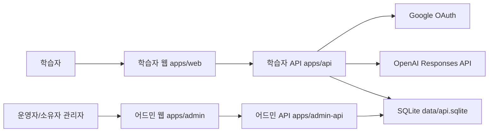
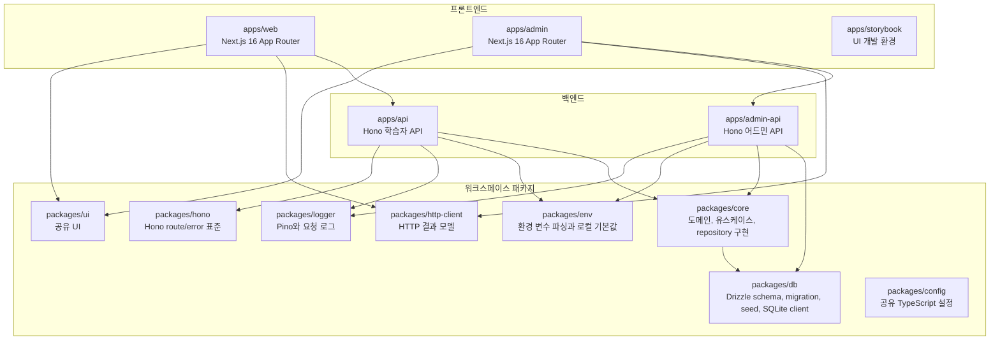

# 시스템 개요

이 문서는 writing-app의 엔지니어링 관점 시스템 구조, 서비스 경계, 배포 인프라를 설명하는 단일 진실 원천이다.

## 기준

- 기준일: 2026-06-19
- 기준 소스: 현재 코드베이스의 `apps/*`, `packages/*`, 루트 설정, 기존 `docs` 문서
- 제외: 레거시 실험 디렉터리의 구현 파일. 제품 런타임은 해당 디렉터리를 import하지 않는다.

## 시스템 목적

writing-app은 한국어 글쓰기 학습 플랫폼이다. 학습자는 코스를 탐색하고 step 기반 레슨을 수행하며 진행률, 답변, AI 코칭 결과를 저장한다. 운영자는 별도 어드민에서 콘텐츠, 사용자, 분석, 운영 설정을 관리한다.

## C4 Model

### 수준 1. 시스템 맥락



### 수준 2. 컨테이너



## 서비스 경계

| 경계                   | 책임                                                                             | 금지                                                                     |
| ---------------------- | -------------------------------------------------------------------------------- | ------------------------------------------------------------------------ |
| `apps/web`             | 학습자 화면, 인증 시작, API 포트 호출, API DTO mapper                            | DB 직접 접근, 레거시 실험 디렉터리 import, API 응답을 화면에 그대로 전달 |
| `apps/api`             | 학습자 HTTP transport, Hono route, CORS, 인증 세션 확인, OpenAPI 생성, core 호출 | `@workspace/db`와 Drizzle 직접 import                                    |
| `apps/admin`           | 관리자 화면, 관리자 로그인, 어드민 API 포트 호출                                 | 학습자 API 호출, DB 직접 접근                                            |
| `apps/admin-api`       | 관리자 HTTP transport, 관리자 인증, 권한 guard, 운영 API                         | 학습자 웹 세션/쿠키와 혼용                                               |
| `packages/core`        | 도메인 DTO, 브랜드 타입, 상태 정책, 유스케이스, repository 구현, 학습자 API 조립 | HTTP transport 의존                                                      |
| `packages/db`          | SQLite client, Drizzle schema, migration, seed, persisted 값                     | `@workspace/core` import                                                 |
| `packages/ui`          | 공유 UI primitive와 스타일                                                       | 앱별 데이터 조회, 라우팅 정책                                            |
| `packages/config`      | 공유 TypeScript 설정                                                             | 런타임 코드와 도메인 로직                                                |
| `packages/hono`        | Hono route, validation, error handling 표준                                      | 도메인 정책 소유                                                         |
| `packages/env`         | 환경 변수 파싱과 로컬 기본값                                                     | 앱별 의미 변환                                                           |
| `packages/logger`      | pino logger와 요청 로그 middleware                                               | 비즈니스 이벤트 저장                                                     |
| `packages/http-client` | HTTP result shape와 네트워크 오류 모델                                           | 앱별 사용자 메시지와 인증 정책                                           |

## 런타임 의존성 방향

학습자 API의 핵심 방향은 다음과 같다.

```text
apps/api -> packages/core -> packages/db
```

이 방향은 `scripts/oxlint/workspace-rules.mjs`의 `workspace/no-invalid-workspace-dependency` 규칙으로 강제한다.

어드민 API는 현재 `apps/admin-api`에서 `@workspace/db`를 직접 조립해 `@workspace/core/admin/admin-drizzle.repository`의 `createDrizzleAdminRepository(database.db)`에 넘긴다. 어드민 use case 구현은 `packages/core/modules/admin/application/use-cases`에 dashboard, analytics, course, user, settings, content reset 기능별 파일로 둔다. `admin.service.ts`는 기능별 use case를 조합하고 기능별 port를 명시적으로 받아 단일 mega service/repository 의존이 다시 숨지 않게 한다.
`packages/core`의 module public facade는 domain/application 계약을 노출하고, Drizzle·Better Auth·OpenAI 같은 infrastructure 어댑터는 composition 또는 명시적인 adapter subpath에서만 직접 의존한다.
`packages/core` 내부 구현 파일은 `@workspace/core/modules/*/api` public facade를 역참조하지 않고, 필요한 domain·application port·use-case 선언 파일을 직접 import한다. 이 경계는 `packages/core/src/architecture.test.ts`에서 검증한다.
학습자·관리자 request/response DTO와 Zod schema는 `packages/contracts`가 원본으로 소유한다. 관리자 contract는 `packages/contracts/src/admin` 아래 기능별 파일과 shared schema 파일로 나누고 `@workspace/contracts/admin` entrypoint가 공개 계약을 다시 노출한다. 브라우저 앱은 API 경계에서 contracts를 검증하고 화면은 앱 내부 모델을 소비한다. `apps/admin`은 `http-admin-api.ts` HTTP adapter에서만 admin contract를 검증·변환하고, API 포트와 화면은 앱 모델 타입을 소비한다. `apps/web`의 core 직접 import 금지는 아키텍처 테스트와 workspace lint rule로 고정하며, `packages/core`는 기존 public API 호환성을 위해 contracts를 re-export한다.
매칭 스텝의 presentation choice id, deterministic shuffle, selection map, answer payload 변환은 HTTP contract나 core domain이 아니라 `apps/web/src/features/lessons/lesson-match-presentation.ts`가 소유하는 프런트엔드 feature model이다. `packages/contracts`는 학습 DTO schema만 노출하고, core는 이 웹 UI 상호작용 모델을 재수출하지 않는다.
Learning domain이 content DTO나 content id 타입을 참조해야 할 때는 content module facade가 아니라 `@workspace/contracts/content` 경계를 사용한다. content application service가 learning progress helper를 호출하는 방향은 허용하지만, learning domain이 content module public facade를 되물어 module facade 순환을 만들지 않는다.

## 현재 앱 라우트

### 학습자 웹

- `/`: 랜딩
- `/login`: Google 로그인 화면
- `/app`: 학습 홈
- `/app/courses`: 코스 목록
- `/app/courses/[id]`: 코스 상세
- `/app/lesson?lesson_id=...`: 레슨 진행
- `/app/profile`: 프로필

학습자 웹의 server route는 API 호출 결과를 `apps/web/src/lib/api/route-api-outcome.ts`의 route-level outcome으로 분류한다. 인증 실패는 로그인 redirect, not-found는 route별 notFound 또는 notice, 네트워크·서버 실패는 `AppRouteNotice`로 처리하며, empty state는 성공 응답의 빈 값일 때만 화면 컴포넌트가 다룬다. 앱 홈 route는 profile과 progress를 모두 필수 데이터로 보고, 둘 중 하나의 API 실패도 빈 홈이나 부분 홈으로 변환하지 않는다. 코스 목록 화면은 API 실패를 빈 목록으로 변환하지 않고, 성공 응답의 빈 목록만 별도 empty state로 렌더링한다. 프로필 route는 세션 부재나 API 401만 로그인 이동으로 처리하고, 프로필 API의 네트워크·서버 실패는 장애 notice로 유지한다.

### 어드민 웹

- `/login`: 관리자 로그인
- `/`: 어드민 기본 화면
- `/courses`: 코스 목록
- `/courses/[id]`: 코스 상세/편집 화면
- `/users`: 사용자 목록
- `/users/[id]`: 사용자 상세
- `/analytics`: 분석
- `/settings`: 운영 설정
- `/debug/steps`: 내부 QA용 스텝 디버그

## API 런타임

학습자 API는 `apps/api/src/main.ts`에서 `createLearnerApiCore()`를 통해 core 서비스를 조립하고 Hono 앱에 주입한다. 요청 context의 route 서비스 의존성은 route 등록과 같은 app 조립 경계에서 required로 제공하며, 테스트는 사용하지 않는 서비스를 명시적 failing fake로 채운다. `apps/api/src/routes/index.ts`는 typed route 배열과 auth proxy, `/openapi` bootstrap 등록을 함께 소유한다. OpenAPI 문서는 실제 등록 route에서 `/openapi`로 생성하며, route schema는 `packages/contracts`의 Zod 계약을 직접 참조한다. OpenAPI document/response helper는 `apps/api/src/http/openapi.ts`, learner wire contract schema는 `apps/api/src/http/learner-contract.schemas.ts`가 소유한다. 정적 OpenAPI JSON과 웹 generated 타입의 drift는 `bun run check:api-contract`에서 함께 검증한다.
learner route handler는 typed route가 검증한 transport 입력을 읽고, request context의 use case를 호출한 뒤 성공 응답만 mapping한다. core result의 오류 정규화는 `apps/api/src/errors/map-core-error.ts`의 `unwrapApiCoreResult()`가 담당한다.

콘텐츠 조회는 core의 공통 content reader가 repository 조회, DTO 검증, not-found result를 담당한다. `LearnerContentService`는 이 조회 결과에 학습자 진행률을 합성하는 책임만 추가한다.
학습 step answer 검증은 `packages/core/src/modules/learning/domain/step-answer-policy.ts`의 domain policy가 소유한다. `LearningService`는 command parse, lesson 조회, policy 판정, repository 저장 조정에 집중하고 step type별 answer validator를 직접 구현하지 않는다.
AI 피드백 생성은 `AiFeedbackService`가 lesson 조회와 AI_FEEDBACK step 판정만 담당하고, 시도 한도 계산·prompt 기반 provider 호출·결과 저장은 `ai-feedback-attempt-coordinator.ts`가 조정한다. AI_FEEDBACK step 지원 여부는 `ai-feedback-step-policy.ts` domain policy가 소유한다.

어드민 API는 `apps/admin-api/src/main.ts`에서 SQLite DB, 어드민 repository, Better Auth, 관리자 세션 resolver, 요청 로거를 조립한다. Route는 `@workspace/hono/core`의 typed route definition으로 등록하고, request/query/body wire contract는 `packages/contracts/admin`을 직접 참조한다. 관리자 세션과 owner 권한은 route middleware가 `AppError` 기반 표준 오류로 변환하며, `/openapi`는 등록된 typed route에서 OpenAPI 3.1 문서를 생성한다. `apps/admin-api`의 app 조립 경계는 core의 broad `AdminService`를 route에 직접 넘기지 않고 analytics, courses, dashboard, settings, content reset, users use case 슬롯으로 나눠 주입한다. `apps/admin` 화면은 core나 admin wire DTO package를 직접 import하지 않는다.
어드민 코스 편집기는 root에 `course-editor-shell.tsx` entrypoint만 두고, 레슨/스텝 편집 작업 화면은 `workspace/`, 학습자 표시 확인은 `preview/`, 스텝 타입별 폼은 `step-forms/` 아래에 둔다. step form 의존 방향은 `step-forms/step-form-registry.tsx -> step-forms/index.ts -> step-forms/* -> step-forms/shared/step-form-contract.tsx`이다. 개별 step form은 registry를 import하지 않고, registry는 개별 form 파일이나 shared shell을 직접 import하지 않는다.

`packages/core`의 공개 표면은 실제 런타임에서 쓰이는 module API, learner API bootstrap, result/errors/kernel 같은 공통 값으로 제한한다. request context, event bus, unit of work, container wiring처럼 아직 use case에 연결되지 않은 scaffold는 도입 시점까지 공개하지 않는다.

## 데이터 저장소

- 단일 SQLite 파일을 기본 저장소로 사용한다.
- 로컬 기본 경로는 저장소 루트의 `data/api.sqlite`다.
- 학습자 API와 어드민 API는 같은 SQLite 파일을 공유하지만 인증 테이블과 쿠키 이름을 분리한다.
- 브라우저 localStorage는 사용자 계정, 학습 진행, 연속 학습일의 영속 저장소로 사용하지 않는다.
- `createWritingAppDatabase()`는 연결 직후 `foreign_keys=ON`, `journal_mode=WAL`, `busy_timeout=5000`, `synchronous=NORMAL`을 적용한다.

## 배포 인프라 개요

현재 문서화된 목표 운영 인프라는 다음과 같다.

- Ubuntu 서버에서 프로세스를 실행한다.
- systemd로 `apps/web`, `apps/api`, `apps/admin`, `apps/admin-api` 프로세스를 관리한다.
- Caddy가 reverse proxy와 TLS를 담당한다.
- SQLite 파일은 API 프로세스와 같은 로컬 디스크에 둔다.
- 여러 서버나 네트워크 파일시스템에서 같은 SQLite 파일을 직접 공유하지 않는다.
- SQLite 백업과 복구 절차는 배포 전 필수 운영 절차로 관리한다.

## 운영상 독립성

- `apps/admin`과 `apps/admin-api`가 중단되어도 학습자용 `apps/web`과 `apps/api`는 계속 동작해야 한다.
- 관리자 인증과 학습자 인증은 테이블, 쿠키 이름, 로그인 방식, API origin을 분리한다.
- 콘텐츠 seed는 안정적인 ID 기준으로 기존 콘텐츠를 갱신하고, seed에서 빠진 콘텐츠는 삭제가 아니라 `archived`로 전환한다.
