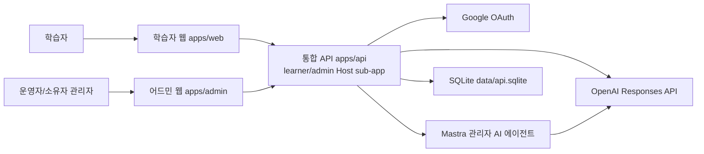
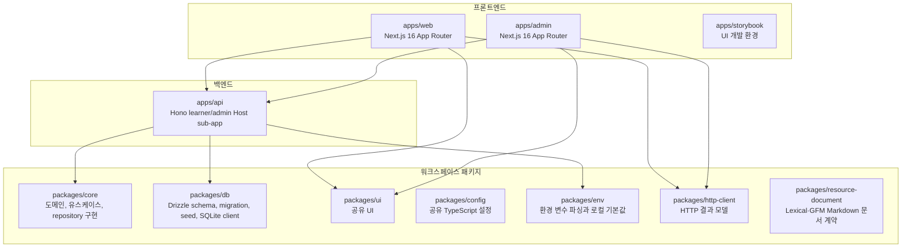

# 시스템 개요

이 문서는 writing-app의 엔지니어링 관점 시스템 구조, 서비스 경계, 배포 인프라를 설명하는 단일 진실 원천이다.

## 기준

- 기준일: 2026-07-18
- 기준 소스: 현재 코드베이스의 `apps/*`, `packages/*`, 루트 설정, 기존 `docs` 문서
- 제외: 레거시 실험 디렉터리의 구현 파일. 제품 런타임은 해당 디렉터리를 import하지 않는다.

## 시스템 목적

writing-app은 한국어 글쓰기 학습 플랫폼이다. 학습자는 코스를 탐색하고 step 기반 레슨을 수행하며 진행률, 답변, AI 코칭 결과를 저장한다. 운영자는 별도 어드민에서 콘텐츠, 사용자, 분석, 운영 설정을 관리한다.

## C4 Model

### 수준 1. 시스템 맥락



이 다이어그램은 저장소의 최종 runtime과 Compose·Caddy source configuration을 나타낸다. 외부 운영 실행은 사용자 승인으로 이번 아키텍처 작업의 검증 범위에서 제외했으므로, 이 문서는 실제 production 배포나 관찰 성공을 주장하지 않는다.

### 수준 2. 컨테이너



## 서비스 경계

| 경계                         | 책임                                                                                               | 금지                                                            |
| ---------------------------- | -------------------------------------------------------------------------------------------------- | --------------------------------------------------------------- |
| `apps/web`                   | 학습자 화면, 인증 시작, API 포트 호출, canonical API DTO 검증                                      | DB 직접 접근, 레거시 실험 디렉터리 import, 무검증 API 응답 소비 |
| `apps/api`                   | 단일 DB 수명주기, learner/admin Host sub-app 조립, app-owned adapter, HTTP transport·guard·OpenAPI | route·middleware·HTTP response 경계의 DB·Drizzle 직접 import    |
| `apps/admin`                 | 관리자 화면, 관리자 로그인, 기능별 API schema 검증과 의미 있는 화면 projection                     | 학습자 API 호출, DB 직접 접근, 무변환 DTO 복제                  |
| `packages/core`              | 도메인 DTO, 브랜드 타입, 상태 정책, 유스케이스, port                                               | HTTP transport 의존, concrete adapter 소유                      |
| `packages/db`                | SQLite client, Drizzle schema, migration, seed, persisted 값                                       | `@workspace/core` import                                        |
| `packages/ui`                | 공유 UI primitive, 순수 도메인 프레젠테이션, 스타일                                                | 앱별 데이터 조회, 채점/세션, 라우팅 정책, API 호출              |
| `packages/config`            | 공유 TypeScript 설정                                                                               | 런타임 코드와 도메인 로직                                       |
| `packages/env`               | 환경 변수 파싱과 로컬 기본값                                                                       | 앱별 의미 변환                                                  |
| `packages/http-client`       | HTTP result shape와 네트워크 오류 모델                                                             | 앱별 사용자 메시지와 인증 정책                                  |
| `packages/resource-document` | Lexical node, GFM AST mapper와 Markdown 변환·검증                                                  | React UI, API 호출, DB 영속화, 폴더·트리 정책                   |

## 런타임 의존성 방향

통합 API의 런타임 의존성 방향은 다음과 같다.

```text
apps/api composition -> packages/core public port/use case
                     -> apps/api adapter -> packages/db primitive
```

`apps/api/src/api-runtime.ts`가 SQLite client와 close-once 수명주기를 한 번 소유하고, learner core와 별도 관리자 Better Auth/session resolver, 여섯 관리자 capability route group을 같은 composition root에서 조립한다. learner composition은 core의 `auth`, `learning`, `ai-feedback` 공개 facade에서 policy·use case·port를 직접 가져와 app-owned adapter와 연결한다. 가입 hook과 session resolver는 같은 profile repository를 직접 사용하고, transition route에는 repository의 `startLesson`·`completeStep`만 노출한다. 관리자 composition은 content, identity, dashboard analytics, settings, AI chat, resource library의 adapter·query reader·factory를 target `apps/api`에 조립한다. core의 DB·Drizzle runtime edge, 앱 route·middleware·HTTP response 경계의 DB·Drizzle import와 `packages/db -> packages/core`는 `scripts/oxlint/workspace-rules.mjs`와 architecture ratchet으로 차단한다.
`packages/core`의 module public facade는 domain/application 계약을 노출한다. Better Auth, OpenAI provider와 모든 persistence adapter는 실행 앱이 소유한다. 현재 architecture ratchet 실측은 runtime allowance와 capability allowance 모두 0개다.
`packages/core` 내부 Implementation은 package `imports`의 `#/*` private alias로 필요한 domain·application port·use-case 선언 파일을 직접 import한다. 자기 공개 Interface 역참조와 외부의 Implementation deep import는 package Interface architecture 검사에서 차단한다.
학습자·관리자 request/response DTO와 Zod schema는 `packages/contracts`가 원본으로 소유한다. `*Request`, query와 header는 transport에서 검증하고, 변경 route는 검증된 값을 별도 application command로 명시적으로 구성한다. core use case와 repository port는 HTTP request 타입을 입력으로 사용하지 않는다. 브랜드 ID, 상태 값과 안정적인 조회 projection은 변경 이유가 같으면 공유한다. 이 결정은 ADR-0009를 따른다.
관리자 content core 경계는 `@workspace/contracts/admin/content-data`의 course editor·projection item·publish/reset canonical data만 사용한다. course/reset port와 use case는 content capability가 소유하고 app composition이 content repository를 두 factory에 직접 연결한다. course 목록은 flat application page result, 보관은 `not-found | ok` 결과로 반환하며 target `apps/api` admin route가 기존 pagination envelope와 `{ archived: true }` acknowledgement로 mapping한다. course 생성·editor 조회/저장·발행·content reset 성공값도 route가 공개 schema로 검증한 뒤 응답한다. path, status, ETag·If-Match와 owner/version conflict 의미는 유지한다.
관리자 identity core 경계는 `@workspace/contracts/admin/identity-data`의 admin/user ID·role, user item/detail과 filter/sort canonical data만 사용한다. 사용자 목록·상세 read는 admin capability가, 상태 변경·profile soft-delete mutation은 auth capability가 소유한다. app composition과 route dependency는 query/mutation을 분리한다. 사용자 목록은 flat application page result, 상태 변경과 삭제는 명시적 `forbidden | not-found | ok` 결과로 반환하며 target `apps/api` admin route가 기존 pagination envelope, public 오류와 `{ deleted: true }` acknowledgement로 mapping한다. route는 상세·상태 변경 성공값도 공개 schema로 검증하고 기존 profile soft-delete와 operator `403` 의미를 유지한다. session revoke·cascade·physical delete와 self-owner 정책은 추가하지 않았다.
관리자 dashboard·analytics core 경계는 capability-local `AdminDashboardReader`와 `AdminAnalyticsReader`를 독립 port로 사용한다. app composition과 route가 두 reader를 직접 사용한다. reader는 `@workspace/contracts/admin/dashboard-analytics-data`의 dashboard·analytics snapshot, lesson item과 sort/direction canonical data만 사용한다. lesson analytics는 flat application page result로 반환하며 target `apps/api` admin route가 기존 pagination envelope로 mapping한다. route는 기간·검색·정렬·page query를 명시적으로 조립하고 dashboard·summary·page 성공값을 전송 직전 검증한다. 두 reader는 cross-capability projection을 조회하지만 mutation method나 write SQL을 갖지 않는다.
관리자 settings core 경계는 `@workspace/contracts/admin/settings-data`의 canonical snapshot만 사용한다. app composition은 좁은 `SettingsRepository`를 독립 use case factory에 직접 연결한다. notice·legal request body와 길이 검증은 target `apps/api` admin route에 남고, route가 검증된 필드를 명시적 command로 조립해 `forbidden | ok(value)` application 결과를 기존 HTTP status로 mapping한다. 모든 조회·저장 성공 응답도 route에서 검증하며 persistence의 version·ETag 없는 last-write-wins 의미는 유지한다.
웹 feature Adapter는 schema 검증 뒤 wire DTO와 화면 의미가 같으면 canonical DTO를 그대로 반환한다. 필드 이름, 표시 단위, 정렬 또는 UI 상태처럼 실제 의미가 달라질 때만 별도 projection을 두며, 참조를 복사하기 위한 identity mapper는 만들지 않는다. 화면 Module은 feature Interface를 통해 이 타입을 소비하므로 contract package의 광범위한 client import나 RSC 비직렬화 값이 새어 나오지 않는다.
HTTP 성공·실패 discriminant와 생성자는 `packages/http-client`가 단독 소유한다. 학습자와 관리자 앱은 자기 오류 union을 고정하는 type-only result specialization만 유지하고 runtime transport는 canonical 생성자를 직접 호출한다.
매칭 스텝의 presentation choice id, deterministic shuffle, pending·selection map과 stable item-ID 답안 변환은 `apps/web/src/features/lessons`가 소유한다. `packages/ui`의 `MatchAnswer`는 controlled choice·connection을 표시하고 button 접근성과 연결선 DOM 측정만 담당한다. `packages/contracts`는 학습 DTO schema만 노출하고, core는 웹 UI 상호작용 모델을 재수출하지 않는다.
Learning domain이 content DTO나 content id 타입을 참조해야 할 때는 content module facade가 아니라 `@workspace/contracts/content` 경계를 사용한다. content application service가 learning progress helper를 호출하는 방향은 허용하지만, learning domain이 content module public facade를 되물어 module facade 순환을 만들지 않는다.

## capability 소유권·대표 탐색 경로

다음 경로는 target runtime에서 대표적인 변경이 어느 capability에 속하는지 확인하는 현재 source 탐색 순서다. 모든 경로는 공개 계약 → 순수 policy/use case → app-owned adapter → composition → route 순서로 읽는다. 공개 계약은 wire·canonical data를, core는 HTTP·Drizzle에 독립적인 정책과 application 결과를, adapter는 SQLite 해석을, composition은 실행 의존성 연결을, route는 인증·입력·응답 mapping을 소유한다.

| 변경 시나리오       | 실제 source 탐색 경로                                                                                                                                                                                                                                                                                                                                                                                                                                                                                                                                                                            | 경계 확인                                                                                                                               |
| ------------------- | ------------------------------------------------------------------------------------------------------------------------------------------------------------------------------------------------------------------------------------------------------------------------------------------------------------------------------------------------------------------------------------------------------------------------------------------------------------------------------------------------------------------------------------------------------------------------------------------------ | --------------------------------------------------------------------------------------------------------------------------------------- |
| 학습 단계 완료      | [공개 계약](../../packages/contracts/src/learning/learner-api.ts) → [순수 policy](../../packages/core/src/modules/learning/domain/complete-step-effect-plan.ts) → [app-owned adapter](../../apps/api/src/adapters/learning/learner-transition-drizzle.repository.ts) → [composition](../../apps/api/src/learner-api-core.ts) → [route](../../apps/api/src/modules/learning/learner-transition.routes.ts)                                                                                                                                                                                         | route는 HTTP body·세션을 command로 만들고, policy는 effect 순서를 결정하며, adapter만 SQLite transaction을 해석한다.                    |
| 관리자 content 발행 | [공개 계약](../../packages/contracts/src/admin/content-data.ts) → [순수 use case](../../packages/core/src/modules/content/application/use-cases/admin-course.use-case.ts) → [app-owned adapter](../../apps/api/src/adapters/content/admin-course-drizzle.repository.ts) → [composition](../../apps/api/src/modules/admin-content/admin-content.composition.ts) → [route](../../apps/api/src/modules/admin-content/curriculum-editor.routes.ts)                                                                                                                                                   | use case는 owner authorization을, adapter는 draft version·SQL을, route는 `If-Match`·OpenAPI mapping을 소유한다.                         |
| 자료실 문서 조회    | [공개 계약](../../packages/contracts/src/admin/resource-library-data.ts)·[문서 wire 계약](../../packages/contracts/src/admin/admin-resource-documents.ts) → [순수 use case](../../packages/core/src/modules/resource-library/application/use-cases/resource-document.use-case.ts) → [app-owned adapter](../../apps/api/src/adapters/resource-library/resource-document-drizzle.repository.ts) → [composition](../../apps/api/src/modules/admin-resource-library/admin-resource-library.composition.ts) → [route](../../apps/api/src/modules/admin-resource-library/resource-documents.routes.ts) | use case는 Markdown 정규화·result variant를, adapter는 ETag version·FTS·SQLite transaction을, route는 관리자 세션·HTTP ETag를 소유한다. |

product backend executable은 `apps/api` 하나이며 learner/admin Host sub-app을 함께 소유한다. 관리자 foundation과 여섯 capability는 legacy subprocess 없이 target-only 계약 suite로 검증한다.

## 현재 앱 라우트

### 학습자 웹

- `/`: 랜딩
- `/login`: Google 로그인 화면
- `/app`: 학습 홈
- `/app/courses`: 코스 목록
- `/app/courses/[id]`: 코스 상세
- `/app/lesson?lesson_id=...`: 레슨 진행
- `/app/profile`: 프로필

학습자 웹의 server route는 `ApiResult`에서 직접 분기한다. 인증 실패는 로그인 redirect, not-found는 route별 notFound 또는 notice, 네트워크·서버 실패는 `AppRouteNotice`로 처리하며, empty state는 성공 응답의 빈 값일 때만 화면 컴포넌트가 다룬다. 앱 홈 route는 profile과 progress를 모두 필수 데이터로 보고, 둘 중 하나의 API 실패도 빈 홈이나 부분 홈으로 변환하지 않는다. 코스 목록 화면은 API 실패를 빈 목록으로 변환하지 않고, 성공 응답의 빈 목록만 별도 empty state로 렌더링한다. 프로필 route는 세션 부재나 API 401만 로그인 이동으로 처리하고, 프로필 API의 네트워크·서버 실패는 장애 notice로 유지한다.

### 어드민 웹

- `/login`: 관리자 로그인
- `/`: 어드민 기본 화면
- `/courses`: 코스 목록
- `/courses/[id]`: 코스 상세/편집 화면
- `/users`: 사용자 목록
- `/users/[id]`: 사용자 상세
- `/analytics`: 분석
- `/settings`: 운영 설정
- `/resources`: 관리자 자료실
- `/chat`: 관리자 AI 채팅

코스 썸네일의 canonical source는 `apps/web/public/course-thumbnails`다. 어드민은 현재 `CourseVisualKey` 5개만 `apps/admin/public/course-thumbnails`에 byte-identical mirror로 포함하고 `/course-thumbnails/<visual-key>.png` 정적 경로로 제공한다. `bun run check:course-thumbnail-assets`가 파일 집합과 SHA-256을 검증하므로 어드민 runtime은 sibling `apps/web` 파일시스템을 읽지 않는다.

## API 런타임

`apps/api/src/main.ts`와 E2E 진입점은 `createApiRuntime()`으로 하나의 SQLite client와 close-once 수명주기를 만들고 learner/admin Hono sub-app을 Host dispatcher에 등록한다. learner sub-app의 `createLearnerApiCore()`는 주입된 DB에 core의 공개 policy·use case·port와 app-owned adapter를 조립한다. 요청 context의 route 서비스 의존성은 route 등록과 같은 app 조립 경계에서 required로 제공하며, 테스트는 사용하지 않는 서비스를 명시적 failing fake로 채운다. `apps/api/src/routes/index.ts`는 typed route 배열과 auth proxy, `/openapi` bootstrap 등록을 함께 소유한다. 학습자 HTTP 경계는 `@workspace/contracts/learning`의 strict Zod schema와 추론 타입을 직접 사용한다. OpenAPI 문서는 실제 등록 route에서 `/openapi`로만 생성하며 정적 JSON과 generated TypeScript 타입은 추적하지 않는다. `apps/api/src/http/learner-response.ts`는 성공 응답 runtime 검증을, `learner-error-response.ts`는 canonical 오류와 request ID 정규화를 담당한다.
learner route handler는 typed route가 검증한 transport 입력을 읽고 request context의 use case를 호출한다. read route의 공통 결과 정규화는 `apps/api/src/errors/map-core-error.ts`가 담당하고, 학습 command route의 application 결과·expected rejection은 `apps/api/src/http/learner-command-route-mapper.ts`가 기존 성공 wire와 public 오류로 변환한다. 모든 성공 응답은 전송 직전 canonical response schema로 검증한다.

학습자 콘텐츠 조회는 `LearnerContentService`와 `ProgressService`가 `LearnerReadModelRepository`를 호출해 코스 목록·분류·상세, 레슨과 진행 상태를 조회하고 `@workspace/contracts/learning/read-data`의 canonical schema로 검증한다. `apps/api/src/http/learner-read-route-mapper.ts`가 HTTP query의 정규화, opaque cursor decode·encode와 `{ items, nextCursor }` wire mapping을 소유하고 core service·repository에는 decoded cursor 위치와 canonical item page만 전달한다. 잘못된 cursor는 이 app transport 경계에서 `INVALID_CURSOR`로 변환하며 course not-found와 lesson 잠금은 core application result로 유지한다.
`apps/api/src/adapters/learning/learner-read-model-drizzle.repository.ts`는 lesson SQL 결과에서 decode에 필요한 값만 `LearnerLessonPersistedRowBundle`로 복사하고, `learner-read-persisted-data.ts`가 `summary_json`과 step `content_json`을 canonical schema로 검증한다. decoder는 Drizzle query builder와 HTTP를 import하지 않고 `decoded | corrupt` 결과만 반환한다. 손상 결과는 부분 응답을 만들지 않으며 전용 내부 오류를 거쳐 외부의 기존 `INTERNAL_SERVER_ERROR` 500으로 정규화된다. core의 `learner-cursor.ts`는 decoded primary type·정렬 방향을 순수 condition으로 만들고 `learner-read-projection.ts`는 course/progress page와 learning state를 결정적으로 투영한다. app-local `learner-read-cursor-drizzle.ts`만 condition을 SQL predicate로 변환하며 schema/index, query 수와 HTTP wire는 바꾸지 않는다.
레슨 step 공개 projection은 `packages/core/src/modules/learning/application/learner-step-presenter.ts`가 소유한다. presenter는 10개 variant와 중첩 항목을 object literal allowlist로 새로 구성해 정답·해설·AI 설정·원본 매칭/분류 관계와 미래 internal field를 기본 거부한다. 동일한 학습자 scope·curriculum version·lesson·step은 같은 HMAC 기반 항목 순서를 만들며, `apps/api` read adapter는 persisted step decode와 scope 파생 뒤 presenter 호출만 수행한다.
학습 step 채점은 `packages/core/src/modules/learning/domain/step-grading-policy.ts`가 소유한다. learner transition service와 repository는 HTTP body/response를 참조하지 않고 `@workspace/contracts/learning/step-data`의 canonical submission·evaluation·learning state와 transport-neutral command/result variant만 사용해 고정 curriculum version, 잠금, 순서, 답안·진행·완료·활동일의 원자적 저장을 조정한다. 시작·완료·AI finalize route가 wire 입력을 command로, application 결과와 rejection을 기존 HTTP 응답·오류로 매핑한다.
AI 피드백 전이 service는 고정 version의 선행 WRITE 답안을 준비하고, 시도 한도·prompt 기반 provider 호출·결과 저장은 AI feedback attempt coordinator와 consumer-owned learning transition port를 통해 조정한다. target·sequence·attempt 상태와 replay/finalize 분기는 core의 순수 decision이 결정하고, app learning adapter는 snapshot 조회와 짧은 `IMMEDIATE` transaction effect만 적용한다.

`apps/api/src/api-runtime.ts`는 단일 SQLite client에 learner core, 별도 관리자 Better Auth/session resolver, 여섯 capability route group을 한 composition root에서 조립한다. Host dispatcher는 서로 겹치지 않는 learner/admin allowlist로 두 Hono sub-app을 분리한다. target admin sub-app은 health, session, `/api/auth/*`, CORS·trusted origin·6 MiB body limit·no-store·OpenAPI와 immutable capability registry를 가지며 AI chat, dashboard analytics, content, identity, resource library, settings group이 모두 등록돼 있다.

관리자 route는 `apps/api/src/http/platform/core`의 typed route definition과 `packages/contracts/admin` wire contract를 사용한다. 관리자 세션과 owner 권한은 route middleware가 표준 오류로 변환하며, `/openapi`는 등록된 typed route에서 OpenAPI 3.1 문서를 생성한다. 자료실 트리·문서·검색·자산·가져오기·내보내기는 REST를 사용하고 지속 연결 endpoint를 두지 않는다. 자료실 core는 transport-neutral command/query/result/rejection과 canonical data만 공개하며 HTTP request/query/response wrapper·error schema를 참조하지 않는다. target route가 parse, 관리자 actor mapping, status/error mapping과 응답 직전 schema validation을 소유한다.

AI chat core는 `admin/ai-chat-data`의 canonical conversation ID·conversation·message·role과 transport-neutral query/history 결과만 사용한다. target app composition과 route는 좁은 `AiChatRepository`를 직접 사용한다. 목록의 canonical 배열과 history의 `messageItems`는 target `apps/api` route가 list/detail wrapper로 mapping해 검증한다. 같은 route의 stream adapter가 message request, rate limit, Mastra provider 호출과 chunk/done/error schema 검증·직렬화를 소유한다. target adapter는 `admin_ai_chat_conversations`, `admin_ai_chat_messages` persistence와 관리자 격리·pagination·ordering을 유지하며 provider SDK를 import하지 않는다. Mastra Memory는 사용하지 않고 저장된 메시지를 프롬프트 컨텍스트로 구성하며 provider는 DB transaction 밖에 남는다.

`packages/resource-document`는 브라우저·headless 서버 공용 Lexical 0.46.0 node와 정규 GFM AST import/export·검증을 제공한다. `content_markdown`이 문서 본문의 유일한 영속 원본이며 조회 응답은 현재 `version`의 강한 ETag를 함께 반환한다. 저장은 `If-Match`가 일치할 때만 제목·Markdown·FTS·수정 메타데이터와 버전을 한 SQLite transaction에서 갱신하고, 충돌은 `412 Precondition Failed`와 최신 문서를 반환한다. `apps/admin` 자료실은 최대 3단계 이름순 전체 트리와 Lexical WYSIWYG 편집기, 명시적 저장, 미저장 경고와 포커스 복귀 HTTP 재검증을 제공한다. 충돌 시 로컬 편집본을 유지하며 자동 병합하지 않는다.
어드민 코스 편집기는 root에 `course-editor-shell.tsx` entrypoint만 두고, 레슨/스텝 편집 작업 화면은 `workspace/`, 학습자 표시 확인은 `preview/`, 스텝 타입별 폼은 `step-forms/` 아래에 둔다. step form 의존 방향은 `step-forms/step-form-registry.tsx -> step-forms/index.ts -> step-forms/* -> step-forms/shared/step-form-contract.tsx`이다. 개별 step form은 registry를 import하지 않고, registry는 개별 form 파일이나 shared shell을 직접 import하지 않는다.

`packages/core`의 공개 표면은 실제 런타임에서 쓰이는 `admin`, `ai-feedback`, `auth`, `content`, `learning`, `resource-library` 6개 capability API로 제한한다. 실행 앱 전용 bootstrap, request context, event bus, unit of work, container wiring처럼 공개 소비자가 없는 seam·scaffold는 노출하지 않는다.

## 데이터 저장소

- 단일 SQLite 파일을 기본 저장소로 사용한다.
- 로컬 기본 경로는 저장소 루트의 `data/api.sqlite`다.
- `apps/api`만 SQLite writer와 close owner를 소유하며 learner/admin 인증 테이블과 쿠키 이름은 분리한다.
- 브라우저 localStorage는 사용자 계정, 학습 진행, 연속 학습일의 영속 저장소로 사용하지 않는다.
- `createWritingAppDatabase()`는 연결 직후 `foreign_keys=ON`, `journal_mode=WAL`, `busy_timeout=5000`, `synchronous=NORMAL`을 적용한다.

## 배포 인프라 개요

현재 문서화된 목표 운영 인프라는 다음과 같다.

- Ubuntu 24.04 LTS 단일 서버에서 Docker Compose로 학습자 웹, 어드민 웹, 통합 API를 관리한다.
- Cloudflare Tunnel만 외부 연결을 만들며 호스트에는 애플리케이션 port를 공개하지 않는다.
- Caddy가 Tunnel과 애플리케이션 사이의 내부 HTTP reverse proxy를 담당하고 외부 TLS는 Cloudflare가 종료한다.
- SQLite 파일은 API 프로세스와 같은 로컬 디스크에 둔다.
- 여러 서버나 네트워크 파일시스템에서 같은 SQLite 파일을 직접 공유하지 않는다.
- Litestream이 SQLite WAL을 Cloudflare R2에 연속 복제한다.
- Ansible이 Docker 설치, 설정 배치, migration, 배포, 검증, 코드 롤백과 DB 복구를 수행한다.
- 상세 실행 계약은 `deployment.md`를 단일 진실 원천으로 사용한다.

## 운영상 독립성

- `apps/admin`의 SSR 또는 화면 장애가 학습자용 `apps/web`과 `apps/api`를 중단시키지 않아야 한다. 반면 통합 `apps/api` process 장애는 learner/admin Host 모두에 영향을 줄 수 있으므로 Host별 sub-app failure isolation, readiness와 운영 관찰로 완화한다.
- 관리자 인증과 학습자 인증은 테이블, 쿠키 이름, 로그인 방식, API origin을 분리한다.
- 콘텐츠 seed는 안정적인 ID 기준으로 기존 콘텐츠를 갱신하고, seed에서 빠진 콘텐츠는 삭제가 아니라 `archived`로 전환한다.

## 채택된 목표 런타임과 어댑터 경계

[ADR-0012](./adr/ADR-0012-single-api-runtime.md)는 backend를 `apps/api` 단일 프로세스로 통합하고 learner/admin hostname·cookie·secret·table·origin·권한은 별도 sub-app으로 유지하도록 채택했다. 저장소에는 strict Host dispatcher, 두 독립 auth instance, 단일 DB·종료 owner와 여섯 관리자 capability route가 구현돼 있고 Compose·Caddy도 두 public API Host를 `apps/api:4000`으로 전달한다. 외부 운영 증적은 사용자 승인으로 범위에서 제외했으며 실제 production 배포·관찰 성공으로 해석하지 않는다.

[ADR-0014](./adr/ADR-0014-app-owned-persistence-adapters.md)는 composition, SDK와 concrete persistence adapter를 실행 앱이 소유하고 `packages/core`에는 순수 policy·use case·port만, `packages/db`에는 client·schema·migration·seed·persisted primitive만 남기는 목표를 채택했다. MTA-15~26에서 capability별 이동과 bootstrap 제거를 끝내 core runtime allowance를 0으로 닫았으며, 단일 API runtime 전환 시에도 이 경계를 유지한다.

## 관리자 API 조립 경계

`apps/api/src/api-runtime.ts`가 database 생성·공유·종료와 learner core, 별도 관리자 Better Auth, 관리자 capability composition을 소유한다. content reset·identity·dashboard analytics·settings·AI chat·자료실 adapter를 만들고 query reader/repository는 route에 직접 전달하며 정책이 있는 use case만 factory로 조립한다. shutdown은 신규 요청 차단, Bun server 정지, close-once 데이터베이스 종료 순서다.

top-level Host dispatcher는 raw `Host`와 `Request.url` authority가 일치하고 정확히 한 allowlist에 속할 때만 해당 sub-app을 호출한다. Origin과 forwarded host는 dispatch 입력이 아니다. 여섯 capability route는 `apps/api`에 모두 등록됐다.
