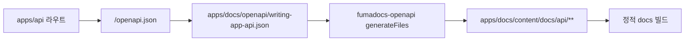

# API OpenAPI 문서 통합 설계

## 배경

`apps/api`는 Hono와 `hono-openapi`를 사용해 `/openapi.json`을 제공한다. `apps/docs`는 Fumadocs 기반 Next.js 문서 앱이며 현재 `output: "export"` 정적 빌드를 사용한다. API 문서는 실행 중인 API 서버를 직접 조회하지 않고, API 앱이 생성한 OpenAPI 파일을 docs 앱이 읽어서 Fumadocs 문서로 생성해야 한다.

## 목표

- `apps/api`가 현재 라우트 기준 OpenAPI 3.1 JSON 파일을 생성한다.
- 생성된 OpenAPI 파일은 `apps/docs`가 입력으로 사용한다.
- `apps/docs`는 `fumadocs-openapi`를 사용해 API 레퍼런스 MDX 문서를 생성한다.
- docs 앱의 정적 export 구조를 유지하고, 빌드 시 API 서버 실행에 의존하지 않는다.
- 생성 절차와 검증 방법을 `/docs` 문서에 한국어로 기록한다.

## 제외 범위

- API 클라이언트 SDK 생성은 포함하지 않는다.
- Swagger UI, Scalar 같은 별도 런타임 API 콘솔은 포함하지 않는다.
- API 서버 라우트 자체의 계약 변경은 포함하지 않는다.
- `/prototype` 디렉터리는 변경하지 않는다.

## 권장 아키텍처

파일 기반 생성 파이프라인을 사용한다.

1. `apps/api`에서 OpenAPI 문서를 생성하는 재사용 가능한 함수를 둔다.
2. API 생성 스크립트는 테스트용 의존성으로 `createApiApp()`을 조립하고 `/openapi.json` 응답을 받아 JSON 파일로 저장한다.
3. 저장 위치는 docs 앱이 소유하는 입력 파일인 `apps/docs/openapi/writing-app-api.json`로 둔다.
4. `apps/docs`는 이 JSON 파일을 `fumadocs-openapi`의 입력으로 읽고 `apps/docs/content/docs/api/**` MDX 파일을 생성한다.
5. Fumadocs 페이지 렌더러는 OpenAPI 타입 페이지일 때 `APIPage`를 사용하고, 일반 MDX 문서는 기존 렌더링 경로를 유지한다.

이 구조는 API 서버 실행과 docs 빌드를 분리한다. CI나 로컬 빌드에서 API 앱 코드를 실행해 파일을 만들지만, 네트워크 포트나 서버 프로세스는 필요하지 않다.

## 생성 흐름



## 파일 책임

- `apps/api/src/openapi/openapi-document.ts`
  - OpenAPI 문서를 `Response`가 아닌 plain object로 생성한다.
  - API 라우트가 사용하는 문서 메타데이터와 파일 생성 스크립트가 같은 출처를 쓰게 한다.

- `apps/api/src/scripts/generate-openapi.ts`
  - `createApiApp()`을 조립해 OpenAPI JSON을 생성한다.
  - 출력 경로 기본값은 `../../docs/openapi/writing-app-api.json`로 둔다.
  - 필요하면 CLI 인자로 출력 경로를 받을 수 있게 한다.

- `apps/docs/openapi/writing-app-api.json`
  - docs 앱의 OpenAPI 입력 파일이다.
  - API 앱 생성 스크립트의 산출물이며, 변경 사항을 리뷰할 수 있도록 저장소에 포함한다.

- `apps/docs/scripts/generate-openapi-docs.ts`
  - `fumadocs-openapi`의 `generateFiles()`로 API 레퍼런스 문서를 생성한다.
  - 출력 경로는 `apps/docs/content/docs/api`로 둔다.

- `apps/docs/components/api-page.tsx`
  - `fumadocs-openapi/ui`의 `createAPIPage()`로 OpenAPI 전용 페이지 컴포넌트를 제공한다.

- `apps/docs/app/docs/[[...slug]]/page.tsx`
  - `page.data.type === "openapi"`인 경우 `APIPage`를 렌더링한다.
  - 일반 문서는 기존 `MDX` 렌더링을 유지한다.

- `apps/docs/package.json`
  - OpenAPI 입력 파일 생성과 Fumadocs 문서 생성을 실행하는 스크립트를 추가한다.
  - docs 빌드 전에 생성 스크립트가 실행되도록 연결한다.

- `docs/api-openapi-docs.md`
  - 전체 생성 절차, 산출물, 검증 명령, 운영상 주의점을 한국어로 기록한다.

## 스크립트 계약

루트 또는 앱 필터에서 다음 흐름을 실행할 수 있어야 한다.

```bash
bun --filter @workspace/api openapi:generate
bun --filter docs openapi:generate
bun --filter docs build
```

`apps/docs`의 `build`는 OpenAPI 문서 생성 후 `next build`를 실행한다. `types:check`도 생성된 Fumadocs collection 타입에 의존하므로 OpenAPI 문서 생성 후 실행되도록 한다.

## 오류 처리

- OpenAPI JSON 생성이 실패하면 스크립트는 종료 코드 1로 실패한다.
- `apps/docs/openapi/writing-app-api.json`이 없거나 JSON 파싱에 실패하면 docs 문서 생성 스크립트도 실패한다.
- 생성 문서가 stale 상태인지 확인하기 위해 최종 검증에서 생성 스크립트 실행 후 `git diff --check`와 관련 파일 diff를 확인한다.

## 테스트와 검증

- API 앱 테스트에 `/openapi.json` 응답 경로 검증을 유지한다.
- OpenAPI 파일 생성 스크립트는 실제 파일 생성까지 검증하는 작은 테스트 또는 스크립트 실행 검증으로 확인한다.
- docs 앱은 `bun --filter docs types:check`, `bun --filter docs lint`, `bun --filter docs build`로 확인한다.
- 전체 작업 후 가능한 범위에서 루트 `bun run lint`, `bun run test`, `bun run typecheck`, `bun lefthook run pre-commit`를 실행한다.

## 문서화

작업 시작 시 `docs/api-openapi-docs.md`에 설계 시작 항목을 추가한다. 작업 완료 시 같은 문서에 실제 구현된 스크립트, 생성 파일, 검증 결과를 갱신한다.

## 수용 기준

- `apps/api`에서 명령 한 번으로 `apps/docs/openapi/writing-app-api.json`이 생성된다.
- `apps/docs`에서 명령 한 번으로 OpenAPI 기반 Fumadocs MDX 문서가 생성된다.
- `/docs/api` 아래에서 API 레퍼런스 문서가 렌더링된다.
- docs 빌드는 실행 중인 API 서버가 없어도 성공한다.
- 변경 사항과 실행 방법이 `/docs`에 한국어로 기록된다.
