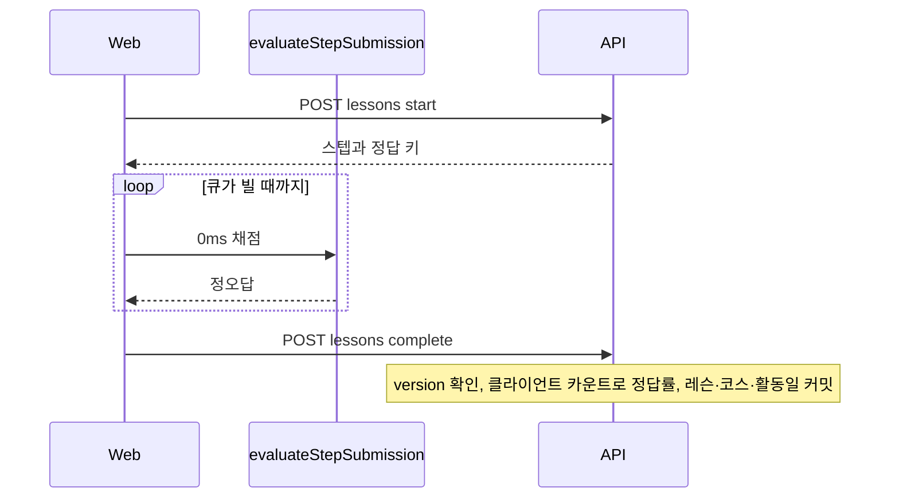
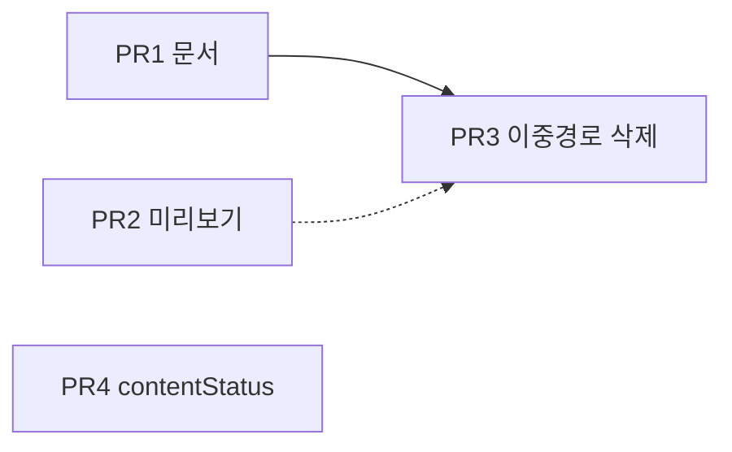

# 우발적 복잡성 우선순위 상 작업 계획

## 문서 상태

- 상태: 구현 완료, 브라우저 UI 재확인은 도구 단절로 미완. `ci:tests`·`build`·typecheck는 통과했고, 학습자 `completeLesson` HTTP는 정답률·스트릭 응답을 확인했다.
- 기준 날짜: 2026-09-03
- 기준 커밋: `1c4f88ff49f4b9163e6cd4357352d332570fa801`
- 입력: 저장소 루트의 커밋하지 않은 감사 파일 `우발적 복잡성 감사 결과.md`

이 문서는 한시 작업 범위다. 현재 제품 사실은 권위 문서를 따른다.

코드 PR은 이 문서의 착수를 따로 요청할 때 진행한다.

## 목표

2026-09-01 클라이언트 즉시 채점 전환 이후에도 남은 서버 `completeStep` 경로와 채점 복제를 제거한다.

확정 스텝 11종과 채점 소유자를 권위 문서와 코드에서 같게 둔다.

관리자 학습자 미리보기에 누락된 3타입을 넣는다.

레슨 조회마다 published 코스 목록을 다시 읽는 조회를 없앤다.

## 제품 전제

클라이언트 즉시 채점을 유지한다.

레슨 완료 정답률과 스트릭은 클라이언트가 보낸 `mistakeCount`와 `totalAttempts`를 신뢰한다.

`completeLesson` body의 미사용 `answers` 필드는 스키마에서 제거한다.

인증 시험처럼 지표 무결성이 필요해지면 이 전제를 되돌리고 서버 재채점을 다시 검토한다.

## 범위

### 포함

- AC-7-01, AC-7-02, AC-7-03: 권위 문서 정합
- AC-1-04: 관리자 미리보기 `TRUE_FALSE`, `SENTENCE_BUILD`, `ERROR_CORRECT`
- AC-1-01, AC-1-02, AC-2-01, AC-2-04, AC-6-01, AC-10-01: 죽은 `completeStep` 경로와 복제 채점 제거
- AC-1-03, AC-9-03: `answers` 제거와 신뢰 전제 문서화
- AC-8-01: 레슨 조회마다 `listPublishedCourses`를 도는 조회

### 제외

- AC-1-05 좁은 content query port
- AC-1-06 저장소 파일 분할
- AC-2-02 DTO 별칭 정리
- AC-3-03 ADR-0025 extra export
- TS6 호환 패키지와 제품 미사용 UI 카탈로그
- ADR-0029의 “8개 고정”을 현재 사실로 고치는 일. ADR은 이력이다.

## 목표 모델

서버 `POST .../steps/{stepId}/complete`와 `gradeLearnerStep`는 이 모델에 없다.

저장소 안 학습자 호출자는 [`apps/web`](../../../apps/web)뿐이다.

웹은 [`use-lesson-session.ts`](../../../apps/web/src/features/lesson-session/hooks/use-lesson-session.ts)에서 `evaluateStepSubmission`과 `completeLesson`만 쓴다.

E2E에도 step complete 호출이 없다.

외부 OpenAPI 소비자는 이 저장소에서 확인되지 않았다.

## PR 순서

PR 1과 PR 2는 서로 독립이다.

PR 3은 PR 1의 문서 전제 뒤에 둔다.

PR 4는 PR 3과 독립이다. learning 충돌을 피하려면 PR 3 뒤에 둔다.

브랜치 prefix는 [`git-workflow.md`](../../engineering/git-workflow.md)의 `codex/`를 따른다.

---

## PR 1 — 권위 문서를 코드에 맞춘다

### 코드 권위

스텝 타입 집합은 [`lessonStepTypeValues`](../../../packages/shared/contracts/src/content/steps/index.ts)가 소유한다.

채점 함수는 [`evaluateStepSubmission`](../../../packages/shared/contracts/src/learning/step-grading.ts)이 소유한다.

레슨 런타임 전환 기록은 [`lesson-runtime.md`](../../engineering/lesson-runtime.md)의 2026-09-01 항목이다.

### 변경 문서

1. [`product-scope.md`](../../product/product-scope.md)

   “8개 활동”을 확인 2종과 채점 9종, 합 11종으로 바꾼다.

   `TRUE_FALSE`, `SENTENCE_BUILD`, `ERROR_CORRECT`를 목록에 넣는다.

2. [`req-adm-3-content-operations.md`](../../product/requirements/admin/req-adm-3-content-operations.md)

   “확정 스텝 타입 8개”와 타입 목록을 11종으로 맞춘다.

3. [`learner-journey.md`](../../product/learner-journey.md)

   서버가 채점 소유라는 문장을 폐기한다.

   클라이언트는 정답 판정을 소유한다.

   서버는 시작, draft version, 레슨 완료 커밋, 활동일을 소유한다.

   정답률은 클라이언트 카운트를 신뢰한다는 전제를 한 문장으로 적는다.

4. [`content-model.md`](../../product/content-model.md)

   “서버 evaluation 계약” 문구를 클라이언트 채점과 서버 완료 커밋으로 고친다.

   11종 목록은 이미 맞으므로 복제하지 않는다.

5. [`frontend-development.md`](../../engineering/frontend-development.md)

   학습자 경로의 `completeStep`과 `retry | advanced | lesson_completed` 서술을 삭제한다.

   `evaluateStepSubmission`과 `completeLesson`으로 바꾼다.

   “표준 8개 스텝 타입”을 11종으로 바꾼다.

   “채점을 프론트가 다시 계산하지 않는다”는 문장을 현재 모델에 맞게 고친다.

6. [`SCR-006-learner-lesson.md`](../../design/screens/SCR-006-learner-lesson.md)

   서버 evaluation만 표시한다는 문장을 클라이언트 채점 모델에 맞춘다.

   `acceptIncorrect` 재제출 서술을 재시도 큐 모델에 맞춘다.

7. [`lesson-session-state-machine.md`](../../engineering/lesson-session-state-machine.md)

   외부 effect의 “AI 피드백 요청”을 제거한다.

   “서버의 일반 단계 완료” 서술을 제거한다.

8. [`package-interface-and-import-rules.md`](../../engineering/package-interface-and-import-rules.md)

   현재 `packages/infra/`에 없는 `event-bus`를 목록에서 뺀다.

9. [`lesson-runtime.md`](../../engineering/lesson-runtime.md)

   경계 절은 이미 신 모델이다.

   이력의 “8개 활동”은 이력으로 둔다.

   현재형 문장이 남아 있으면 11종과 클라이언트 채점으로 맞춘다.

### 완료 기준

현재 권위 문서에 “8개 활동”, “서버가 채점 소유”, 학습자 경로 `completeStep`, `event-bus` 현재형이 없다.

### 검증

변경한 Markdown에 `bun oxfmt --check`를 실행한다.

---

## PR 2 — 관리자 미리보기 3타입

### 기준

화면은 [`SCR-104`](../../design/screens/SCR-104-admin-course-detail.md)다.

렌더러 재사용은 [ADR-0028](../../engineering/adr/ADR-0028-admin-learner-step-preview-reuse.md)을 따른다.

구현은 [implement-ui 스킬](../../../.agents/skills/workflows/implement-ui/SKILL.md)을 따른다.

### 변경

대상은 [`learner-step-preview.tsx`](../../../apps/admin/src/features/course-editor/ui/learner-step-preview.tsx)다.

`renderStepPreview` switch는 `CATEGORIZE`에서 끝난다.

`TRUE_FALSE`, `SENTENCE_BUILD`, `ERROR_CORRECT` 분기를 추가한다.

학습자와 같이 `@workspace/ui/components/learning`의 `TrueFalseAnswer`, `SentenceBuildAnswer`, `ErrorCorrectAnswer`를 쓴다.

handler는 넘기지 않는다.

표시 순열은 기존 [`orderAdminPreviewItems`](../../../apps/admin/src/features/course-editor/model/learner-step-preview-presentation.ts)를 쓴다.

`SENTENCE_BUILD` 타일과 `ERROR_CORRECT` 구간·교정안에 순열을 적용한다.

`TRUE_FALSE` 버튼 순서는 고정이다. 근거는 [`REQ-LRN-10`](../../product/requirements/platform/req-lrn-10-checkable-activities.md)이다.

`EditorStep` exhaustiveness를 강제한다.

학습자 [`lesson-step-renderer.tsx`](../../../apps/web/src/features/lesson-session/ui/lesson-step-renderer.tsx)의 `satisfies Record<LessonStepType, …>` 또는 `assertNever`와 같은 패턴을 쓴다.

새 primitive는 만들지 않는다.

미리보기 전용 테스트는 추가하지 않는다.

### 완료 기준

관리자 코스 편집에서 세 타입이 빈 화면이 아니다.

누락 타입은 컴파일이 실패한다.

### 검증

1. 관리자 코스 편집에서 세 타입 스텝을 연다.
2. 미리보기가 학습자 렌더러와 같은 컴포넌트로 보이는지 확인한다.
3. 라이트·다크와 키보드 포커스를 확인한다.
4. 관련 workspace typecheck와 lint를 실행한다.

---

## PR 3 — 이중 유스케이스와 미사용 계약을 제거한다

한 모델만 남긴다.

문서 PR과 같은 전제를 코드에 고정한다.

PR 3 전에 generated client 소비자와 배포 로그를 한 번 더 확인한다.

저장소 밖 클라이언트가 step complete HTTP를 쓰면 삭제 후 깨진다.

### 삭제할 서버 표면

- [`registerCompleteStepRoute`](../../../packages/modules/learning/src/interface/http/learning-routes.ts)
- `LearningApplication.submitStep`
- `LearningTransitionRepository.completeStep`
- [`planCompleteStep`](../../../packages/modules/learning/src/domain/complete-step-effect-plan.ts)
- [`gradeLearnerStep`](../../../packages/modules/learning/src/domain/step-grading-policy.ts)와 [`step-grading-policy.test.ts`](../../../packages/modules/learning/src/domain/step-grading-policy.test.ts)
- HTTP mapper의 `presentCompleteStepResult`
- [`learning-drizzle-repository.test.ts`](../../../packages/modules/learning/src/infrastructure/persistence/learning-drizzle-repository.test.ts)의 `completeStep` 호출

### 삭제할 클라이언트·계약 표면

- [`lesson-session-effect-adapter.ts`](../../../apps/web/src/features/lesson-session/api/lesson-session-effect-adapter.ts)의 `completeStep`
- [`lesson-view-model.ts`](../../../apps/web/src/features/lesson-session/model/lesson-view-model.ts)의 `toLessonCompleteStepResult`와 `LessonCompleteStep*` 별칭
- `completeLearnerStep*` schema와 OpenAPI 응답
- [`lessonStepDefinitions`](../../../packages/shared/contracts/src/content/steps/index.ts)의 `evaluatedByServer`

### `answers` 제거

[`completeLearnerLessonBodySchema`](../../../packages/shared/contracts/src/learning/learner-transition.ts)에서 `answers`를 뺀다.

domain command, application, 웹 어댑터의 optional `answers`를 뺀다.

[`planCompleteLesson`](../../../packages/modules/learning/src/domain/complete-lesson-effect-plan.ts)은 이미 `answers`를 쓰지 않는다.

정답률 계산은 `mistakeCount`와 `totalAttempts`로 유지한다.

웹 [`completeLesson` 호출](../../../apps/web/src/features/lesson-session/hooks/use-lesson-session.ts)은 지금처럼 카운트만 보낸다.

### 생성 파이프라인

`apps/api` OpenAPI 생성 후 [`packages/infra/http-client`](../../../packages/infra/http-client) Orval을 같은 변경에서 돌린다.

[`api-contract.md`](../../engineering/api-contract.md)대로 consumer와 server를 한 변경에 둔다.

호환이 깨지는 migration 설명은 “저장소 학습자 웹이 이 endpoint를 호출하지 않음”이다.

### 테스트

채점 정본은 [`evaluateStepSubmission`](../../../packages/shared/contracts/src/learning/step-grading.ts)과 기존 [`step-grading.test.ts`](../../../packages/shared/contracts/src/learning/step-grading.test.ts)만 남긴다.

새 테스트는 넣지 않는다.

죽은 경로만 붙잡던 테스트는 경로와 같이 지운다.

### 완료 기준

제품 소스에 `completeStep`, `submitStep`, `gradeLearnerStep`, `evaluatedByServer` 심볼이 없다.

`completeLesson` body에 `answers`가 없다.

### 검증

1. `bun run ci:static`
2. `bun run ci:tests`
3. `bun run build`
4. 학습자 레슨 한 건을 끝까지 완료한다.
5. 완료 화면에 정답률과 스트릭이 표시되는지 브라우저로 확인한다.

---

## PR 4 — curriculum 조회에 코스 상태를 싣는다

대상은 [`content-query-adapter.ts`](../../../packages/modules/learning/src/infrastructure/adapters/content-query-adapter.ts)의 `mapPublishedCurriculum`이다.

현재는 `readCurriculum` 뒤에 `listPublishedCourses()` 전체로 active/archived를 추정한다.

[`PublishedCurriculumRevision`](../../../packages/modules/content/src/domain/content-model.ts)에는 코스 `status`가 없다.

1. `readCurriculum` 결과에 코스 `status`(`active` | `archived`)를 싣는다.
2. 어댑터는 그 필드를 `contentStatus`로 옮긴다.
3. 추가 목록 조회를 하지 않는다.

고정된 옛 revision을 “현재 카탈로그 version이 아니다”는 이유로 `archived`로 만들지 않는다.

`archived`는 코스 보관 상태만 뜻한다.

AC-1-05 파사드 전체 주입은 하지 않는다.

정책이 바뀌는 매핑이므로, archived 코스 curriculum이 목록 조회 없이 `archived`가 되는 기존 저장소 또는 어댑터 테스트가 있으면 그 단정만 맞춘다.

새 스위트는 만들지 않는다.

### 검증

관련 learning·content 테스트와 `ci:static`을 실행한다.

학습자 레슨 조회가 코스 목록 전량에 의존하지 않는지 코드 리뷰로 확인한다.

---

## 리스크

step complete HTTP를 저장소 밖 클라이언트가 쓰면 삭제 후 깨진다.

PR 3 전에 generated client 소비자와 배포 로그를 확인한다.

정답 키를 클라이언트에 주는 모델과 카운트 신뢰는 치팅을 허용한다.

문서만 고치고 이중 경로를 남기면 서버 채점이 다시 살아날 수 있다.

PR 1 직후 PR 3을 같은 작업 주기로 붙인다.

관리자 미리보기는 읽기 전용이다.

세 타입에 handler나 채점 UI를 넣지 않는다.

## 후속

저장소 분할, learning의 content 파사드 축소, `Lesson = LearnerLesson` 별칭 정리, ADR-0025 tooling export, TS6 호환 패키지, 제품 미사용 UI 카탈로그는 이 작업 밖에 둔다.
