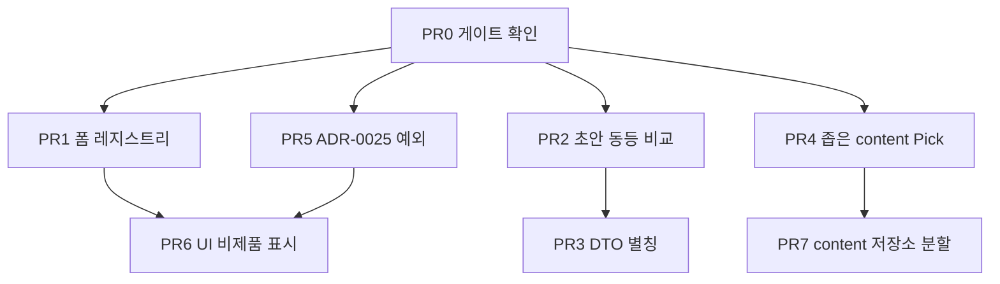

# 우발적 복잡성 남은 항목 작업 계획

## 문서 상태

- 상태: 구현 완료. PR 0 게이트는 `check:architecture`·`check:knip` 위반 0으로 닫았다. 브라우저 UI 재확인은 도구 단절로 미완. `ci:tests`·`build`·관련 typecheck는 통과했다. `ci:static`은 이 작업과 무관한 `docs/work/2026-09-02-lesson-start-screen/prototype.html` 형식 검사에서만 실패했다.
- 기준 날짜: 2026-09-03
- 기준 커밋: `6025134269e0f9c6d4b17f0c3c6be6aa39de1ca3`
- 입력: 저장소 루트의 `우발적 복잡성 감사 결과.md`

이 문서는 한시 작업 범위다. 현재 제품 사실은 권위 문서를 따른다.

이미 끝난 우선순위 상 작업([`../2026-09-03-accidental-complexity-high-priority/plan.md`](../2026-09-03-accidental-complexity-high-priority/plan.md))은 이 범위에 넣지 않는다. 완료 ID: AC-1-01~04, AC-2-01, AC-2-04, AC-6-01, AC-7-01~03, AC-8-01, AC-9-03, AC-10-01.

## 목표

감사에서 아직 열린 중기·장기 항목과 확인 게이트만 처리한다.

완료된 단기 작업과 ‘해당 없음’ 항목은 다시 구현하지 않는다.

## 범위

### 포함

- 확인: AC-1-08 순환 의존성, AC-3-04 knip
- 중기 코드: AC-1-05, AC-1-07, AC-2-02, AC-2-05
- 문서 정합: AC-3-03, AC-3-02, AC-10-02
- 장기 코드: AC-1-06 content 저장소만 분할

### 제외

- AC-3-01: Dependency Cruiser가 TypeScript 7 API를 지원할 때까지 유지. 제거 조건은 [`repository-architecture-tooling.md`](../../engineering/repository-architecture-tooling.md)가 소유한다.
- AC-4-01: 깨진 URL query를 기본 필터로 보내는 선택은 보안 silent failure가 아니다. 운영자 오류 메시지를 제품이 요구하기 전에는 유지한다.
- AC-7-04: 최근 커밋 샘플은 이미 한국어 한 줄·이유 중심이다.
- AC-8-02: `OrderAnswer` `next/dynamic`은 번들 측정 없이 추가 분할하지 않는다. 정적 import로 되돌리지도 않는다.
- 감사에서 ‘해당 없음’인 AC-2-03, AC-4-02, AC-5-01, AC-6-02, AC-7-05, AC-9-01/02/04, AC-10-03.

## 작업 순서

브랜치 prefix는 [`git-workflow.md`](../../engineering/git-workflow.md)의 `codex/`다.

PR 1·2·4·5는 서로 독립이다. PR 3은 PR 2 뒤에 둔다. PR 7은 PR 4 뒤에 둔다.

---

## PR 0 — 게이트 확인 (AC-1-08, AC-3-04)

실행만 한다. 위반이 0이면 항목을 닫고 코드를 바꾸지 않는다.

1. `bun run check:architecture`
2. `bun run check:knip`

위반이 있으면 그 모듈 쌍·미사용 심볼만 고친다. 규칙 완화는 하지 않는다.

완료 기준: 두 명령이 실패 없이 끝난다.

---

## PR 1 — 관리자 스텝 폼 레지스트리 (AC-1-07)

대상은 [`step-form-registry.tsx`](../../../apps/admin/src/features/course-editor/ui/step-forms/step-form-registry.tsx)다.

`stepFormByType`이 이미 `satisfies StepFormRegistry`로 11종을 강제한다. 타입별 동일 JSX switch를 지우고 맵에서 컴포넌트를 꺼내 한 번 렌더한다.

개별 폼 파일과 [`step-workspace.tsx`](../../../apps/admin/src/features/course-editor/ui/workspace/step-workspace.tsx)는 서명이 같으면 건드리지 않는다.

새 primitive·테스트는 넣지 않는다.

완료 기준: 레지스트리와 switch가 한 경로만 남는다. 누락 타입은 `satisfies`로 컴파일이 실패한다.

검증: 관리자 코스 편집에서 스텝 폼 하나가 기존과 같이 열리는지 브라우저로 확인한다. 관련 workspace typecheck.

---

## PR 2 — 초안 답안 동등 비교 (AC-2-05)

대상은 [`use-lesson-draft-sync.ts`](../../../apps/web/src/features/lesson-session/hooks/use-lesson-draft-sync.ts)의 `sameDraftAnswer`다.

`JSON.stringify`를 타입 분기 필드 비교로 바꾼다.

`MATCH.pairs`와 `CATEGORIZE.assignments`는 id로 정렬한 뒤 비교한다. 의미는 같고 배열 순열만 다른 답안이 dirty로 남지 않게 한다.

기존 [`use-lesson-draft-sync.test.tsx`](../../../apps/web/src/features/lesson-session/hooks/use-lesson-draft-sync.test.tsx)에 MATCH 또는 CATEGORIZE 순열 단정 하나만 추가한다. 새 스위트는 만들지 않는다.

완료 기준: 키 순서와 `MATCH`/`CATEGORIZE` 순열만 다른 답안은 같은 초안으로 본다.

검증: 학습자 레슨에서 저장 직후 dirty가 남지 않는지, MATCH 재배열 왕복이 불필요 저장을 만들지 않는지 브라우저로 확인한다.

---

## PR 3 — 전송 DTO 화면 별칭 제거 (AC-2-02)

용어집 금지는 [`docs/glossary.md`](../../glossary.md)의 `Dto as Lesson`이다.

[`lesson-view-model.ts`](../../../apps/web/src/features/lesson-session/model/lesson-view-model.ts)에서 `Lesson = LearnerLesson` 등 별칭을 지운다.

`toLessonViewModel` / parse 헬퍼는 남긴다. 반환 타입은 `@workspace/contracts/learning/...` 이름을 그대로 쓴다.

lesson-session feature의 import를 계약 타입으로 바꾼다.

learning 도메인의 `LearningStep = LessonStepDto`는 persisted published step 계약이다. 별칭을 지우고 소비자에서 `LessonStepDto`를 직접 쓴다.

화면 전용 매퍼는 만들지 않는다. wire와 화면 필드가 아직 같다.

완료 기준: 제품 소스에 `export type Lesson = LearnerLesson`와 `export type LearningStep = LessonStepDto`가 없다.

검증: 관련 typecheck. 학습자 레슨 시작·완료 화면이 타입 이름만 바뀌고 동작은 같다.

---

## PR 4 — learning의 content 주입을 조회 4메서드로 좁힌다 (AC-1-05)

AC-8-01은 끝났다. 남은 문제는 [`createLearningModule`](../../../packages/modules/learning/src/module.ts)과 [`createLearningContentQueryPort`](../../../packages/modules/learning/src/infrastructure/adapters/content-query-adapter.ts)가 `ContentApplication` 전체를 받는 것이다.

어댑터가 쓰는 것은 4개다: `findCurriculumByLesson`, `readCurriculum`, `listPublishedCourses`, `resolveAssetReferences`.

내부 [`LearningContentQueryPort`](../../../packages/modules/learning/src/application/ports/learning-ports.ts)는 이미 좁다. content `./ports`에 새 공개 타입을 추가하지 않는다.

모듈·어댑터 인자 타입을 `Pick<ContentApplication, 위 4개>`로 바꾼다.

`LearningCurriculum.contentStatus`의 `?`와 `?? "active"`는 mapper가 항상 status를 실으므로 같은 변경에서 필수로 올린다. 매핑 정책을 바꾸지 않는다.

완료 기준: learning 모듈 팩토리가 archive/publish/MCP 메서드를 타입으로 요구하지 않는다. 런타임 조회 횟수는 지금과 같다.

검증: learning typecheck와 기존 repository 테스트. 새 스위트는 만들지 않는다.

---

## PR 5 — ADR-0025 tooling 예외를 문서에 고정한다 (AC-3-03)

content는 ADR이 허용한 4개 외에 CLI·테스트 extra를 연다. export를 `./module`로 접지 않는다.

1. [`ADR-0025`](../../engineering/adr/ADR-0025-module-public-surface-four-subpaths.md) — 런타임 4 subpath는 유지한다. CLI 전용과 테스트 전용 extra는 예외로 적는다.
2. [`package-interface-and-import-rules.md`](../../engineering/package-interface-and-import-rules.md) — 현재 관례에 CLI·test-fixtures 예외를 적는다. extra key 목록은 manifest가 소유하므로 문서에 복제하지 않는다.

완료 기준: 현재 권위 문서가 content extra export를 위반으로 읽히지 않는다. manifest exports는 그대로다.

검증: 변경 Markdown에 `bun oxfmt --check`.

---

## PR 6 — 제품 미사용 UI를 문서에 표시한다 (AC-3-02, AC-10-02)

컴포넌트를 옮기거나 삭제하지 않는다. 표시 위치는 [`ui-documentation.md`](../../design/ui-documentation.md)가 가리키는 `apps/ui` 컴포넌트 가이드다.

- `input-otp`, calendar/`react-day-picker`: 제품 앱 미사용이라고 한 문장 넣는다.
- `transcribe-answer`, `paragraph-organize-answer`: 제외 타입·비제품이라고 한 문장 넣는다.

`content-model.md`의 제외 목록은 이미 맞다. 값을 복제하지 않는다.

완료 기준: UI 문서에서 해당 항목이 제품 확정 스텝·제품 앱 경로가 아님을 읽을 수 있다.

검증: UI 문서 페이지에서 해당 가이드 문구. `bun oxfmt --check`.

---

## PR 7 — content drizzle 저장소를 유스케이스 파일로 나눈다 (AC-1-06)

착수 조건: PR 4 뒤에 둔다.

[`content-drizzle-repository.ts`](../../../packages/modules/content/src/infrastructure/persistence/content-drizzle-repository.ts)의 [`ContentRepository`](../../../packages/modules/content/src/application/ports/content-ports.ts) 포트는 쪼개지 않는다. 팩토리 `createDrizzleContentRepository`는 남긴다.

파일 경계: 발행 조회, 초안·발행 트랜잭션, 코스 CRUD·편집기, 에셋, MCP 영수증.

기존 테스트 경계를 유지한다. 새 스위트는 만들지 않는다.

learning transition 저장소는 이번 주기에 나누지 않는다.

완료 기준: content 저장소 동작과 테스트가 같고, 한 파일이 발행·에셋·MCP를 동시에 소유하지 않는다.

검증: `bun run ci:static`, content·learning 테스트, `bun run build`.

---

## 리스크

- PR 3은 import 이름만 바꾸는 광역 diff다. 동작 변경과 섞지 않는다.
- PR 7은 머지 충돌이 크다. 중기 변경보다 앞에 두지 않는다.
- ADR-0025 본문에 extra key를 나열하면 manifest와 이중 권한이 된다. 예외 종류만 적는다.
- 공유 UI 파일을 문서 앱으로 옮기면 Luma 카탈로그와 inventory 계약이 깨진다. PR 6은 문구만 바꾼다.
