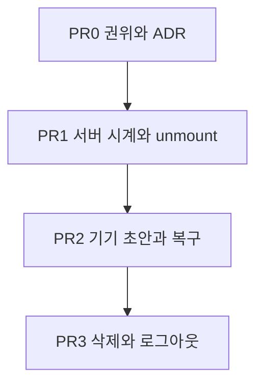

# 작성 세션 내구 초안과 서버 replica

## 문서 상태

- 상태: 구현 완료. 권위 문서와 코드가 세 시계·기기 초안·로그아웃/삭제 정리를 반영한다.
- 기준 날짜: 2026-09-03
- 입력: 작성 세션 동기화 조사. 현재 권위는 [`REQ-LRN-11`](../../product/requirements/platform/req-lrn-11-purpose-writing.md), [`SCR-009`](../../design/screens/SCR-009-learner-writing-studio.md), [`learner-journey.md`](../../product/learner-journey.md), [`use-writing-autosave.ts`](../../../apps/web/src/features/writing/hooks/use-writing-autosave.ts).

이 문서는 한시 작업 범위다. 현재 제품 사실은 권위 문서를 따른다. 구현은 PR 0의 권위 개정 뒤에만 시작한다.

## 목표

학습자가 작성 세션에서 친 본문은 탭이 사라져도 같은 기기에 남는다. 다시 열면 그 본문을 복구한 뒤 서버 `version`과 맞춘다. 서버 전송은 지금처럼 일반 텍스트 전체와 `expectedVersion`이다.

완료 기준은 다음이 모두 참일 때다.

1. 브라우저 뒤로가기, 탭 숨김, 강제 종료 뒤 같은 글을 다시 열면 마지막 기기에 커밋된 본문이 보인다.
2. 연결이 있으면 그 본문이 `PUT /writings/{writingId}`로 서버에 반영된다.
3. 점검하기, 새 글 시작, 글 삭제는 오프라인 큐에 들어가지 않는다.
4. 로그아웃과 학습자 데이터 정리는 기기 초안을 함께 지운다.

## 문제

현재 내구 경계는 메모리와 네트워크다.

- 입력이 800ms 동안 멈추거나 blur·hidden·pagehide·헤더 나가기일 때만 `PUT`한다.
- 계속 치면 서버 저장이 한 번도 나가지 않는다.
- 같은 문서의 클라이언트 라우팅 뒤로가기는 `pagehide`가 없다. unmount는 타이머만 취소한다. 진행 중 `PUT`은 AbortSignal로 끊길 수 있다.
- 다시 열면 `GET`만 보고 hydrate한다. 미전송 타자는 사라진다.
- IndexedDB가 없다. `apps/web`에 브라우저 저장소 사용이 없다.

## 고정 결정

조사에서 이 제품에 옮기지 않기로 한 것은 다시 열지 않는다.

| 결정                                                     | 이유                                                                                                             |
| -------------------------------------------------------- | ---------------------------------------------------------------------------------------------------------------- |
| 서버 페이로드는 본문 전체와 `expectedVersion`을 유지한다 | 단일 작성자 일반 텍스트다. 점검은 서버가 가진 본문 전체가 필요하다. 짧은 글에서 패치 JSON이 본문보다 클 수 있다. |
| OT, Yjs, 블록 트랜잭션, WebSocket을 도입하지 않는다      | 실시간 협업은 `REQ-LRN-11` 비범위다. Notion·Docs의 연산 모델은 협업 문서용이다.                                  |
| 문단 PATCH와 Myers diff를 만들지 않는다                  | 기준 `version`이 어긋나면 적용이 깨진다. Docs 연산이 아니다.                                                     |
| 빈 주기 폴링으로 같은 본문을 반복 `PUT`하지 않는다       | 변경이 있을 때만 보낸다. 본문이 같으면 `version`을 올리지 않는 현재 계약을 지킨다.                               |
| 점검·글 생성·삭제는 기기 큐에 넣지 않는다                | 외부 AI, 하루 한도, 발행본 고정, 파괴 명령은 서버가 거절권을 가진다.                                             |
| 로컬은 정본이 아니라 거울이다                            | Safari는 7일 무상호작용과 저장 압력으로 IndexedDB를 지울 수 있다. 서버 글이 백업 정본이다.                       |

채택하는 모델의 이름은 오프라인 퍼스트 플랫폼이 아니다. **내구 초안 + 서버 replica**다.

## 목표 구조

세 시계를 겹친다. 한 시계로 모든 이탈을 막지 않는다.

1. **화면.** 키마다 본문 state를 갱신한다. 지금과 같다.
2. **기기.** 본문, `baseVersion`, checksum, 시각을 IndexedDB에 쓴다. hidden, freeze, pagehide, 라우트 unmount에서 즉시 flush한다.
3. **서버.** 최신 본문 하나를 `PUT`한다. 동시에 진행 중 요청은 1개다. idle debounce와 `maxWait`와 이벤트 flush를 함께 쓴다.

복귀 hydrate는 `GET`과 기기 스냅샷을 대조한 뒤에만 편집기를 채운다.

| 기기                                             | 서버                  | 동작                                             |
| ------------------------------------------------ | --------------------- | ------------------------------------------------ |
| 없음 또는 본문 동일                              | 있음                  | 서버 본문으로 채운다                             |
| 본문 다름, `baseVersion`이 서버 `version`과 같음 | 안 바뀜               | 기기 본문을 넣고 즉시 `PUT`한다. 대화상자는 없다 |
| 본문 다름, `baseVersion`이 서버보다 작음         | 다른 탭·기기에서 바뀜 | 기존 충돌 UI를 연다                              |
| checksum 불일치                                  | 있음                  | 기기 레코드를 지우고 서버 본문을 쓴다            |

`local.version > serverVersion`만으로 복구하지 않는다. 크래시 직후 기기는 같은 `baseVersion`에 dirty 본문만 가진다.

## 권위 문서 개정

구현 PR보다 먼저 고친다. 코드와 문서가 어긋난 채로 저장소를 두지 않는다.

### 제품

[`REQ-LRN-11`](../../product/requirements/platform/req-lrn-11-purpose-writing.md)

- “입력이 800ms 동안 멈추면 저장을 요청한다”를 서버 저장 시계로 좁힌다. idle debounce와 계속 입력 중 `maxWait`를 함께 적는다. 숫자 리터럴의 정본은 코드 상수다. 문서는 동작을 소유하고 값을 복제하지 않는다.
- 기기 커밋 시계를 추가한다. 화면 본문은 서버 ACK를 기다리지 않고 같은 기기 store에 남는다.
- 라우트 unmount를 즉시 flush 조건에 넣는다.
- 복귀 시 기기 스냅샷과 서버 글을 대조한다고 적는다.
- 비범위 “오프라인 영속 저장”을 폐기하지 않는다. **카탈로그·점검·삭제의 오프라인 수행**으로 좁힌다. 작성 세션 본문의 기기 초안은 범위로 옮긴다.

[`US-LRN-12`](../../product/user-stories/platform/us-lrn-12-write-purpose-task.md)

- 인수 기준에 비정상 이탈 후 같은 글 재오픈 복구를 넣는다.
- 비범위 “오프라인 작성”을 과제 시작과 점검의 오프라인 수행으로 좁힌다.

[`learner-journey.md`](../../product/learner-journey.md) 쓰기 세션

- 클라이언트 책임에 미전송 본문의 기기 초안을 추가한다.
- 서버 책임은 고정 발행본, 본문 `version`, 점검, 한도, 고지 확인을 유지한다.

### 디자인

[`SCR-009`](../../design/screens/SCR-009-learner-writing-studio.md), [`patterns.md`](../../design/patterns.md) 목적 과제 쓰기

- 평시 서버 반영 완료는 지금처럼 점 없는 `role="status"`다.
- 서버 저장 중은 파란 펄스 점이다. 실패·충돌·오프라인은 빨간 점과 `Insight`다.
- 기기에서 복구한 직후는 `role="status"`로 한국어 한 줄을 읽힌다. 새 뱃지와 헤더 문구는 넣지 않는다.
- 서버 미반영이어도 기기에 커밋됐으면 나가기 대화상자를 열지 않는다. 대화상자는 기기 커밋도 실패한 입력에만 둔다.

### 엔지니어링

[`frontend-development.md`](../../engineering/frontend-development.md) 작성 세션 문단

- 세 시계와 SPA unmount flush, 마운트 대조를 적는다.

[`privacy.md`](../../engineering/privacy.md)

- 답안·학습 상태 행에 브라우저 IndexedDB 초안을 추가한다. 본문이 기기에 평문으로 남는다.
- 로그아웃, 학습자 데이터 정리, 글 삭제와 같은 시점에 해당 초안을 지운다고 적는다.

ADR

- 되돌리기 어려운 저장소 결정을 ADR로 남긴다. 다음 ADR 번호는 저장소의 최신 ADR 다음이다.
- 결정 문장: 작성 세션 본문의 내구 경계는 기기 IndexedDB 스냅샷이다. 서버는 `PUT` 본문 전체 replica다. 협업 엔진은 도입하지 않는다.

## 범위

### 포함

- 권위 문서와 ADR
- `useWritingAutosave`의 `maxWait`, 라우트 unmount flush, Abort가 keepalive·기기 커밋을 취소하지 않게 분리
- 학습자·글 ID로 키를 잡은 IndexedDB 스냅샷
- 마운트 대조와 복구 안내
- 로그아웃·글 삭제·학습자 정리와 기기 초안 삭제
- 기존 autosave 테스트 확장과 필요한 최소 E2E

### 제외

- 쓰기 홈 목록에 미동기화 미리보기 합성. 홈은 서버 목록을 유지한다. 다시 열 때 세션이 복구한다.
- `navigator.storage.persist()` 권한 UX. 호출은 넣되 거절을 기능 실패로 다루지 않는다.
- 여러 탭 리더 선출. 기존 충돌 UI와 `BroadcastChannel` 알림만 검토하고, 1차에서는 충돌 UI로 충분하다.
- Web Worker IndexedDB. 학습자 본문 길이가 작다. 메인 스레드 트랜잭션으로 시작한다.
- Background Sync API. Safari와 iOS가 없다.
- 레슨 draft 동기화. 이 작업은 쓰기 작성 세션만 다룬다.

## 작업 순서

브랜치 prefix는 [`git-workflow.md`](../../engineering/git-workflow.md)의 `codex/`다.

PR은 순서대로 연다. 각 PR은 앞 PR이 메인에 들어간 뒤에 시작한다.

---

## PR 0 — 권위 문서와 ADR

코드를 바꾸지 않는다.

완료 기준:

- `REQ-LRN-11`, `US-LRN-12`, `learner-journey.md`, `SCR-009`, `patterns.md`, `frontend-development.md`, `privacy.md`가 위 개정과 같다.
- ADR이 내구 초안 + 서버 replica를 채택하고 협업 엔진을 거절한다.
- 비범위가 카탈로그·점검·삭제의 오프라인 수행으로 좁혀진다.

검증: `bun oxfmt --check`를 해당 Markdown에 실행한다.

---

## PR 1 — 서버 시계와 라우트 이탈

대상은 [`use-writing-autosave.ts`](../../../apps/web/src/features/writing/hooks/use-writing-autosave.ts), [`writing-transport.ts`](../../../apps/web/src/features/writing/api/writing-transport.ts), [`writing-studio.tsx`](../../../apps/web/src/features/writing/ui/writing-studio.tsx)다.

동작:

1. idle debounce는 유지한다. 상수 이름은 코드가 소유한다.
2. 같은 입력 폭주에 `maxWait`를 둔다. 계속 쳐도 서버 `PUT`이 상한마다 한 번 나간다.
3. 훅 cleanup에서 대기 타이머만 지우지 않는다. 기기 커밋이 아직 없으면 이 PR에서는 최신 본문으로 `PUT`을 시도한다. AbortSignal은 기본 전송에만 붙인다. unmount unload 전송은 abort하지 않는다.
4. `hasUnsavedChanges`는 진행 중 `PUT`과 충돌만으로 나가기 대화상자를 열지 않게 재정의하지 않는다. 이 PR에서는 서버 dirty를 유지한다. 대화상자 완화는 PR 2 이후다.

테스트:

- 기존 [`use-writing-autosave.test.tsx`](../../../apps/web/src/features/writing/hooks/use-writing-autosave.test.tsx)에 연속 입력 `maxWait` 단정 하나를 추가한다.
- unmount 뒤 마지막 본문이 전송되는 단정 하나를 추가한다.

완료 기준: 멈추지 않고 쳐도 `maxWait` 안에 `PUT`이 나간다. 스튜디오 라우트를 떠나면 대기 debounce가 버려지지 않는다.

검증: 훅 테스트. 작성 세션에서 연속 입력 후 헤더 나가기와 브라우저 뒤로가기를 손으로 확인한다. 이 PR만으로는 강제 종료 복구를 약속하지 않는다.

---

## PR 2 — 기기 초안과 마운트 복구

대상은 `apps/web/src/features/writing/` 아래 새 store 모듈과 autosave 훅이다. `@workspace/ui`와 API module에 IndexedDB를 넣지 않는다.

스키마는 코드가 소유한다. 문서는 필드를 복제하지 않는다. 레코드는 학습자 ID와 글 ID로 구분한다. 본문, `baseVersion`, checksum, 기록 시각을 가진다.

동작:

1. 화면 본문이 바뀌면 서버 `PUT`과 별도로 기기 store에 쓴다. 기기 쓰기는 서버 debounce보다 짧거나 같다.
2. hidden, freeze, pagehide, unmount에서 기기 flush를 먼저 한다.
3. 스튜디오 마운트는 `GET`과 기기 레코드를 같이 읽는다. 위 대조 표대로 편집기를 채운다. SSR 본문이 한 프레임 보였다가 덮이지 않게 복구가 끝날 때까지 같은 본문을 유지하거나 입력을 연다.
4. checksum이 다르면 기기 레코드를 삭제하고 서버 본문을 쓴다.
5. 복구가 일어났으면 `role="status"`로 알린다.
6. 서버 `PUT`이 성공하고 본문이 같으면 해당 글의 기기 레코드를 삭제하거나 `baseVersion`을 맞춘다. 성공 본문을 기기에 불필요하게 남기지 않는다.
7. 기기에 커밋된 dirty는 헤더 나가기 대화상자를 열지 않는다. 서버 반영은 백그라운드에서 이어진다.

테스트:

- fake-indexeddb로 복구·checksum 폐기·서버 성공 후 정리 단정을 훅 스위트에 붙인다.
- 마운트 대조의 네 갈래 중 정상 복구와 충돌 두 갈래를 우선한다.

완료 기준: 탭을 닫았다가 같은 글을 열면, 마지막 기기 커밋 본문이 보이고 연결 시 `PUT`이 이어진다.

검증: Chromium에서 강제 종료에 가까운 `page.close({ runBeforeUnload: false })` 후 재오픈. 브라우저 뒤로가기 후 홈에서 다시 들어가기. iOS Safari는 가능하면 수동. Playwright WebKit background timer 한계는 [`frontend-development.md`](../../engineering/frontend-development.md)와 같다.

---

## PR 3 — 공유 기기 삭제

대상은 로그아웃 클라이언트, 글 삭제 UI, 학습자 데이터 정리와 맞물리는 web 경로다.

동작:

1. `requestLogout`이 성공하기 전에 현재 학습자의 쓰기 초안 store를 지운다.
2. 홈에서 글을 삭제하면 해당 `writingId` 초안을 지운다.
3. 할당량 초과는 오래된 초안을 지우고 한 번 재시도한다. 숨기지 않는다.

완료 기준: 다른 학습자로 같은 브라우저에 로그인해도 이전 본문이 복구되지 않는다. 삭제한 글의 초안이 다시 나타나지 않는다.

검증: 로그아웃 후 재로그인, 글 삭제 후 같은 ID로 복구 시도가 없음을 훅 또는 브라우저로 확인한다.

서버 학습자 정리 transaction은 이미 글 원문을 지운다. 이 PR은 브라우저 거울만 맞춘다. API schema와 migration은 바꾸지 않는다.

## 저장 상태 UX

Micro Dot 계약은 유지한다.

| 상태                   | 헤더                            | live region                           |
| ---------------------- | ------------------------------- | ------------------------------------- |
| 기기 커밋, 서버 반영됨 | 점 없음                         | 저장됨                                |
| 서버 `PUT` 중          | 파란 펄스                       | 저장 중                               |
| 네트워크·저장 실패     | 빨간 점                         | alert. 기기에 남아 있음을 먼저 말한다 |
| version 충돌           | 빨간 점과 기존 Insight          | 기존 문구                             |
| 기기에서 복구함        | 점 없음, 서버 `PUT` 중이면 펄스 | 이 기기에서 글을 복구했습니다         |

새 툴바, 저장 버튼, 동기화 퍼센트는 넣지 않는다.

## 확인 방법

권위 `REQ-LRN-11` 확인 방법에 다음을 더한다.

- 연속 입력 중 `maxWait` 안에 서버 저장이 나가는지 확인한다.
- 브라우저 뒤로가기 후 같은 글을 다시 열면 이탈 직전 본문이 보이는지 확인한다.
- 강제 종료에 가까운 닫기 후 재오픈에서 기기 커밋 본문이 복구되는지 확인한다.
- 다른 탭이 서버 글을 바꾼 뒤 복귀하면 충돌 UI가 열리는지 확인한다.
- 로그아웃 뒤 다른 학습자에게 이전 초안이 보이지 않는지 확인한다.
- 오프라인에서 점검하기가 큐에 쌓이지 않고 한국어 거절 또는 기존 저장 실패 안내를 보이는지 확인한다.

## 위험

- 홈 미리보기는 서버 본문이라, 미동기화 타자 직후 홈에 나가면 목록이 한동안 이전 미리보기다. 1차에서는 세션 재오픈으로 복구한다. 목록 합성이 필요해지면 별도 작업으로 연다.
- IndexedDB 실패는 현재와 같이 메모리 + 서버 경로로 떨어진다. 기기 내구가 없다고 작성을 막지 않는다.
- 공유 기기와 비공개 브라우징은 초안이 남지 않거나 탭과 함께 사라질 수 있다. 서버 정본이 남는다는 안내를 복구 문구에 넣지 않는다. 복구는 같은 기기 세션의 사실만 말한다.

## 후속 (이 작업 밖)

- 쓰기 홈 카드에 미동기화 미리보기
- 여러 탭 단일 writer
- 레슨 draft에 같은 내구 모델
