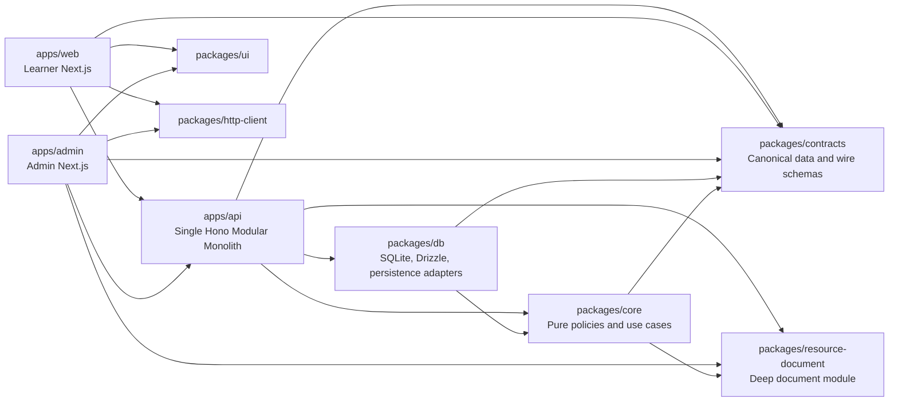

# 모노레포 목표 아키텍처 제안

작성일: 2026-07-17  
대상: 업로드된 `codebase(11).md` Repomix 스냅샷  
결론: **두 개의 프런트엔드와 하나의 백엔드로 구성한 기능 중심 모듈러 모놀리스**, 내부 구현은 **Functional Core / Imperative Shell**, 데이터 모델은 **불변의 plain data와 discriminated union 중심**으로 재구성한다.

---

## 1. 최종 권고

이 코드베이스에 가장 적합한 목표 구조는 다음과 같다.

1. `apps/web`과 `apps/admin`은 별도 Next.js 애플리케이션으로 유지한다.
2. `apps/api`와 `apps/admin-api`는 장기적으로 하나의 Hono 프로세스로 통합한다.
3. `packages/core`에는 순수 정책, 상태 전이, 유스케이스만 둔다.
4. Drizzle, SQLite, Better Auth, OpenAI, AWS SDK, Hono, Next.js 같은 기술 구현은 실행 앱 또는 `packages/db`에 둔다.
5. 모듈은 `admin`이라는 사용자 유형이 아니라 `content`, `learning`, `auth`, `ai-feedback`, `resource-library` 같은 변경 이유로 나눈다.
6. `admin` 모듈은 관리자 권한 정책과 교차 도메인 **읽기 전용 운영 projection**, 운영 설정, 관리자 AI 채팅처럼 실제로 관리자 제품에만 속하는 기능으로 축소한다.
7. `packages/contracts`는 서버와 클라이언트가 공유하는 canonical data/schema의 단일 출처로 유지하되, core가 HTTP query·pagination·error response 같은 transport 전용 타입에 의존하지 않게 한다.
8. `packages/resource-document`는 큰 구현을 작은 공개 API 뒤에 숨긴 현재의 딥모듈 성격을 유지한다.
9. `packages/ui`는 표현 전용으로 제한하고 localStorage, 라우팅, 세션, API, 학습 상태 orchestration을 제거한다.
10. 마이크로서비스, 이벤트 소싱, 범용 event bus, 범용 repository, DI container, 도메인별 workspace 분할은 도입하지 않는다.

한 문장으로 요약하면 다음과 같다.

> **실행 경계는 적게, 업무 경계는 명확하게, 정책은 순수하게, I/O는 가장자리로 몰아낸다.**

---

## 2. 분석 범위와 신뢰 수준

### 2.1 검증된 범위

제공된 Repomix 문서에서 실제 파일 엔트리 729개를 추출해 모두 분석했다.

- 총 파일: 729개
- 총 줄 수: 약 64,420줄
- TypeScript/TSX/JavaScript 정적 분석 대상: 610개 파일
- import/export 참조: 2,404개
- 함수·메서드·클래스 선언: 1,868개

주요 영역의 규모는 다음과 같다.

| 영역                         | 파일 수 |  줄 수 |
| ---------------------------- | ------: | -----: |
| `packages/ui`                |     113 | 11,461 |
| `apps/admin`                 |     132 | 11,445 |
| `packages/core`              |     102 | 10,282 |
| `apps/web`                   |      99 |  7,621 |
| `packages/db`                |      31 |  5,734 |
| `apps/admin-api`             |      43 |  4,315 |
| `packages/resource-document` |      12 |  2,501 |
| `packages/contracts`         |      46 |  2,070 |
| `apps/api`                   |      41 |  1,917 |

### 2.2 분석하지 못한 범위

Repomix 설정상 다음 영역은 스냅샷에서 명시적으로 제외되었다.

- `apps/storybook`
- `docs`
- `packages/config`
- `scripts`
- `prototype`
- `.worktrees`
- 일부 테스트(`**/*.test.ts`)
- `.gitignore` 및 Repomix 기본 ignore 대상
- binary asset의 실제 내용

따라서 이 문서에서 “현재 코드”라고 표현하는 대상은 **제공된 코드 팩에 포함된 코드**다. 제외된 파일 내부의 구현, Storybook 사용 현황, custom quality script의 실질 복잡도는 확정적으로 판단하지 않는다.

### 2.3 표기 규칙

- **검증된 사실**: 제공된 파일과 정적 import/선언 분석으로 확인했다.
- **권고**: 현재 요구와 비용 구조를 근거로 한 목표 설계다.
- **추론**: 운영 지표나 사용자 데이터가 없어 코드와 배포 구조에서 유추한 내용이다.

아래 목표 디렉터리는 제안이며 현재 존재한다고 주장하지 않는다. 파일과 함수 수준의 예시는 제공된 코드에 실제 존재하는 이름만 사용한다.

---

## 3. 현재 구조에서 확인된 핵심 사실

### 3.1 `packages/core`가 core와 infrastructure를 동시에 소유한다

**검증된 사실**

`packages/core/package.json`은 다음 production dependency를 가진다.

- `@workspace/db`
- `drizzle-orm`
- `better-auth`
- `openai`
- `@workspace/resource-document`
- `zod`

`packages/core/src`에서 확인한 infrastructure import는 다음과 같다.

- `@workspace/db`를 import하는 파일: 22개
- `drizzle-orm`을 import하는 파일: 17개
- `better-auth`를 import하는 파일: 2개
- `openai`를 import하는 파일: 1개

`packages/core/src/composition/bootstrap.ts`는 SQLite 연결, Drizzle repository, Better Auth, OpenAI client, 서비스 조립과 종료를 모두 담당한다. `admin-bootstrap.ts`도 DB repository, ID 생성, resource use case 조립을 담당한다.

현재 문서는 core가 framework와 HTTP transport에 독립적이라고 설명하지만, 실제 package boundary는 DB·ORM·인증·AI SDK와 결합되어 있다.

**영향**

- core unit test가 infrastructure dependency graph의 영향을 받는다.
- DB 또는 auth 변경이 core package 전체의 변경으로 보인다.
- 애플리케이션 composition root가 라이브러리 내부에 숨는다.
- “도메인 규칙을 찾으려면 어디를 봐야 하는가”가 불명확해진다.

### 3.2 상태 전이 로직이 repository 내부에 집중되어 있다

**검증된 사실**

가장 큰 두 파일은 다음과 같다.

| 파일                                       | 줄 수 |
| ------------------------------------------ | ----: |
| `learner-transition-drizzle.repository.ts` | 1,112 |
| `learner-read-model-drizzle.repository.ts` |   923 |

`learner-transition-drizzle.repository.ts`는 다음 책임을 함께 가진다.

- 고정 curriculum scope 조회
- 레슨 잠금 검증
- 현재 step 순서 검증
- step content JSON decode
- `gradeLearnerStep` 호출
- 답안 저장
- step 전진
- lesson 완료
- course 완료
- 학습 활동 집계
- AI feedback 준비와 완료
- response read model 조립
- SQLite transaction 관리

반면 `createLearnerTransitionService`는 `completeStep`과 `startLesson`을 repository에 그대로 전달한다. 즉 현재 추상화는 유스케이스를 보호하지 않고 함수 이름을 한 번 더 반복한다.

**영향**

- 기능 변경 범위가 SQL 파일 크기에 비례한다.
- 순수 정책과 transaction 구현을 독립적으로 이해하기 어렵다.
- DB 변경과 도메인 변경이 같은 파일에서 충돌한다.
- 테스트가 정책보다 repository fixture에 묶이기 쉽다.

### 3.3 `admin` 모듈이 하나의 업무 능력이 아니라 여러 업무의 집합이다

**검증된 사실**

`AdminRepository`는 다음 interface의 intersection이다.

- `DashboardReader`
- `AnalyticsReader`
- `AiChatAdminRepository`
- `CourseAdminRepository`
- `UserAdminRepository`
- `SettingsRepository`
- `ContentResetRepository`

`AdminService`도 analytics, AI chat, content reset, course, dashboard, settings, user use case를 spread로 합친다. `createAdminApiCore`는 하나의 `adminRepository`와 하나의 `adminService`를 모든 관리자 기능에 공급한다.

**판단**

“관리자가 사용한다”는 이유는 같은 모듈에 둘 변경 이유가 아니다.

- 코스 draft/publish/archive는 `content`의 변경 이유다.
- 학습자 상태 변경과 삭제는 `auth` 또는 learner identity의 변경 이유다.
- dashboard/analytics는 운영 read model의 변경 이유다.
- 설정과 AI chat은 실제 관리자 전용 capability다.

현재 모듈은 역할 기반 분리이고, 목표는 변경 가능성 기반 분리여야 한다.

### 3.4 forwarding file과 identity mapper가 경로를 늘린다

**검증된 사실**

`packages/core`에서 import/export만 수행하는 매우 작은 forwarding file을 최소 21개 확인했다.

대표 예:

- `modules/content/domain/content.dto.ts`
- `modules/content/domain/content.ids.ts`
- `modules/content/domain/steps/*.dto.ts`
- `modules/learning/domain/learner-read-model.dto.ts`
- `modules/learning/domain/learning.ids.ts`
- `shared/kernel/status.ts`
- `modules/admin/domain/admin.dto.ts`
- `modules/ai-feedback/domain/ai-feedback.dto.ts`

또한 다음 앱 mapper는 의미 변환 없이 object를 복사한다.

- `toAnalytics`
- `toLessonPage`
- `toLesson`
- `toSettings`
- `toReset`
- `toUserListItem`
- `toDashboard`

`createContentService`는 `createContentReader`를 반환할 뿐이고, 제공된 production import graph에서 `createDrizzleContentRepository`, `createContentService`, `toCourseProgress`, `withLearnerCourseProgress`는 정의 외 사용을 찾지 못했다. 단, 제외된 테스트와 script의 참조 가능성은 별도 확인이 필요하다.

### 3.5 UI package가 application state와 browser storage를 소유한다

**검증된 사실**

`packages/ui/src/lib/lesson-draft-storage.ts`는 다음을 구현한다.

- localStorage key/version 정책
- user scope
- memory cache
- storage event listener
- quota 분류
- legacy key cleanup

이 파일은 `apps/web`의 lesson/auth feature에서 사용된다. `WriteAnswer`는 이 storage 결과 타입을 직접 import한다.

`packages/ui/src/components/lesson/match-presentation.ts`는 choice ID 생성, 결정적 shuffle, selection transition과 answer 변환을 소유하고, `apps/web/src/features/lessons/lesson-match-presentation.ts`가 다시 re-export한다.

**판단**

- 브라우저 draft persistence는 learner application 책임이다.
- match selection은 learner feature의 view state다.
- UI package는 데이터를 표시하고 callback을 호출해야지 저장 정책을 정의하면 안 된다.

### 3.6 실행 프로세스가 데이터 경계보다 더 많이 분리되어 있다

**검증된 사실**

현재 production compose는 네 product container를 실행한다.

- `web`
- `api`
- `admin`
- `admin-api`

`api`와 `admin-api`는 같은 `/var/lib/writing-app/api.sqlite`를 bind mount하며 같은 SQLite DB를 쓴다. 배포는 단일 Ubuntu 서버, Caddy, Cloudflare Tunnel, Litestream 구성이다.

두 API는 Hono app setup, auth wiring, middleware, logger, OpenAPI, lifecycle, environment, health, image release 책임을 각각 가진다. 학습자 API에는 graceful drain lifecycle이 있고 관리자 API는 별도 runtime을 가진다.

**추론**

현재 데이터 저장소와 배포 호스트가 하나이고 독립 확장 경계가 없으므로, API 프로세스 분리가 제공하는 운영 이점보다 중복 비용이 더 크다. 단, 조직이 관리자와 학습자 API에 서로 다른 SLO, release cadence, 접근 네트워크를 실제로 운영한다는 외부 증거가 있다면 이 결론은 재검토해야 한다.

### 3.7 문서와 구현의 drift가 확인된다

**검증된 사실**

`ARCHITECTURE.md`, `BACKEND.md`, `FRONTEND.md`, `CONTEXT.md`에는 Yjs, WebSocket, 실시간 공동 편집이 현재 기능으로 기술되어 있다. 그러나 제공된 current product source에서는 Yjs/WebSocket 협업 구현을 찾지 못했고, resource document는 integer version과 Markdown normalization/validation 중심으로 보인다.

이는 단순 문서 문제가 아니다. 새 개발자가 존재하지 않는 경계를 탐색하게 만들고, architecture review에서 잘못된 전제를 사용하게 한다.

---

## 4. 설계 목표를 비용 모델로 변환

좋은 아키텍처를 “인적 비용 최소화”로 정의하면 평가 기준은 다음 다섯 가지가 된다.

| 비용           | 질문                                                          |
| -------------- | ------------------------------------------------------------- |
| 탐색 비용      | 변경하려는 규칙, 화면, 저장 코드를 어디에서 찾는가?           |
| 변경 증폭 비용 | 한 요구 변경이 몇 모듈·패키지·프로세스를 건드리는가?          |
| 검증 비용      | 안전성을 어떤 작은 테스트 집합으로 증명할 수 있는가?          |
| 운영 비용      | 몇 프로세스·image·origin·secret·health·rollback을 관리하는가? |
| 회수 비용      | 잘못된 결정을 얼마나 작은 diff로 되돌릴 수 있는가?            |

목표 구조는 저장소 크기가 아니라 **변경 범위**에 작업 복잡도가 비례해야 한다.

예를 들어 학습 채점 규칙 변경은 다음에만 영향을 주어야 한다.

1. canonical step data/schema
2. 순수 grading policy
3. 해당 policy test
4. 필요한 경우 화면의 결과 표현

SQLite query, OpenAI adapter, 관리자 dashboard, unrelated UI primitive가 함께 변경되면 경계가 잘못된 것이다.

---

## 5. 대안 비교

## 5.1 런타임 대안

### 대안 A. 현재 네 product runtime 유지

구성:

- learner web
- learner API
- admin web
- admin API

장점:

- 가장 적은 초기 이동
- 관리자 API 장애를 프로세스 수준에서 분리
- 서로 다른 CORS/auth 설정을 이해하기 쉬움

단점:

- 같은 SQLite writer를 두 프로세스가 소유
- Hono, logger, lifecycle, env, image, deployment가 중복
- 독립 배포를 실제로 하지 않으면 release 경계가 허상
- module boundary와 process boundary가 불일치

평가: **단기 migration 상태로는 허용, 최종 상태로는 비추천**

### 대안 B. 두 frontend + 하나의 API

구성:

- learner web
- admin web
- 단일 Hono API

장점:

- SQLite writer와 transaction owner가 하나
- backend image, lifecycle, logger, health, env 조립 감소
- in-process direct call로 module 간 네트워크 실패가 없음
- 기존 API host를 같은 process에 연결해 계약을 보존할 수 있음
- 향후 분리는 module API가 안정된 뒤 수행 가능

단점:

- backend process의 장애 반경이 커짐
- 관리자 코드 변경도 learner API 재배포를 유발
- auth middleware 등록 실수의 보안 영향이 커짐
- admin-only SDK가 process memory에 들어올 수 있음

완화:

- learner/admin auth handler, cookie, secret, DB table을 계속 분리
- route registration과 middleware test를 별도로 유지
- 기존 `api`와 `admin-api` hostname을 처음에는 그대로 유지하고 Caddy만 같은 service로 전달
- admin-only adapter는 필요 시 구성 단계에서만 생성

평가: **권고**

### 대안 C. 두 Next.js 앱을 각각 full-stack으로 사용

장점:

- product container가 두 개까지 줄 수 있음
- server action/RSC에서 HTTP hop을 일부 제거

단점:

- 두 Next process가 다시 같은 SQLite를 직접 소유
- 도메인과 persistence가 Next lifecycle에 결합
- learner/admin이 서로 다른 DB adapter와 composition을 중복
- 인프라 독립성이 낮아짐

평가: **비추천**

### 대안 D. capability별 microservice

장점:

- 독립 scaling과 release가 가능
- process 수준 격리 강화

단점:

- 현재 SQLite와 단일 서버 전제에 맞지 않음
- network, contract version, tracing, retry, idempotency, deployment가 급증
- 팀의 변경 비용이 저장소 크기가 아니라 분산 시스템 토폴로지에 지배됨

평가: **현재 요구에는 명백히 비추천**

## 5.2 내부 구조 대안

### 모든 모듈에 동일한 Clean Architecture 디렉터리 적용

`domain/application/ports/use-cases/infrastructure/api`를 모든 모듈에 동일하게 둔다.

- 장점: 형식적 일관성
- 단점: 작은 기능에도 navigation과 forwarding file이 증가
- 현재 결과: content domain의 14개 파일이 합계 14줄인 극단적 forwarding 구조

평가: 비추천

### 모든 것을 concrete function으로 직접 연결

- 장점: 파일 수와 추상화가 최소
- 단점: DB/SDK가 정책에 침투하고 test seam이 사라짐

평가: 비추천

### 기능 중심 vertical slice + 선택적 ports/adapters

- 업무 규칙은 capability 안에 둔다.
- DB/network/browser 같은 volatile I/O에만 port를 둔다.
- 작은 모듈은 평탄하게 유지한다.
- 큰 모듈만 sub-capability로 나눈다.
- 순수 decision과 imperative transaction을 분리한다.

평가: **권고**

---

## 6. 목표 시스템 구조



핵심 의존성 규칙은 다음이다.

```text
실행 앱 → core + adapter
adapter → core
core -X→ adapter
```

즉, `packages/core`는 `packages/db`를 모른다. `apps/api`가 core use case와 DB adapter를 조립한다.

---

## 7. 배포·프로세스 수준 아키텍처

## 7.1 최종 product runtime

| runtime      | 역할                                                         |
| ------------ | ------------------------------------------------------------ |
| `apps/web`   | learner UI, RSC, browser adapter                             |
| `apps/admin` | admin UI, editor, RSC, browser adapter                       |
| `apps/api`   | learner/admin HTTP, auth, business composition, DB ownership |

Storybook, migration, backup, restore는 product runtime이 아니라 tooling/operation job으로 유지한다.

## 7.2 API 통합 시 보존할 보안 경계

하나의 process는 하나의 security context를 의미하지 않는다. 다음은 반드시 분리한다.

- learner Better Auth secret과 admin Better Auth secret
- learner auth table과 `admin_*` auth table
- learner session cookie와 admin session cookie
- learner route middleware와 admin route middleware
- learner origin과 admin origin
- owner-only mutation authorization
- admin request body limit과 learner request body limit
- learner response secret redaction

초기 통합에서는 외부 URL을 바꾸지 않는다.

```text
api.example.com       ─┐
                       ├─> 동일한 apps/api process
admin-api.example.com ─┘
```

이 방식은 frontend 변경 없이 process 수만 줄이며, 문제가 생기면 Caddy target을 다시 분리할 수 있어 가역적이다.

## 7.3 SQLite 관점

하나의 backend process는 현재 SQLite 선택과 정합성이 높다.

- write transaction owner가 하나다.
- connection lifecycle이 하나다.
- 두 API process 사이 writer contention과 종료 순서가 줄어든다.
- Litestream과 migration/backup 흐름은 유지할 수 있다.

향후 horizontal scaling이 필요해지면 먼저 DB topology를 바꿔야 한다. SQLite를 유지한 채 process만 쪼개는 것은 의미 있는 확장 전략이 아니다.

---

## 8. 패키지 수준 책임

## 8.1 `packages/core`

### 목표

- business invariant
- pure policy
- state transition
- application use case
- I/O port type
- expected domain error

### 금지 dependency

- `@workspace/db`
- `drizzle-orm`
- `better-auth`
- `openai`
- `@aws-sdk/*`
- `hono`
- `next`
- `react`
- filesystem, environment variable, global network call

### 허용 dependency

- `packages/contracts`의 transport-neutral ID/value/schema
- `packages/resource-document`의 deterministic document API
- Zod처럼 deterministic validation을 제공하는 library

### 구조 원칙

현재의 모든 모듈에 동일한 `domain/application/infrastructure` depth를 강제하지 않는다.

- 파일이 적은 module은 capability directory 바로 아래에 둔다.
- port와 public API가 실제로 필요할 때만 `ports` 또는 `api`를 둔다.
- infrastructure는 core에 두지 않는다.
- package export는 use case와 stable data/policy만 노출한다.
- repository implementation과 composition root는 export하지 않는다.

## 8.2 `packages/db`

### 목표

- SQLite client
- Drizzle schema
- migration
- seed
- backup/restore primitive
- capability별 Drizzle adapter
- persisted JSON decode
- transaction boundary

현재 core의 다음 파일군을 이 패키지로 이동한다.

- `*-drizzle.repository.ts`
- `learner-read-models.ts`
- DB row/pagination/query helper

이 패키지는 core port/type에 의존해 구현체를 제공한다. 이는 dependency inversion의 올바른 방향이다.

### 금지

- HTTP status/code
- Hono `Context`
- Next.js API
- UI 타입
- OpenAI/AWS network call
- 순수 business decision을 SQL 함수 안에 감추는 것

## 8.3 `packages/contracts`

### 목표

- canonical immutable data schema
- HTTP request/response schema
- branded ID
- discriminated union
- public error schema

### 규칙

- 같은 의미의 DTO와 app model을 중복 정의하지 않는다.
- 화면 모델이 DTO와 동일하면 DTO를 직접 사용한다.
- Date ↔ ISO string, secret 제거, 명칭 변경, aggregation처럼 의미가 바뀔 때만 mapper를 둔다.
- OpenAPI는 문서와 외부 integration artifact이지 내부 TypeScript type의 두 번째 출처가 아니다.
- core는 query string, HTTP pagination response, HTTP error response 같은 transport 전용 타입을 import하지 않는다.

패키지 이름을 지금 바꾸지 않는다. 역할을 먼저 명확히 하고, 실제로 domain data와 HTTP wire data가 독립적으로 변하기 시작할 때만 split을 검토한다.

## 8.4 `packages/resource-document`

이 패키지는 유지한다.

검증된 source는 약 2,415줄이지만 공개 entrypoint는 제한적이다. Lexical, mdast, GFM round trip, image/table validation을 숨긴다. 이는 딥모듈의 좋은 형태다.

규칙:

- DB, session, route, object storage를 모른다.
- input data를 받아 deterministic result를 반환한다.
- unsupported document state를 명시적 issue data로 반환한다.
- Lexical class는 library integration 내부에 한정한다.
- 외부 소비자는 `normalizeResourceMarkdown`, `prepareResourceMarkdownImport`, `readResourceMarkdownPlainText` 같은 공개 API만 사용한다.

함수형 프로그래밍을 이유로 Lexical이 요구하는 node class를 억지로 제거하지 않는다. class는 adapter 내부 구현이고, package 외부 계약은 data/function이어야 한다.

## 8.5 `packages/ui`

### 목표

- design token
- UI primitive
- pure presentation component
- 접근성 기본값

### 제거할 책임

- localStorage
- session
- routing
- API call
- OpenAPI
- core grading
- app state machine
- learner-specific persistence policy

구체적으로 다음을 app으로 돌린다.

- `lesson-draft-storage.ts` → learner web
- `match-presentation.ts`의 learner selection state → learner lesson feature
- `WriteAnswer`의 storage-specific result dependency → callback 결과를 display data로만 받도록 축소

`safe-navigation-path.ts`는 두 frontend가 공유하는 보안 invariant다. 이 함수 하나 때문에 새 workspace를 만들지 않는다. 즉시 이동하지 않고 현재 위치를 명시적 예외로 유지하되, UI 이외의 frontend-common 기능이 추가로 생길 때만 별도 경계를 검토한다. 이것이 decision deferral에 부합한다.

## 8.6 `packages/http-client`

현재 web/admin 두 소비자가 있고 network error redaction/result shape라는 동일한 의미를 공유하므로 유지할 수 있다.

다만 다음 alias는 줄인다.

- `ApiResult`
- `AdminApiResult`
- `adminApiOk`
- `adminApiError`

하나의 transport result를 직접 사용하고, domain별 error type만 type parameter로 구분한다.

## 8.7 `packages/env`, `packages/hono`, `packages/logger`

두 API가 존재하는 동안은 공유 가치가 명확하다. API 통합 후에도 자동으로 합치지 않는다.

다음 기준을 다시 평가한다.

- production consumer가 하나뿐인가?
- 공개 API가 구현보다 충분히 작은가?
- 별도 dependency set을 격리하는가?
- app-local로 옮겼을 때 navigation이 실제로 줄어드는가?

조건을 충족하지 못하면 `apps/api`로 흡수한다. 먼저 합치지 않는 이유는 API 통합과 package 통합을 한 번에 하면 rollback 단위가 커지기 때문이다.

## 8.8 `packages/repository-tooling`, `packages/config`

제공된 스냅샷에서 핵심 소비자인 `scripts`와 `packages/config` 내부가 제외되어 있어 최종 병합/삭제 판단을 하지 않는다.

다만 product runtime dependency graph에 들어가지 않는다는 규칙은 유지한다.

---

## 9. capability 수준 모듈 경계

## 9.1 `content`

### 소유

- Course identity
- curriculum draft/published revision
- Unit/Lesson/Step content
- step content validation
- draft save conflict
- publish
- archive
- content reset

### 현재 파일의 이동 방향

- `admin-course.use-case.ts` → content owner
- `admin-content-reset.use-case.ts` → content owner
- `admin-course-drizzle.repository.ts` → DB content adapter
- `content-drizzle.repository.ts` → 사용 여부 확인 후 제거 또는 DB content read adapter
- `content-reader.ts`, `content.service.ts` → production 참조 확인 후 중복 제거

관리자가 실행한다는 이유로 content command를 admin module에 두지 않는다. authorization은 command를 호출하기 전에 적용하고, command 자체의 business invariant는 content가 소유한다.

## 9.2 `learning`

### 소유

- lesson start
- current step
- answer submission
- grading 결과
- retry/advance/lesson complete/course complete
- progress
- activity day/streak
- learner-personalized course/lesson projection
- learner response secret redaction policy

### 현재 파일의 이동·재구성 방향

- `step-grading-policy.ts` 유지
- `learning-date.ts` 유지
- `learner-transition.ts` 유지
- `learner-cursor.ts` 유지
- `learner-progress.service.ts` 유지하되 단순 forwarding 여부를 계속 점검
- `learner-transition-drizzle.repository.ts` → DB transaction shell로 이동·축소
- `learner-read-model-drizzle.repository.ts` → DB query adapter로 이동·분해
- `presentLearnerStep`, `createCourseLearningState` 같은 pure projection은 core로 이동

learner-specific course/lesson response는 content와 progress를 결합하므로 learning read side가 소유하는 편이 변경 이유에 더 가깝다. content module은 비개인화된 published content와 admin editing을 소유한다.

## 9.3 `auth`

### 소유

- learner profile status invariant
- onboarding policy
- session abstraction
- bearer token parsing
- admin role/actor policy

### infrastructure 위치

- Better Auth runtime과 plugin은 `apps/api`
- auth table adapter는 `packages/db`

### 관리자 user operation

현재 `AdminUserUseCase`와 `admin-user-drizzle.repository.ts`가 수행하는 학습자 상태 변경·삭제는 admin이 아니라 learner identity/auth capability가 소유한다. admin route는 이 command를 호출하는 delivery channel일 뿐이다.

## 9.4 `ai-feedback`

### 소유

- attempt policy
- prompt policy/version
- provider timeout/result classification
- idempotency coordination
- feedback payload validation
- learning transition finalize orchestration

### 경계

- `AiFeedbackProvider` port 유지
- OpenAI adapter는 `apps/api`
- attempt persistence adapter는 `packages/db`
- network call은 DB transaction 밖에서 수행
- 성공 feedback 저장과 learning advance만 짧은 transaction으로 처리

현재 구조에서 이 부분은 port의 필요성이 실제로 존재한다. 외부 provider는 volatile하고 failure mode가 독립적이기 때문이다.

## 9.5 `resource-library`

### 소유

- tree policy
- document version/conflict
- search
- asset metadata
- import/export
- trash/restore

### 유지할 pure policy

- `normalizeResourceName`
- `createAvailableResourceName`
- `validateResourceNameChange`
- `validateResourceMove`
- `trashResourceSubtree`
- `restoreResourceSubtree`

### adapter

- tree/document/search/asset Drizzle implementation → `packages/db`
- R2 `ResourceAssetStore` → `apps/api`
- document codec → `packages/resource-document`

현재 versioned Markdown 구조는 단순하고 설명 가능하다. 실제 current source에 없는 실시간 collaboration을 다시 선제 도입하지 않는다.

## 9.6 `admin`

### 목표 범위

- `AdminActor`, role, owner authorization
- cross-capability read-only dashboard/analytics projection
- admin settings
- admin AI chat가 제품 요구로 유지될 경우 그 use case

### 금지

- course command ownership
- learner account command ownership
- giant `AdminRepository`
- 모든 관리자 기능을 합친 `AdminService`

cross-capability dashboard/analytics는 query side에서만 허용한다. 이 read model은 여러 table을 join할 수 있지만 다른 module의 write invariant를 변경해서는 안 된다.

---

## 10. 디렉터리 수준 원칙

## 10.1 core는 기술 계층보다 capability 탐색을 우선한다

현재처럼 모든 파일을 다음 네 단계로 강제하지 않는다.

```text
module/domain
module/application/ports
module/application/use-cases
module/infrastructure
```

목표는 다음 규칙이다.

```text
packages/core/src/modules/<capability>/
  api/                  # 실제 external consumer가 있을 때만
  <existing-policy>.ts
  <existing-use-case>.ts
  <existing-port>.ts    # 실제 I/O seam이 있을 때만
```

파일이 많아질 때만 `commands`, `queries`, `policies` 같은 sub-capability 분리를 추가한다. directory depth는 아키텍처의 상징이 아니라 탐색 비용을 줄이는 도구다.

## 10.2 DB는 capability mirror를 가진다

현재 core의 Drizzle 파일 이름을 유지하면서 `packages/db/src` 아래 capability별로 배치한다.

예시로 이동할 실제 파일:

```text
learner-transition-drizzle.repository.ts
learner-read-model-drizzle.repository.ts
learner-profile-drizzle.repository.ts
ai-feedback-drizzle.repository.ts
admin-course-drizzle.repository.ts
admin-user-drizzle.repository.ts
resource-tree-drizzle.repository.ts
resource-document-drizzle.repository.ts
resource-search-drizzle.repository.ts
resource-asset-drizzle.repository.ts
```

`schema`, `migrations`, `seeds`는 현재 역할을 유지한다.

## 10.3 API `modules`는 transport vertical slice다

`apps/api/src/modules/*`는 business module 구현이 아니라 HTTP adapter다.

각 route 파일이 가져야 할 책임:

1. request schema 연결
2. auth/authorization middleware 연결
3. wire data를 command/query로 변환
4. core use case 호출
5. error를 HTTP로 매핑
6. response schema 검증

SQL, Drizzle table, OpenAI client, domain transition을 route에 넣지 않는다.

현재 `apps/admin-api/src/routes/*.route.ts`는 API 통합 시 `apps/api/src/modules`의 해당 capability에 귀속시킨다. 파일 이름과 route factory는 먼저 유지하고, rename은 별도의 mechanical change로 처리한다.

## 10.4 frontend는 현재 큰 방향을 유지한다

`apps/web`과 `apps/admin`의 다음 구조는 적절하다.

```text
app/          route, layout, server composition
features/     user-visible capability
components/   cross-feature app shell/layout
lib/          Next/browser/HTTP adapter
```

추가 규칙:

- `app/page.tsx`는 data loading, redirect, feature composition만 한다.
- feature 간 import는 stable data/presentation만 허용한다.
- 재사용되지 않는 route flow를 generic helper로 숨기지 않는다.
- URL로 복원 가능한 상태는 URL에 둔다.
- interaction state는 feature-local reducer/hook에 둔다.
- global state library는 현재 요구에 추가하지 않는다.

---

## 11. 파일 수준 재구성 결정

| 현재 파일 또는 파일군                                        | 결정                                        | 이유                                                           |
| ------------------------------------------------------------ | ------------------------------------------- | -------------------------------------------------------------- |
| `packages/core/src/composition/bootstrap.ts`                 | `apps/api` composition으로 이동             | DB/Auth/OpenAI 조립은 executable 책임                          |
| `packages/core/src/composition/admin-bootstrap.ts`           | `apps/api` composition으로 이동             | admin backend도 같은 composition root가 소유                   |
| `packages/core/**/infrastructure/**/*-drizzle.repository.ts` | `packages/db`로 이동                        | core의 infrastructure independence 확보                        |
| `learner-auth.ts`, `learner-test-auth-plugin.ts`             | `apps/api`로 이동                           | Better Auth SDK adapter                                        |
| `openai-feedback-provider.ts`                                | `apps/api`로 이동                           | 외부 provider adapter                                          |
| `admin.repository.ts`                                        | capability별 port로 해체                    | unrelated interface intersection 제거                          |
| `admin.service.ts`                                           | 삭제                                        | seven use case를 spread하는 façade는 정보 은닉을 제공하지 않음 |
| `learner-transition.service.ts`                              | 삭제 또는 실제 orchestration owner로 재작성 | 현재는 repository pass-through                                 |
| `content.service.ts`                                         | 삭제                                        | `createContentReader` forwarding                               |
| core의 one-line `*.dto.ts`, `*.ids.ts`, `status.ts`          | 삭제                                        | canonical contract 직접 import                                 |
| `learner-transition-drizzle.repository.ts`                   | DB로 이동 후 transaction shell로 축소       | SQL과 decision 분리                                            |
| `learner-read-model-drizzle.repository.ts`                   | DB query와 pure presenter 분리              | secret redaction/projection을 독립 테스트                      |
| `admin-course-drizzle.repository.ts`                         | DB content adapter로 이동                   | content owner에 맞춤                                           |
| `admin-user-drizzle.repository.ts`                           | DB auth/identity adapter로 이동             | learner account owner에 맞춤                                   |
| `admin-drizzle.repository.ts`                                | 삭제                                        | giant aggregate repository 제거                                |
| `lesson-draft-storage.ts`                                    | `apps/web` lesson/auth 경계로 이동          | learner persistence policy                                     |
| UI `match-presentation.ts`                                   | `apps/web` lesson feature로 이동            | learner-specific view state                                    |
| web `lesson-match-presentation.ts`                           | 삭제                                        | re-export만 수행                                               |
| admin `course-thumbnails/[name]` runtime route               | 제거                                        | sibling app filesystem runtime coupling 제거                   |
| admin identity mapper가 있는 `*-api.ts`                      | canonical DTO 직접 반환                     | 의미 없는 duplicate model 제거                                 |
| `server-lifecycle.ts`                                        | 단일 backend lifecycle로 재사용             | graceful drain 정책 통일                                       |
| Yjs/WebSocket을 기술한 root 문서                             | current source와 동기화                     | onboarding 오류 제거                                           |

정적 asset은 runtime에서 `apps/web/public`을 읽지 않는다. 빌드 시 두 app에 필요한 기존 이미지 파일을 포함하거나 object storage를 사용한다. 어느 방식을 선택할지는 asset 배포 요구가 확인될 때 결정한다.

---

## 12. 함수 수준 설계

## 12.1 유지해야 할 좋은 순수 함수

다음 함수들은 목표 구조의 방향과 잘 맞는다.

| 함수                                   | 이유                                                         |
| -------------------------------------- | ------------------------------------------------------------ |
| `gradeLearnerStep`                     | 입력 step/submission에서 deterministic grading result를 생성 |
| `toLearningDateKey`                    | 시간대 규칙을 한곳에 고정                                    |
| `addLearningCalendarDays`              | calendar arithmetic를 I/O 없이 수행                          |
| `calculateCurrentStreakDays`           | plain data에서 streak 계산                                   |
| `transitionLessonSession`              | UI session state machine을 event/data로 표현                 |
| `courseEditorReducer`                  | 편집 상태 전이를 reducer로 표현                              |
| `createAiFeedbackPrompt`               | prompt 정책과 version을 deterministic data로 생성            |
| `calculateRemainingAiFeedbackAttempts` | attempt policy를 pure calculation으로 표현                   |
| `normalizeResourceName`                | name invariant를 data result로 반환                          |
| `validateResourceMove`                 | cycle rule을 pure validation으로 표현                        |
| `trashResourceSubtree`                 | immutable subtree transition                                 |
| `restoreResourceSubtree`               | immutable restore transition                                 |
| `normalizeResourceMarkdown`            | 복잡한 editor implementation을 pure API 뒤에 숨김            |
| `resolveSafeInternalPath`              | 두 frontend가 공유하는 security invariant                    |

이 함수들이 보여 주는 공통 원칙은 다음이다.

```text
동일 입력 → 동일 출력
외부 상태 변경 없음
실패는 discriminated union으로 표현
```

## 12.2 composition으로 이동할 함수

| 함수                            | 목표                                                   |
| ------------------------------- | ------------------------------------------------------ |
| `createLearnerApiCore`          | `apps/api`가 직접 DB/Auth/AI adapter를 조립하도록 이동 |
| `createAdminApiCore`            | 동일 API composition에 통합                            |
| `createLearnerAuth`             | app infrastructure adapter                             |
| `createOpenAiFeedbackProvider`  | app external adapter                                   |
| `createR2ResourceAssetStore`    | app external adapter로 유지                            |
| 모든 `createDrizzle*Repository` | `packages/db` adapter factory                          |

composition 함수는 global singleton을 숨기지 않고 resource ownership을 반환해야 한다. DB close, server shutdown, provider cleanup의 owner가 하나여야 한다.

## 12.3 삭제할 forwarding 함수

- `createContentService`
- 현재 형태의 `createLearnerTransitionService`
- `createAdminService`
- `adminApiOk`
- `adminApiError`
- 의미 변환 없는 `toAnalytics`, `toLessonPage`, `toLesson`, `toSettings`, `toReset`, `toUserListItem`, `toDashboard`

삭제 기준은 단순하다.

> 입력과 출력의 의미가 같고 실패 격리·정보 은닉·정책을 추가하지 않으면 함수가 아니라 경유지다.

## 12.4 transaction orchestration으로 축소할 함수

다음 함수는 삭제 대상이 아니라 책임 재배치 대상이다.

### `completeStep`

최종 형태는 다음 단계만 보여야 한다.

1. 필요한 decision data load
2. pure grading/transition 호출
3. rejection이면 즉시 반환
4. effect를 한 transaction에서 적용
5. response projection 반환

현재처럼 scope 조회, JSON decode, sequence rule, grading, insert/update, activity aggregation, response assembly의 세부가 한 함수와 같은 파일에 섞이지 않게 한다.

### `startLesson`

- unlock/version validation은 pure decision data로 분리
- insert/upsert와 activity 기록은 transaction shell
- idempotent result를 유지

### `completeAiFeedbackStep`

- provider call은 transaction 밖
- finalize decision과 write만 transaction 안
- learning transition을 AI repository가 직접 구현하지 않게 한다.

### `advanceAcceptedStep`

- next step/lesson/course 상태 계산과 SQL update를 분리
- 계산 결과를 plain effect data로 표현
- persistence shell이 effect를 순서대로 적용

### `prepareAiFeedback`

- read-only query와 feedback target invariant를 분리
- target step validation은 pure function으로 독립 테스트 가능해야 한다.

## 12.5 read model 함수

### `presentLearnerStep`

이 함수는 DB adapter 파일 밖의 pure presenter로 이동한다. 10개 step type별 allowlist와 정답 제거는 보안 경계다. SQL보다 더 중요한 독립 test 대상이다.

### `findCourseDetail`, `findLesson`

- SQL query와 row gathering은 DB adapter
- `createCourseLearningState`, step presentation, progress percentage는 pure projection
- cursor condition 생성은 deterministic query helper

read side는 CQRS-lite로 취급한다. 별도 event store나 projection worker를 만들지 않고, write invariant와 response projection만 코드상 분리한다.

## 12.6 큰 React 함수

다음 함수는 line count 자체보다 서로 다른 변경 이유가 한 함수에 있다는 점이 문제다.

| 함수                     | 선언 길이 |
| ------------------------ | --------: |
| `AdminCoursesPage`       |     442줄 |
| `AdminAiChatSession`     |     402줄 |
| `CourseEditorShell`      |     372줄 |
| `ResourceWorkspace`      |     331줄 |
| `AdminUsersPage`         |     312줄 |
| `ResourceDocumentEditor` |     310줄 |
| `MatchAnswer`            |     259줄 |
| `CoursesPage`            |     249줄 |
| `AdminSettingsPage`      |     230줄 |
| `renderStep`             |     220줄 |
| `useLessonSession`       |     195줄 |

분리 기준:

- server data와 browser interaction
- reducer/state machine과 rendering
- filter/query state와 result list
- dialog lifecycle와 main screen
- editor library bridge와 product toolbar
- repeated discriminated-union dispatch

새 abstraction을 만들기 위해 분리하지 않는다. 한 부분의 변경이 다른 부분을 읽지 않아도 될 때만 파일을 나눈다.

`useLessonSession`과 `transitionLessonSession`의 현재 조합은 좋은 방향이다. hook은 effect/orchestration을 맡고 machine은 pure transition을 맡는다. 같은 패턴을 course editor와 resource workspace에 적용한다.

## 12.7 함수 작성 규칙

1. untrusted data는 boundary에서 한 번 parse한다.
2. expected business rejection은 discriminated union으로 반환한다.
3. programmer error, corrupted invariant, infrastructure failure는 throw하고 app boundary에서 기록한다.
4. `Date.now()`, `crypto.randomUUID()`, global fetch는 core 함수 내부에서 읽지 않는다.
5. `now`, ID, provider는 composition에서 전달한다.
6. network call을 DB transaction 안에서 실행하지 않는다.
7. mutation은 reducer, editor library, DB transaction 같은 명시적 imperative shell에만 둔다.
8. class는 Lexical node, React error boundary처럼 framework가 요구할 때만 사용한다.
9. `map/filter/reduce`가 더 읽기 어려우면 명확한 loop를 사용한다. 함수형 스타일은 문법이 아니라 side-effect 통제다.
10. boolean flag 여러 개 대신 state를 discriminated union으로 표현한다.
11. dependency object에는 실제 사용하는 capability만 받는다. giant service/repository bag을 받지 않는다.
12. 80줄 이상의 I/O 함수 또는 150줄 이상의 React component는 자동 실패 기준이 아니라 “두 개 이상의 변경 이유가 있는지” review trigger로 사용한다.

---

## 13. Data-Oriented Programming 적용

## 13.1 데이터와 행동을 분리한다

도메인 상태는 class instance가 아니라 readonly plain object로 표현한다.

좋은 현재 예:

- `LessonSessionState`
- `LessonSessionEvent`
- `StepGradingResult`
- `ResourceSubtreeTransition`
- `Result<T, E>`
- step DTO discriminated union

행동은 이 데이터를 입력으로 받는 함수다.

## 13.2 canonical data는 하나만 둔다

다음 중복을 제거한다.

```text
AdminAnalyticsDto -> AdminAnalytics
AdminSettingsDto -> AdminSettings
AdminUserDetailDto -> AdminUserDetail
```

동일 shape를 다시 정의하면 type safety가 증가하는 것이 아니라 동기화 비용이 증가한다.

## 13.3 파생 데이터는 가능한 한 계산한다

- progress percentage
- completion count
- current streak
- presentation flags

성능 측정 없이 별도 persisted state로 만들지 않는다. 현재 관계형 progress와 activity aggregate처럼 transaction 정합성 또는 query 비용 근거가 있는 값만 저장한다.

## 13.4 effect도 명시적 데이터로 다룬다

복잡한 transition은 pure decision이 다음과 같은 정보를 반환하도록 한다.

```text
accepted/retry/completed
answer to persist
next step
lesson completion
course completion
activity increments
```

구체적인 SQL은 effect를 해석하는 shell이 실행한다. 이 방식은 event sourcing을 의미하지 않는다. 영속 event log를 만들지 않고, transaction 내부의 적용 계획을 데이터로 명확히 표현하는 것이다.

---

## 14. contract와 validation 전략

## 14.1 validation 위치

Zod parse가 필요한 경계:

- HTTP request
- HTTP response 직전
- persisted JSON column read
- external AI response
- environment variable
- imported Markdown/file metadata

일반적으로 불필요한 위치:

- typed use case가 typed DB adapter에서 받은 object를 다시 동일 schema로 parse
- DTO를 `{ ...dto }`로 복사한 뒤 다시 parse
- 동일 프로세스의 순수 함수 사이

## 14.2 오류 모델

목표 오류 계층은 두 개면 충분하다.

1. core domain/application result
2. HTTP/browser transport result

같은 성공/실패를 `kind`, `status`, `RouteOutcome`, alias constructor로 반복 포장하지 않는다.

## 14.3 OpenAPI

- Zod contract에서 OpenAPI를 생성한다.
- 외부 소비자 문서와 compatibility check에 사용한다.
- 같은 monorepo 내부 frontend용 generated type을 별도 canonical source로 만들지 않는다.

---

## 15. frontend 아키텍처

## 15.1 route

route component는 명시적이어야 한다. 현재 home/profile/courses route의 token read, redirect, API result 분기는 일부 반복되지만 이해 비용이 낮다. 단순 중복 제거를 위해 redirect와 error semantics를 숨기는 거대한 generic loader를 만들지 않는다.

재사용이 명확한 경우 feature-local helper만 만든다.

## 15.2 feature

각 feature는 다음을 가까이 둔다.

- display component
- local state machine/reducer
- feature API adapter
- mapper가 정말 필요한 경우 mapper
- feature test

다른 feature의 내부 파일을 직접 import하지 않는다. 현재 home이 courses의 visual asset mapping을 import하는 사례처럼 실제 app-wide data가 되면 app-level stable 위치로 승격하거나 작은 중복을 허용한다.

## 15.3 UI package

presentation component의 prop은 다음으로 제한한다.

- display data
- value
- event callback
- accessibility label

다음은 받지 않는다.

- API client
- session token
- router
- localStorage implementation
- core service
- repository

## 15.4 상태

- server state: server component 또는 feature API adapter
- URL state: query/path
- interaction state: nearest component/hook/reducer
- draft persistence: learner feature adapter
- cross-tab storage synchronization: 해당 app adapter

현재 요구에 global store는 필요하지 않다.

---

## 16. shared module 승인 기준

새 shared package/module은 다음 질문을 모두 통과해야 한다.

1. 독립적인 실제 소비자가 둘 이상인가?
2. 두 소비자에서 의미가 정확히 같은가?
3. 변경 주기가 함께 움직이는가?
4. app/session/router/env 같은 owner-specific 책임이 없는가?
5. public API가 implementation보다 작고 안정적인가?
6. 재생성 비용이 package 유지 비용보다 큰가?
7. owner와 test가 명확한가?

예외:

- 보안 invariant
- protocol contract
- 매우 복잡한 딥모듈

현재 평가:

| 모듈                                | 평가                                                                |
| ----------------------------------- | ------------------------------------------------------------------- |
| `contracts`                         | 유지                                                                |
| `resource-document`                 | 강하게 유지                                                         |
| UI primitive/token                  | 유지                                                                |
| `http-client`                       | 두 frontend가 쓰므로 유지 가능                                      |
| `env/hono/logger`                   | API 통합 후 재평가                                                  |
| `shared/kernel/status.ts`           | 삭제; 단순 re-export                                                |
| `features/shared/get-filter-url.ts` | admin 내부 두 consumer이므로 app-local shared로 적정                |
| `lesson-draft-storage.ts` in UI     | 부적정                                                              |
| `safe-navigation-path.ts` in UI     | package 위치는 어색하지만 보안 예외로 즉시 새 package를 만들지 않음 |

---

## 17. scalability·maintainability·security·performance trade-off

| 관점       | 권고안의 효과                                     | 비용/위험                                          | 대응                                             |
| ---------- | ------------------------------------------------- | -------------------------------------------------- | ------------------------------------------------ |
| 유지보수성 | capability ownership과 pure core로 변경 범위 축소 | 초기 이동량                                        | behavior-preserving 순서로 이동                  |
| 인지 부하  | 기술 계층 depth와 forwarding file 감소            | 익숙한 Clean Architecture 폴더가 사라짐            | module README/public API와 naming으로 보완       |
| 보안       | auth/owner policy를 명시적 경계로 유지            | 단일 API process의 blast radius 증가               | 별도 auth handler/table/secret/middleware test   |
| 성능       | identity mapper·중복 parse·process 중복 감소      | 하나의 process에 admin dependency가 로드될 수 있음 | 측정 후 lazy composition; 선제 microservice 금지 |
| SQLite     | writer owner와 lifecycle 단순화                   | API process 장애 시 전체 backend 영향              | graceful shutdown, health, rollback 유지         |
| 확장성     | module을 in-process로 확장하고 추후 추출 가능     | 즉시 독립 scaling 불가                             | DB topology가 바뀔 때만 process split 검토       |
| 배포       | product image 4개에서 3개로 감소                  | admin 변경도 API redeploy                          | 현재 공동 release 관행과 비교해 결정             |
| 가역성     | 기존 host/contract를 유지한 process consolidation | temporary compatibility 설정                       | Caddy target만 되돌릴 수 있게 유지               |

---

## 18. 단기 적용안과 장기 목표

## 18.1 단기: 동작을 바꾸지 않는 구조 정리

### 1단계. architecture guardrail 고정

다음 import를 CI에서 금지한다.

```text
packages/core -> @workspace/db, drizzle-orm, better-auth, openai, Hono, Next, React
packages/ui -> apps/*, packages/core, packages/db
apps/web|admin -> packages/db, drizzle-orm
HTTP route -> Drizzle schema
```

기존 `packages/repository-tooling`을 활용할 수 있지만 제외된 script 내부는 별도 확인한다.

### 2단계. forwarding 제거

- one-line DTO/ID/status re-export 삭제
- identity mapper 삭제
- `lesson-match-presentation.ts` 삭제
- production 미사용으로 보이는 old content service/read-model은 excluded tests까지 확인 후 삭제

이 단계는 낮은 위험으로 navigation과 type duplication을 줄인다.

### 3단계. composition root 이동

`createLearnerApiCore`, `createAdminApiCore`의 조립 책임을 `apps/api`와 현재 `apps/admin-api`로 먼저 이동한다. 이때 runtime 수는 아직 바꾸지 않는다.

목표는 core package가 adapter factory를 export하지 않게 하는 것이다.

### 4단계. infrastructure 이동

- Drizzle repository → `packages/db`
- Better Auth/OpenAI adapter → API app
- core package dependency에서 DB/Auth/OpenAI 제거

각 capability를 하나씩 이동하며 public HTTP contract를 유지한다.

## 18.2 중기: 기능 경계와 functional core 정립

### 5단계. learning transition 분해

characterization test를 먼저 고정한다.

- retry
- accepted advance
- lesson complete
- course complete
- idempotent replay
- locked/version conflict
- AI feedback finalize

그 후 `completeStep`, `startLesson`, `completeAiFeedbackStep`, `advanceAcceptedStep`에서 pure decision과 SQL effect를 분리한다.

### 6단계. read model 분해

- SQL query
- row decode
- pure presentation
- secret redaction
- cursor

를 분리하고 `presentLearnerStep`을 독립 보안 test로 고정한다.

### 7단계. admin grab-bag 해체

- course/content reset → content
- user status/delete → auth/identity
- dashboard/analytics → admin read side
- settings/AI chat → admin
- `AdminRepository`, `AdminService`, `admin-drizzle.repository.ts` 제거

## 18.3 장기: runtime consolidation

### 8단계. admin route를 단일 API process에 등록

- 기존 hostname 유지
- auth middleware 분리
- response contract 비교
- 동일 DB/backup/migration 경로 사용
- 학습자 API의 graceful drain lifecycle을 전체 backend에 적용

### 9단계. `admin-api` image 제거

동일 request fixture로 두 runtime의 response와 authorization parity가 검증된 뒤에만 제거한다.

### 10단계. 작은 platform package 재평가

API 통합 후 실제 consumer 수를 기준으로 `hono`, `logger`, `env`의 app-local 흡수 여부를 결정한다. migration과 동시에 하지 않는다.

---

## 19. rollback 가능한 migration 원칙

1. HTTP path, request, response를 먼저 유지한다.
2. 파일 이동과 behavior 변경을 같은 commit에 섞지 않는다.
3. adapter 이동 전 characterization test를 고정한다.
4. old/new implementation을 장기간 병렬 유지하지 않는다.
5. compatibility wrapper에는 제거 조건을 명시한다.
6. DB migration과 package refactor를 동시에 수행하지 않는다.
7. API 통합 초기에는 Caddy route만 변경해 rollback 가능하게 한다.
8. rename은 ownership 이동이 끝난 뒤 별도 mechanical change로 한다.

---

## 20. 테스트 전략

## 20.1 core

가장 많은 test를 두어야 하는 곳이다.

- grading policy
- transition decision
- date/streak
- resource tree policy
- content publish validation
- admin authorization policy
- AI attempt policy

DB, network, React가 없어야 한다.

## 20.2 DB adapter

실제 SQLite integration test를 사용한다.

- transaction atomicity
- unique/conflict
- idempotency
- keyset cursor query
- JSON decode corruption
- archive/publish reference integrity

mocked ORM query builder test를 늘리지 않는다.

## 20.3 route

- schema 연결
- auth/owner middleware
- error mapping
- response schema validation

단순 prop forwarding이나 Hono 내부 구현을 반복 검증하지 않는다.

## 20.4 frontend

- reducer/state machine
- user-visible behavior
- save failure
- navigation security
- 핵심 flow

Tailwind class 문자열, 서드파티 primitive의 내부 DOM, 긴 copy 전체를 과도하게 고정하지 않는다.

## 20.5 E2E

- learner login → lesson start → answer → completion
- admin owner login → content mutation
- resource document version conflict
- backup/restore smoke

핵심 위험만 유지한다.

---

## 21. architecture acceptance criteria

목표 구조 완료 여부를 다음 조건으로 판단한다.

### dependency

- [ ] `packages/core`의 DB/ORM/Auth/AI/HTTP/UI import가 0개다.
- [ ] `packages/ui`의 app persistence/router/API import가 0개다.
- [ ] Next app이 DB package를 import하지 않는다.
- [ ] 다른 capability 내부 implementation을 직접 import하지 않는다.
- [ ] module cross-call은 public API 또는 application port를 통한다.

### structure

- [ ] `AdminRepository`와 `AdminService`가 없다.
- [ ] use case와 repository에 같은 command verb를 그대로 중복한 pass-through가 없다.
- [ ] one-line DTO/ID forwarding file이 없다.
- [ ] identity mapper가 없다.
- [ ] composition root가 executable app에 있다.

### runtime

- [ ] product backend process는 하나다.
- [ ] learner/admin auth secret·cookie·table·middleware는 분리되어 있다.
- [ ] graceful drain과 DB close owner가 하나다.
- [ ] 기존 API contract와 hostname은 migration 중 보존된다.

### quality

- [ ] pure policy test가 infrastructure 없이 실행된다.
- [ ] DB adapter는 실제 SQLite integration test를 가진다.
- [ ] learner response secret redaction test가 독립적으로 존재한다.
- [ ] architecture document가 current source와 일치한다.

---

## 22. 새 개발자의 탐색 경로

목표 구조에서 새 개발자는 다음 순서로 읽는다.

### 학습 완료 규칙을 바꾸는 경우

1. `contracts`의 step/submission/result data
2. `step-grading-policy.ts`
3. `learner-transition.ts`
4. learning use case
5. DB learning adapter
6. learner route

### 코스 발행을 바꾸는 경우

1. content contract
2. content publish validation/use case
3. DB content adapter
4. admin course route
5. admin editor feature

### 자료 문서 format을 바꾸는 경우

1. `packages/resource-document` public API
2. resource-library document use case
3. DB document adapter
4. admin editor integration

이 순서에서 unrelated admin dashboard, auth SDK, deployment file을 읽을 필요가 없어야 한다.

---

## 23. 도입하지 않을 구조

현재 요구와 증거로는 다음을 도입하지 않는다.

- capability별 microservice
- capability별 workspace/package
- event sourcing
- distributed event bus
- saga
- generic `Repository<T>`
- generic CRUD service
- DI container/service locator
- 모든 API response용 별도 app model
- 모든 module에 동일한 4-layer directory
- hypothetical PostgreSQL/Redis abstraction
- global frontend state manager
- runtime plugin architecture

이들은 “나중에 필요할 수 있음”만으로 도입하지 않는다. 실제 두 번째 implementation, 독립 scaling 요구, 다른 release cadence, 반복된 장애가 증거가 될 때 결정한다.

---

## 24. 불확실성과 재검토 조건

다음 정보는 제공된 코드만으로 확인할 수 없다.

- admin AI chat의 실제 사용 빈도와 가치
- dashboard/analytics의 실제 운영 의사결정 기여
- learner/admin API의 서로 다른 SLO 또는 release cadence
- production concurrency와 SQLite lock 지표
- Storybook에서만 사용되는 UI inventory
- 제외된 quality script의 실제 결함 방지 효과

따라서 다음 조건이 확인되면 일부 권고를 바꾼다.

| 확인된 증거                                                             | 재검토 대상                        |
| ----------------------------------------------------------------------- | ---------------------------------- |
| 관리자 API가 learner API와 독립 SLO/배포를 가진다                       | API process 통합                   |
| admin traffic 또는 dependency가 learner latency를 유의미하게 악화시킨다 | admin module process 분리          |
| 여러 external client가 OpenAPI generated SDK를 요구한다                 | contracts 전략                     |
| 두 DB implementation을 실제 운영해야 한다                               | persistence port granularity       |
| 실시간 공동 편집이 실제 핵심 제품 요구다                                | resource-library concurrency model |
| UI 이외 frontend-common 기능이 계속 증가한다                            | frontend shared package            |

현재는 이 증거가 없으므로 가장 단순하고 가역적인 구조를 선택한다.

---

## 25. 결론

현재 코드베이스의 문제는 모듈이 없어서가 아니다. 오히려 디렉터리와 interface는 충분히 많다. 문제는 **경계가 변경 이유와 일치하지 않는 것**이다.

- core는 infrastructure를 소유한다.
- repository는 use case를 소유한다.
- admin은 여러 capability를 소유한다.
- UI는 application persistence를 소유한다.
- 두 API process는 하나의 SQLite를 소유한다.
- 문서는 이미 제거된 구조를 소유한다.

가장 적절한 방향은 더 많은 계층이나 package를 추가하는 것이 아니다.

1. 실행 backend를 하나로 줄인다.
2. capability ownership을 바로잡는다.
3. core를 순수하게 만든다.
4. I/O를 app/DB adapter로 이동한다.
5. forwarding과 identity mapping을 제거한다.
6. 큰 transaction과 화면을 pure decision과 imperative shell로 분리한다.
7. 새 공유 추상화는 실제 두 번째 소비자가 생길 때까지 미룬다.

이 구조가 scalability, maintainability, security, performance 사이에서 현재 제품에 가장 균형이 좋다. 특히 현재의 단일 서버·단일 SQLite·단일 팀이라는 운영 현실에서 개발·배포·운영·유지보수에 드는 총 인적 비용을 가장 낮춘다.
