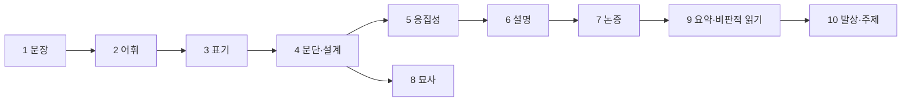

**한국어 글쓰기 입문 코스 10선 설계안 (v3)**

## 문제 정의

의무교육을 마친 한국어 모국어 성인 글쓰기 입문자를 대상으로, 레슨 내부에 글쓰기 활동이 없는 조건(13개 스텝 조합, 레슨당 20스텝 내외)에서 학습·판별만으로 성립하는 코스 10개를 확정합니다. 상황 특화 장르(SNS·회사 문서·자소서·경조사·일기)는 코스 주제에서 제외하고, 예문 수준에서만 성인 생활 글을 씁니다.

## 요구사항 (확정)

- 유닛 4~10개, 레슨 30±20개. 주제 밀도에 따라 능동 배분
- 코스 10(퇴고) 폐기. 유닛으로도 흡수하지 않음
- '발상과 주제 잡기' 신설
- 1번 코스는 문장. 표기·맞춤법은 뒤로
- 규범 판정은 wiki official K + 웹으로 온라인가나다·표준국어대사전 교차 확인
- 총 308레슨 배분 확정 (코스별 22~42)
- 스텝 유형 배정은 이번 단계에서 하지 않음. 축은 13개 스텝으로 자연스럽게 구현되는 형태로 설정

## 배경

v2에서 확인한 문제는 다섯 가지였습니다. 중복 실재(성급한 일반화·순환 논증이 코스 5와 7에 이중, 논리적 비약이 3중, 역개요가 2중), 코스 10의 자립 근거 부족, 사고력·독자 축의 공백, 코스 9의 과밀, 코스 1 첫 유닛의 눈높이 하향. v3는 이 다섯을 각각 해소했습니다.

wiki 근거는 S 92건, K 약 2,000건입니다. 코스별 주 근거는 이렇게 매핑됩니다.

| 코스        | 주 근거                                                                                                      |
| ----------- | ------------------------------------------------------------------------------------------------------------ |
| 1 문장      | K-000812, K-001565, K-001614, K-001683~1684, K-001766~1796, K-001806~1918, K-001935~1936, S-000079, S-000087 |
| 2 어휘      | K-000811, K-001680~1682, K-001876~1890, S-000082, S-000090                                                   |
| 3 표기      | S-000001~006(고시·해설), K-000001~230, K-001932~1946                                                         |
| 4 문단·설계 | K-000716, K-000813~816, K-001012, K-001014, K-001022, K-001220, S-000041, S-000061                           |
| 5 응집성    | K-001015, K-001055, K-001830, K-001849, K-001867, K-001965, K-000247~248                                     |
| 6 설명      | K-000434~437, K-000718, K-001577, K-001884, S-000050, S-000065                                               |
| 7 논증      | K-000497, K-000519~521, K-000536~537, K-000794~797, K-001657, S-000017, S-000048, S-000071                   |
| 8 묘사      | K-000676, K-000899, K-001707~1712, S-000037, S-000082                                                        |
| 9 요약·비판 | K-000478~491, K-000848, K-001056, K-001571, K-001641, K-001715, S-000047, S-000052                           |
| 10 발상     | K-000399~404, K-000678~680, K-001013, K-001628~1640, K-001685~1698, S-000011, S-000038                       |

근거가 얇은 곳은 두 군데입니다. 코스 9 유닛 5(AI 정보 판별)는 K에 직접 근거가 없어 새 S 수집이 필요하고, 코스 8은 규범 근거 대신 문헌 해석 비중이 큽니다.

## 코스 골격

| #   | 코스                  | cat              | visualKey              | 유닛 | 레슨 |
| --- | --------------------- | ---------------- | ---------------------- | ---- | ---- |
| 1   | 정확하고 힘 있는 문장 | 구성과 표현      | basic-sentence-writing | 7    | 42   |
| 2   | 정확한 어휘 선택      | 언어와 읽기      | expression             | 6    | 34   |
| 3   | 표기의 원리           | 언어와 읽기      | basic-sentence-writing | 7    | 40   |
| 4   | 문단과 글의 설계      | 독자와 쓰기 과정 | essay-writing          | 5    | 30   |
| 5   | 논리적 연결과 응집성  | 독자와 쓰기 과정 | grammar-complete       | 4    | 22   |
| 6   | 설명하는 힘           | 구성과 표현      | essay-writing          | 5    | 28   |
| 7   | 논증의 기술           | 사고와 발상      | creative-writing       | 5    | 32   |
| 8   | 관찰과 묘사           | 구성과 표현      | expression             | 4    | 24   |
| 9   | 요약과 비판적 읽기    | 정보와 AI 문해   | grammar-complete       | 5    | 30   |
| 10  | 발상과 주제 잡기      | 사고와 발상      | creative-writing       | 4    | 26   |

---

## 코스 1. 정확하고 힘 있는 문장

**구성과 표현 · basic-sentence-writing · 7유닛 42레슨**  
테제: 한 문장이 한 판단만 담고 성분이 서로 호응할 때 독자는 되돌아가 읽지 않는다.

**유닛 1. 문장의 골격과 호응** (6) — 통과: 어긋난 성분을 이름으로 지목한다

1. 주어와 서술어 사이가 멀어질 때
2. 목적어를 잃어버린 서술어
3. 부사어가 요구하는 서술어 ('결코', '전혀', '조차')
4. 높임의 주체와 대상이 어긋날 때
5. 시제와 시간 부사어의 불일치
6. 생략한 주어가 다른 주어로 읽히는 문장

**유닛 2. 한 문장 한 판단** (6) — 통과: 분할할 문장과 유지할 문장을 가른다  
7. 한 문장에 판단이 둘 이상 들어간 신호  
8. 조건이 겹칠 때 문장을 끊는 자리  
9. 접속 어미로 이어 붙인 세 겹 문장  
10. 관형절이 쌓이면 서술어가 늦어진다  
11. 앞으로 당길 정보와 뒤로 미룰 정보  
12. 나누면 나빠지는 문장: 분할하지 않을 기준

**유닛 3. 군더더기와 상투 표현** (6) — 통과: 삭제해도 뜻이 남는 요소만 덜어낸다  
13. '~것 같다'가 판단을 흐리는 자리  
14. 관형격 '-의'가 겹쳐 쌓인 명사구  
15. 접미사 '-적'이 필요한 자리와 습관인 자리  
16. '있다/있는'이 서술어를 대신할 때  
17. 복수 '-들'과 뜻이 겹친 표현  
18. 삭제 검증: 지운 뒤 의미가 보존되는지 확인하기

**유닛 4. 번역투와 명사화** (6) — 통과: 위험 신호를 금칙어가 아니라 점검 지표로 다룬다  
19. 무생물이 주어 자리에 올 때  
20. '~에 대하여'와 '~에 관하여'의 자리  
21. '~에 있어서'와 '~함에 있어'의 대체  
22. '~을 통해'와 '~을 위해'의 획일화  
23. '가지다'로 뭉개진 서술어 되살리기  
24. 위험 신호는 금칙어가 아니다: 문맥 판단 기준

**유닛 5. 태와 책임 주체** (6) — 통과: 주체가 숨은 지점과 그 이유를 말한다  
25. 피동을 골라야 하는 경우: 정보의 초점  
26. 이중 피동이 만들어지는 결합 구조  
27. '-시키다'가 타동사를 밀어낼 때  
28. '~에 의해'와 '~로 인해'의 선별  
29. 명사형 종결(~함, ~음)이 지우는 주체  
30. 행위자가 사라진 문장에서 책임 찾기

**유닛 6. 문장 구조와 리듬** (6) — 통과: 길이와 구조로 정보 무게를 조절한 예를 판별한다  
31. 홑문장과 겹문장, 정보량으로 고르기  
32. 이어진 문장으로 관계를 드러내기  
33. 안은 문장으로 정보를 압축하기  
34. 문장 길이로 정보의 무게 조절하기  
35. 병렬 구조와 대구가 성립하는 조건  
36. 종결 어미가 단조로울 때 생기는 문제

**유닛 7. 문장 판별 종합** (6) — 통과: 오류를 갈래로 분류하고 우선순위를 정한다  
37. 두 가지로 읽히는 문장의 원인 분류  
38. 수식어의 자리가 뜻을 바꾸는 순간  
39. 과도하게 압축된 문장의 부작용  
40. 소리 내어 읽었을 때 걸리는 지점  
41. 같은 내용 두 판본: 문체와 군더더기 가르기  
42. 문장 오류 여섯 갈래로 분류하기

---

## 코스 2. 정확한 어휘 선택

**언어와 읽기 · expression · 6유닛 34레슨**  
테제: 비슷한 단어가 갈리는 지점은 뜻이 아니라 대상·격·결합이다.

**유닛 1. 유의어의 갈림** (6) — 통과: 무엇이 갈리는지 축을 지목한다

1. 유의어는 뜻이 아니라 쓰임에서 갈린다
2. 정도의 세기가 다른 유의어
3. 감정의 결이 다른 유의어
4. 격식의 층이 다른 유의어
5. 긍정·부정의 함축이 붙은 유의어
6. 사전 뜻풀이에서 갈림점 읽어내기

**유닛 2. 다의어와 동음이의어** (5) — 통과: 문맥으로 뜻을 확정한다  
7. 다의어의 중심 뜻과 주변 뜻  
8. 문맥이 뜻을 확정하는 방식  
9. 동음이의어가 만드는 오해  
10. 사전의 뜻 번호와 용례 읽는 법  
11. 낯선 단어의 뜻을 문맥으로 추론하기

**유닛 3. 대상과 상황에 맞는 단어** (6) — 통과: 대상 자질과 추상도로 후보를 탈락시킨다  
12. 사람에게 쓰는 말과 사물에 쓰는 말  
13. 추상어를 검증 가능한 말로 내리기  
14. 한자어와 고유어, 무엇이 독자에게 쉬운가  
15. 전문 용어를 남길 자리와 풀 자리  
16. 외래어와 차용어를 고르는 기준  
17. 상위어와 하위어로 진술의 범위 맞추기

**유닛 4. 어휘의 격과 톤** (6) — 통과: 한 편의 글에서 톤이 흔들린 자리를 찾는다  
18. 문어체 어휘와 구어체 어휘  
19. 높임 어휘의 단계와 과잉 높임  
20. 은어와 유행어가 글에서 걸리는 지점  
21. 완곡어와 직설어의 선택 효과  
22. 어휘 톤이 흔들리는 신호  
23. 종결 어미와 어휘 격의 어긋남

**유닛 5. 연어와 결합 관계** (5) — 통과: 문법은 맞지만 안 어울리는 결합을 잡는다  
24. 문법은 맞지만 어울리지 않는 결합  
25. 자주 쓰이는 연어를 묶음으로 익히기  
26. 관용구의 정확한 형태  
27. 속담과 고사성어를 문맥에 맞게 쓰기  
28. 조사와 서술어가 요구하는 결합

**유닛 6. 어휘 판별 종합** (6) — 통과: 오류를 갈래로 분류한다  
29. 뜻이 겹친 표현  
30. 개념어는 바꿔 쓰지 않는다: 유의어 변주 억제  
31. 반복되는 단어를 대체할 때의 조건  
32. 반의어로 어휘의 경계 확인하기  
33. 밋밋한 문장을 단어 하나로 바꾸기  
34. 어휘 오류 다섯 갈래로 분류하기

---

## 코스 3. 표기의 원리: 맞춤법·띄어쓰기·문장부호

**언어와 읽기 · basic-sentence-writing · 7유닛 40레슨**  
테제: 규범과 허용형, 규범과 문체 취향을 구별하면 표기는 암기가 아니라 판단이 된다.

**유닛 1. 띄어쓰기의 원리** (6) — 통과: 원칙 조항으로 판단 근거를 댄다

1. 단어는 띄고 조사는 붙인다
2. 의존명사를 띄우는 이유
3. 보조 용언, 원칙과 허용의 경계
4. 단위 명사와 숫자가 만날 때
5. 수는 만 단위로 띄어 쓴다
6. 성명·직함·고유명사·전문 용어의 단위

**유닛 2. 형태가 같은 말 가르기** (6) — 통과: 품사를 판정한 뒤 표기를 결정한다  
7. 품사가 갈리면 띄어쓰기도 갈린다  
8. '되-'와 '돼', '안'과 '않'을 한 원리로 정리하기  
9. '-데'와 '-대': 경험과 전달  
10. '-든지'와 '-던지': 선택과 회상  
11. '-로서'와 '-로써': 자격과 수단  
12. '이에요·예요'와 '-이오·요'의 결합

**유닛 3. 소리와 표기가 어긋나는 자리** (6) — 통과: 조건을 진술하고 예외를 구분한다  
13. 사이시옷이 붙는 조건과 붙지 않는 조건  
14. 두음법칙과 그 예외  
15. '-율'과 '-률', '-난'과 '-란'  
16. 준말이 만들어지는 원리  
17. 겹받침과 활용형의 표기  
18. 없는 표기 가려내기

**유닛 4. 문장부호로 의미 조율** (6) — 통과: 부호가 바꾸는 뜻을 문장 성분으로 설명한다  
19. 쉼표 하나로 갈라지는 문장  
20. 가운뎃점과 쌍점, 열거의 층위  
21. 따옴표의 인용과 강조  
22. 줄임표·줄표·붙임표·물결표의 자리  
23. 괄호의 종류와 보충 설명의 층위  
24. 문장부호로 중의성 해소하기

**유닛 5. 표준어와 허용형** (5) — 통과: 규범·허용·취향을 세 층으로 가른다  
25. 표준어 사정 원칙과 복수 표준어  
26. 방언이 표준어가 되는 경우  
27. 추가 사정된 표준어와 관용 표기  
28. 규범과 문체 취향을 구별하기  
29. 허용형을 문서 안에서 통일하기

**유닛 6. 외래어·숫자·단위 표기** (5) — 통과: 원칙과 관용을 함께 적용한다  
30. 외래어 표기의 다섯 가지 기본 원칙  
31. 자주 틀리는 외래어 표기  
32. 인명·지명 표기와 관용  
33. 숫자·단위·기간의 표기 일관성  
34. 로마자와 한글이 섞일 때

**유닛 7. 표기 판별 종합** (6) — 통과: 검사기가 놓치는 오류를 스스로 잡는다  
35. 검사기가 잡는 오류와 놓치는 오류  
36. 문서 전체의 표기 일관성 점검  
37. 공공언어 표기 기준과 일반 글의 차이  
38. 규범·용례·장르·독자, 네 기준으로 판단하기  
39. 표기 오류가 뜻을 바꾼 사례  
40. 표기 오류 여섯 갈래로 분류하기

---

## 코스 4. 문단과 글의 설계

**독자와 쓰기 과정 · essay-writing · 5유닛 30레슨**  
테제: 문단은 분량이 아니라 소주제문과 뒷받침의 관계로 성립한다.

**유닛 1. 문단의 세 요건** (6) — 통과: 통일성·충분성·긴밀성 중 무엇이 깨졌는지 말한다

1. 문장 묶음과 문단은 다르다
2. 소주제문을 찾아내는 눈
3. 두괄식·미괄식·양괄식의 효과 차이
4. 통일성: 화제에서 벗어난 문장
5. 충분성: 주장만 있고 살이 없는 문단
6. 긴밀성: 문장이 서로 맞물리는 방식

**유닛 2. 뒷받침의 종류와 순서** (6) — 통과: 빠진 뒷받침의 종류를 지목한다  
7. 근거로 뒷받침한 문장  
8. 예시로 뒷받침한 문장  
9. 설명과 비교로 뒷받침한 문장  
10. 인용으로 뒷받침할 때의 조건  
11. 뒷받침 문장의 배열 순서  
12. 뒷받침을 흉내낸 반복 문장

**유닛 3. 문단과 문단 잇기** (6) — 통과: 다리가 없는 지점을 찾아 이유를 댄다  
13. 문단 사이에 다리를 놓는 표현  
14. '그래서 뭐?' 테스트로 다리 점검하기  
15. 기지 정보에서 미지 정보로  
16. 문단 순서를 바꿔야 하는 신호  
17. 긴 문단을 쪼개는 기준  
18. 계단식 문단: 한 문단 한 주장

**유닛 4. 개요로 뼈대 세우기** (6) — 통과: 완성 글에서 개요를 복원한다  
19. 개요 없이 쓴 글에 남는 흔적  
20. 키워드 개요와 문장 개요  
21. 시간순·논리순·비교순의 선택 기준  
22. 독자의 질문 순서로 정보 배치하기  
23. 역개요로 완성 글의 구조 복원하기  
24. 개요 항목 사이의 균형 점검

**유닛 5. 서론·결론과 전체 구조** (6) — 통과: 서론의 약속과 결론의 회수를 대조한다  
25. 서론이 하는 네 가지 일  
26. 첫 문장이 다음 문장을 끌어오는 방식  
27. 결론의 요약·의의·전망 구별하기  
28. 서론의 약속과 결론의 회수가 어긋날 때  
29. 제목과 소제목이 내용을 예고하는 방식  
30. 글 전체 구조를 한 장으로 그리기

---

## 코스 5. 논리적 연결과 응집성

**독자와 쓰기 과정 · grammar-complete · 4유닛 22레슨**  
테제: 접속어는 논리를 만들지 않는다. 논리가 먼저 있고 접속어는 그 표시일 뿐이다.

**유닛 1. 접속 표현** (6) — 통과: 접속어를 넣을 자리와 뺄 자리를 가른다

1. 접속어가 있을 때와 없을 때
2. 순접과 역접의 경계
3. 인과를 나타내는 접속 표현의 강도
4. 대등·첨가·환언·예시의 표시
5. 접속어 없이 논리가 이어지는 문장
6. 접속어 남용이 논리를 가리는 자리

**유닛 2. 지시와 대용** (5) — 통과: 지시 대상을 하나로 확정한다  
7. 지시어가 가리키는 대상 확정하기  
8. '이·그·저'의 거리와 쓰임  
9. 앞 문장 전체를 가리키는 표현  
10. 대명사가 늘어날 때 생기는 혼란  
11. 반복을 피하려다 개념이 흔들릴 때

**유닛 3. 문장 사이의 논리 관계** (6) — 통과: 두 문장 사이에 생략된 연결을 복원한다  
12. 두 문장 사이에 생략된 전제  
13. 나열인가 인과인가: 관계 오표시  
14. 정보 배열이 흐름을 만드는 방식  
15. 주어 연쇄로 이어지는 문단  
16. 화제 전환이 갑작스러운 지점  
17. 논리 관계를 도식으로 옮기기

**유닛 4. 흐름 판별 종합** (5) — 통과: 응집성 문제와 일관성 문제를 구별한다  
18. 문장 순서를 바꿔 흐름 확인하기  
19. 어색한 연결어를 다른 말로 바꾸기  
20. 응집성과 일관성은 다른 문제다  
21. 지시어와 접속어가 겹친 문단 정리하기  
22. 연결 오류 네 갈래로 분류하기

---

## 코스 6. 설명하는 힘: 정의·분류·비교·인과

**구성과 표현 · essay-writing · 5유닛 28레슨**  
테제: 설명 실패는 지식 부족이 아니라 독자의 기지 정보를 잘못 가늠한 결과다.

**유닛 1. 설명의 조건** (5) — 통과: 독자가 이미 아는 것과 모르는 것을 나눈다

1. 설명이 실패하는 네 가지 이유
2. 설명·묘사·논증의 목적 차이
3. 독자의 기지 정보를 가늠하기
4. 지식의 저주: 아는 사람이 못 보는 것
5. 추상도의 층위를 내려가는 순서

**유닛 2. 정의와 분류** (6) — 통과: 정의의 결함 유형을 이름으로 지목한다  
6. 좋은 정의의 조건: 유와 종차  
7. 순환에 빠진 정의  
8. 범위가 넘치거나 모자란 정의  
9. 조작적 정의가 필요한 자리  
10. 분류 기준의 일관성과 층위  
11. 정의와 분류를 결합한 설명 읽기

**유닛 3. 비교·대조와 예시** (6) — 통과: 비교 층위와 예시 대표성을 검사한다  
12. 비교 대상이 같은 층위인가  
13. 비교 기준을 밝히지 않은 대조  
14. 불공정한 비교 대상 선정  
15. 대표성 있는 예시와 극단적 예시  
16. 예시가 개념을 벗어난 경우  
17. 비교와 예시를 결합한 설명 읽기

**유닛 4. 인과와 유추** (6) — 통과: 인과 주장의 강도를 근거에 맞춘다  
18. 원인이 여럿인 현상의 설명  
19. 상관을 인과로 바꿔치기한 설명  
20. 필요조건과 충분조건의 혼동  
21. 유추의 설명력과 그 한계  
22. 비유가 오해를 부르는 지점  
23. 인과와 유추를 결합한 설명 읽기

**유닛 5. 설명문 판별 종합** (5) — 통과: 실패 원인을 갈래로 분류한다  
24. 핵심 용어가 도중에 뜻이 바뀔 때  
25. 숫자와 데이터에 맥락이 없을 때  
26. 전문 용어를 일상어로 바꾼 두 판본  
27. 다섯 가지 설명 방법이 섞인 글 분석  
28. 설명 실패 원인 다섯 갈래로 분류하기

---

## 코스 7. 논증의 기술

**사고와 발상 · creative-writing · 5유닛 32레슨**  
테제: 주장과 근거를 잇는 것은 자료가 아니라 보증이다.

**유닛 1. 주장의 자격** (6) — 통과: 반박 가능한 명제와 그렇지 않은 진술을 가른다

1. 취향의 표현과 논증할 수 있는 주장
2. 사실·해석·가치판단·주장 네 층위
3. 반박 가능성이 주장의 조건이다
4. '모두·항상·절대': 과도한 단정
5. 논쟁적이지 않은 주장의 문제
6. 늘어진 주장을 한 문장으로 압축하기

**유닛 2. 주장·이유·근거·보증** (7) — 통과: 숨은 보증을 문장으로 복원한다  
7. 주장과 이유 사이의 '왜?'  
8. 이유와 근거는 같지 않다  
9. 근거의 네 종류: 사실·통계·견해·사례  
10. 숨은 전제(보증) 드러내기  
11. 보증이 무너지면 근거도 무너진다  
12. 한정어로 주장의 강도 조절하기  
13. 논증 구조를 도식으로 옮기기

**유닛 3. 근거의 질** (6) — 통과: 근거를 탈락시킬 기준을 댄다  
14. 출처의 신뢰도를 따지는 기준  
15. 표본의 수와 대표성  
16. 통계 인용에서 분모와 기간  
17. 전문가 견해의 적합한 권위  
18. 사례가 주장을 대표하지 못할 때  
19. 근거와 주장의 연결이 헐거운 지점

**유닛 4. 논리적 오류** (7) — 통과: 오류를 이름으로 지목한다  
20. 성급한 일반화  
21. 흑백 논리  
22. 거짓 원인  
23. 순환 논증  
24. 인신공격과 허수아비 공격  
25. 감정과 권위에 기댄 호소  
26. 오류가 섞여 있는 문단 가려내기

**유닛 5. 반론과 논증 종합** (6) — 통과: 반론 처리가 논증을 강화한 지점을 설명한다  
27. 예상 반론을 세우는 방법  
28. 반론을 인정하고 범위를 제한하는 문장  
29. 양보가 논증을 강화하는 조건  
30. 균형 잡힌 논조와 편향된 논조  
31. 허술한 논증에 보탤 근거 고르기  
32. 논증 점검 여섯 질문

---

## 코스 8. 관찰과 묘사

**구성과 표현 · expression · 4유닛 24레슨**  
테제: 구체성은 형용사를 늘리는 일이 아니라 감각 정보를 고르는 일이다.

**유닛 1. 설명과 묘사의 갈림** (6) — 통과: 목적에 따라 문장이 달라지는 이유를 말한다

1. 설명과 묘사는 목적이 다르다
2. 오감 가운데 무엇을 골랐는가
3. 촉감·냄새·맛이 들어간 문장
4. 지배적 인상을 먼저 잡은 묘사
5. 관찰과 인상 평가를 가르기
6. 막연한 표현이 구체화되는 단계

**유닛 2. 구체성의 층위** (6) — 통과: 무엇으로 구체화했는지 수단을 지목한다  
7. 정확한 형용사와 막연한 형용사  
8. 부사가 하는 일과 못 하는 일  
9. 수치·색·형태로 내려가기  
10. 동작 동사가 장면을 만드는 방식  
11. 시선의 이동 순서로 배치한 묘사  
12. 디테일 과잉이 메시지를 가릴 때

**유닛 3. 비유의 원리** (6) — 통과: 비유의 근거를 말하고 진부·과잉을 가른다  
13. 직유와 은유의 형식 차이  
14. 비유의 근거: 무엇이 닮았는가  
15. 의인법이 어색해지는 조건  
16. 과장과 축소의 효과와 한계  
17. 진부한 비유를 가려내는 기준  
18. 비유가 뜻을 왜곡하는 지점

**유닛 4. 보여주기 판별 종합** (6) — 통과: 말한 문장과 보여준 문장을 가르고 균형을 판단한다  
19. 감정을 말한 문장과 보여준 문장  
20. 행동으로 심리를 드러낸 문장  
21. 관념적 형용사를 장면으로 바꾼 예  
22. 보여주기와 요약하기의 균형  
23. 대화문이 정보를 전달하는 방식  
24. 과잉 표현을 덜어낸 두 판본

---

## 코스 9. 요약과 비판적 읽기

**정보와 AI 문해 · grammar-complete · 5유닛 30레슨**  
테제: 요약은 줄이는 기술이 아니라 무엇을 버릴지 정하는 판단이다.

**유닛 1. 요약의 조건** (6) — 통과: 버릴 정보의 기준을 진술한다

1. 요약과 발췌는 다르다
2. 핵심 문장과 부연 문장 가르기
3. 삭제해도 되는 정보의 기준
4. 반복과 예시를 걸러내기
5. 요약이 원문의 논지를 바꾸는 순간
6. 길이에 따라 남기는 정보

**유닛 2. 압축의 기술** (6) — 통과: 판단 구조가 보존된 요약을 골라낸다  
7. 여러 문장을 한 문장으로 묶기  
8. 개조식과 서술식의 선택  
9. 핵심어 중심으로 재구성한 요약  
10. 판단 구조를 보존하는 압축  
11. 한 줄 요약과 세 문장 요약  
12. 요약문에서 빠진 내용 확인하기

**유닛 3. 비판적으로 읽기** (7) — 통과: 숨은 전제와 근거의 결함을 지목한다  
13. 사실 진술과 의견 진술 가르기  
14. 글의 중심 주장 찾아내기  
15. 저자의 숨은 전제 드러내기  
16. 근거의 타당성과 충분성  
17. 왜곡되어 인용된 통계  
18. 글의 맥락: 시점과 필자의 위치  
19. 반대 입장에서 다시 읽기

**유닛 4. 출처와 인용** (5) — 통과: 인용·바꿔 쓰기·표절의 경계를 판정한다  
20. 직접 인용과 간접 인용의 경계  
21. 바꿔 쓰기와 표절의 갈림  
22. 재인용이 허용되는 조건  
23. 출처 표기에 들어가는 정보  
24. 자료의 신뢰도 우선순위 매기기

**유닛 5. AI 시대 정보 판별** (6) — 통과: 그럴듯함과 검증 가능함을 가른다  
25. 출처가 분명한 정보와 불분명한 정보  
26. 그럴듯함과 검증 가능함  
27. 생성된 문장에서 반복되는 형식 신호  
28. 존재하지 않는 근거 가려내기  
29. 여러 출처를 교차 확인하는 절차  
30. 정보 판별 다섯 갈래로 분류하기

---

## 코스 10. 발상과 주제 잡기

**사고와 발상 · creative-writing · 4유닛 26레슨**  
테제: 쓸 것이 없는 게 아니라 아직 질문이 없다.

**유닛 1. 쓸 것이 없다는 착각** (6) — 통과: 생성 단계와 평가 단계를 구분한다

1. 착수를 막는 것은 재능이 아니라 절차다
2. 생성과 평가를 분리하기
3. 키워드 매트릭스로 재료 벌리기
4. 계층을 나눠 생각 늘리기
5. 말로 먼저 풀어낸 초안의 흔적
6. 재료가 많아졌을 때 버리는 기준

**유닛 2. 관찰에서 해석으로** (7) — 통과: 사실과 해석을 문장 단위로 가른다  
7. 관찰 진술과 해석 진술 가르기  
8. 관찰→비교→이유→판단의 순서  
9. 비교 대상을 바꾸면 해석이 달라진다  
10. 하나의 사실에 붙은 여러 해석  
11. 해석에 이름 붙이기: 개념화  
12. 반증 조건을 붙인 해석  
13. 성급한 결론과 유보된 결론

**유닛 3. 주제를 좁히고 벼리기** (7) — 통과: 화제를 논쟁 가능한 주제문으로 좁힌다  
14. 화제와 주제는 다르다  
15. 좋은 주제의 두 요건: 구체성과 논쟁성  
16. 시간·공간·대상·방법으로 좁히기  
17. 좁힌 주제를 넓은 맥락에 잇기  
18. 문제 해결형·쟁점형·설명형 주제  
19. 주제문 한 문장으로 세우기  
20. 주제가 흔들린 글의 신호

**유닛 4. 발상 판별 종합** (6) — 통과: 답할 수 있는 질문과 공허한 질문을 가른다  
21. 답할 수 있는 질문과 공허한 질문  
22. 통념을 흔드는 질문  
23. 문제의식이 드러난 서론과 그렇지 않은 서론  
24. 같은 소재에서 갈라진 세 가지 주제  
25. 주제와 자료의 아귀 맞추기  
26. 발상 단계 점검 다섯 질문
